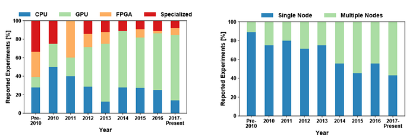
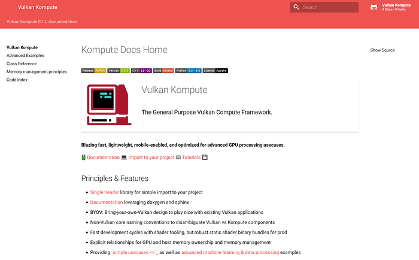
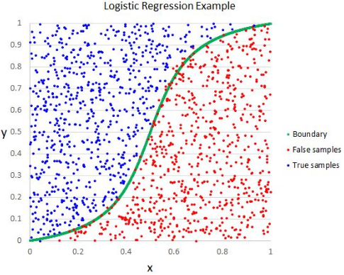
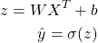
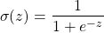
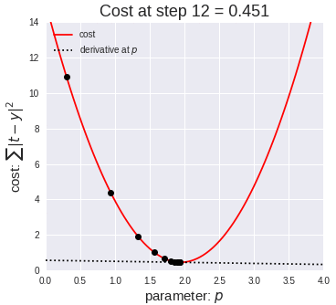
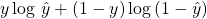
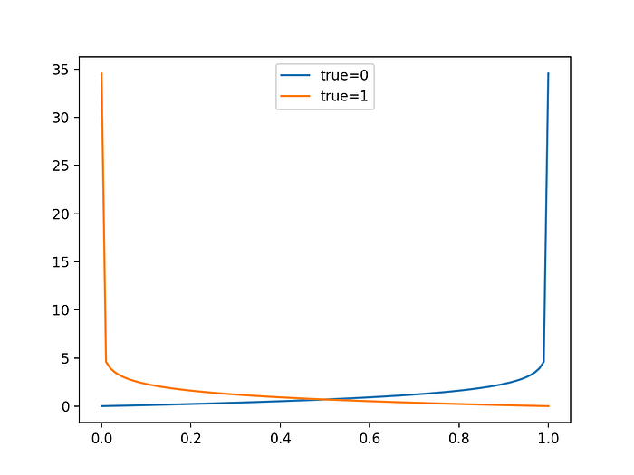

_A hands on introduction into GPU computing with practical machine learning examples using the Kompute Framework & the Vulkan SDK_

Machine learning, together with many other advanced data processing paradigms, fits incredibly well to the parallel-processing architecture that GPU computing offers.

Image by [Author](https://docs.google.com/presentation/d/1WBLcBmk7J04Zu8cD3ugagPkEpKkDuJpNr-HfroNe4X8/edit#slide=id.p)

In this article you’ll learn how to write your own ML algorithm from scratch in GPU optimized code, which will be able to run in virtually any hardware — including your mobile phone. We’ll introduce core GPU & ML concepts and show how you can use the [**Kompute framework**](https://github.com/axsaucedo/vulkan-kompute#vulkan-kompute) to implement it in only a handful lines of code.

We will be building first a simple algorithm that will multiply two arrays in parallel, which will introduce the fundamentals of GPU processing. We will then write a Logistic Regression algorithm from scratch in the GPU. You can find the repo with the full code in the following links:

- [Kompute Repository](https://github.com/EthicalML/vulkan-kompute)
- GPU Array Multiplication [Repository](https://github.com/axsaucedo/vulkan-kompute/tree/4e3802cb9dbf8742f9caf0374ef1612466c5ab1a/examples/array_multiplication#kompute-array-multiplication-example) and [Kompute Code](https://github.com/axsaucedo/vulkan-kompute/blob/4e3802cb9dbf8742f9caf0374ef1612466c5ab1a/examples/array_multiplication/src/Main.cpp#L15)
- GPU Logistic Regression [Repository](https://github.com/axsaucedo/vulkan-kompute/tree/7906406dd1e8bbfb01c1c5d68be44f63587440aa/examples/logistic_regression#kompute-logistic-regression-example), [Kompute Code](https://github.com/axsaucedo/vulkan-kompute/blob/7906406dd1e8bbfb01c1c5d68be44f63587440aa/examples/logistic_regression/src/Main.cpp#L15) and [Shader Code](https://github.com/axsaucedo/vulkan-kompute/blob/7906406dd1e8bbfb01c1c5d68be44f63587440aa/examples/logistic_regression/shaders/glsl/logistic_regression.comp#L7)

## Motivation

The potential and adoption of GPU computing has been exploding in recent years — you can get a glimpse of the increasing speed in adoption from the charts in the image below. In deep learning there has been a massive increase in adoption of GPUs for processing, together with paradigms that have enabled massively parallelizable distribution of compute tasks across increasing number of GPU nodes. There is a lot of exciting research around techniques that propose new approaches towards [model parallelism](https://mxnet.apache.org/versions/1.7/api/faq/model_parallel_lstm.html) and [data parallelism](https://en.wikipedia.org/wiki/Data_parallelism)— both which allow algorithms and data respectively to be sub-divided in a broad range of approaches to maximize processing efficiency.

**Ben-Nun, Tal, and Torsten Hoefler. “Demystifying parallel and distributed deep learning: An in-depth concurrency analysis.” _ACM Computing Surveys (CSUR)_ 52.4 (2019): 1–43.**

In this article we outline the theory, and hands on tools that will enable both, beginners and seasoned GPU compute practitioners, to make use of and contribute to the current development and discussions across these fascinating high-performance computing areas.

## The Vulkan Framework

Before diving right in, it is worth introducing the core framework that is making it possible to build hyper-optimized, cross platform and scalable GPU algorithms — and that is the Vulkan Framework.

Playing “where’s waldo” with Khronos Membership (Image by Vincent Hindriksen via [StreamHPC](https://streamhpc.com/blog/2017-05-04/what-is-khronos-as-of-today/))

Vulkan is an Open Source project led by the [Khronos Group](https://www.khronos.org/), a consortium of a very large number of tech companies who have come together to work towards defining and advancing the open standards for mobile and desktop media (and compute) technologies. On the left you can see the broad range of Khronos Members.

You may be wondering, _why do we need yet another new GPU framework where there are already many options available for writing parallelizable GPU code?_ The main reason is that unlike some of its closed source counterparts (e.g. NVIDIA’s CUDA, or Apple’s Metal) Vulkan is fully Open Source, and unlike some of the older options (e.g. OpenGL), Vulkan is built with the modern GPU architecture in mind, providing very granular access to GPU optimizations. Finally, whilst some alternatives provide vendor-specific support for GPUs, Vulkan provides **cross-platform**, and **cross-vendor** support, which means that it opens the doors to opportunities in mobile processing, edge computing, and more.

The Vulkan SDK provides very low-level access to GPUs, which allows for very specialized optimizations. This is a great asset for GPU developers — the main disadvantage is the verbosity involved, requiring 500–2000+ lines of code to only get the base boilerplate required to even start writing the application logic. This can result not only in expensive developer cycles but also prone to small errors that can lead to larger problems.

This can actually be seen across many new and renowned machine learning & deep learning projects like Pytorch, Tensorflow, and Alibaba DNN — between others — which have either integrated or are looking to integrate the Vulkan GPU SDK to add mobile GPU (and cross-vendor GPU) support. All of these frameworks end up with very similar and extremely verbose boilerplate code, which means they would have benefited (and could still benefit) from using a unified baseline. This was one of the main motivations for us to start the **Kompute**project.

## Enter Kompute

[**Kompute**](https://github.com/axsaucedo/vulkan-kompute#vulkan-kompute) is a framework built on top of the Vulkan SDK, specifically designed to extend its compute capabilities as a simple to use, highly optimized, and mobile friendly General Purpose GPU computing framework.

Kompute [Documentation](https://ethicalml.github.io/vulkan-kompute/) (Image by Author)

Kompute was not built to hide any of the core Vulkan concepts — the Vulkan API is very well designed —instead it augments Vulkan’s Computing capabilities with a BYOV (bring your own Vulkan) design, enabling developers by reducing boilerplate code required and automating some of the more common workflows involved in writing Vulkan applications.

For new developers curious to learn more, it provides a solid base to get started into GPU computing. For more advanced Vulkan developers, Kompute allows them to integrate it into their existing Vulkan applications, and perform very granular optimizations by getting access to all of the Vulkan internals when required. The project is fully open source, and we welcome bug reports, documentation extensions, new examples or suggestions — please feel free to [open an issue](https://github.com/axsaucedo/vulkan-kompute/issues) in the repo.

## Writing your first Kompute

To build our first simple array-multiplication GPU computing application using Kompute, we will create the following:

- Two**Kompute Tensors**to store the input data
- One **Kompute Tensor** to store the output data
- A**Kompute Operation** to create and copy the tensors to the GPU
- A **Kompute Operation** with an Kompute Algorithm that will hold the code to be executed in the GPU (called a “shader”)
- A **Kompute Operation** to sync the GPU data back to the local tensors
- A **Kompute Sequence** to record the operations to send to the GPU in batches (we’ll use the**Kompute Manager**to simplify the workflow)

Kompute [Architecture Design](https://ethicalml.github.io/vulkan-kompute/overview/reference.html) (Image by Author)

At the core of Kompute are “Kompute Operations”, which are used for GPU actions, as well as “Kompute Tensor” operations to handle the GPU data and memory. More specifically, this diagram shows the relationship between Kompute components (including explicit memory ownership).

When interacting with the GPU, you have to send the instructions to the GPU to execute, and you need to make sure that the GPU has all of the relevant data available in GPU memory to begin processing. With Vulkan you send these instructions to the GPU via a queue, so to simplify things intuitively you can think of your GPU as a remote server, where data serialization, resource creation and memory allocation is expensive, and instructions are submitted via a queue — there is still GPU-CPU shared memory but you tend to only use this for data transfer to the GPU.

Let’s jump into the code. Typically, in a Kompute application we’ll follow the following steps:

1. Create a Kompute Manager to manage resources
2. Create Kompute Tensors to hold data
3. Initialise the Kompute Tensors in the GPU with a Kompute Operation
4. Define the code to run on the GPU as a “compute shader”
5. Use Kompute Operation to run shader against Kompute Tensors
6. Use Kompute Operation to map GPU output data into local Tensors
7. Print your results

### 1. Create a Kompute Manager to manage resources

First, we’ll create our Kompute Manager, which is in charge of creating and managing all the underlying Vulkan resources.

As you can see, here we are initializing our Kompute Manager, expecting it to create all the base Vulkan resources on Device 0 (in my case Device 0 is my NVIDIA card, and Device 1 is my integrated graphics card). For more advanced use-cases it’s also possible to initialize the Kompute Manager with your own Vulkan resources (Device, Queue, etc) but this is out of scope of this article.

### 2. Create Kompute Tensors to hold data

We will now create the Kompute Tensors that will be used for input and output. These will hold the data required which will be mapped into the GPU to perform this simple multiplication.

The reason why Kompute uses `std::shared_ptr` by design to avoid passing the objects by value, and instead passing them using [smart pointers](https://docs.microsoft.com/en-us/cpp/cpp/smart-pointers-modern-cpp?view=vs-2019).

### 3. Initialise the Kompute Tensors in the GPU with a Kompute Operation

Now that we have our Tensors created with local data, we will map the data into the GPU. For this we will use the `kp::OpTensorCreate` Kompute Operation, which will initialize the underlying Vulkan buffer and GPU memory, and perform the respective mapping into the GPU.

It’s also worth mentioning that it’s possible to shorten the tensor creation steps by leveraging the Kompute Manager `buildTensor` helper function. This would allow you to skip the need to create the `shared_ptr` explicitly as well as the `kp::OpTensorCreate` Operation as outlined below (you can also find the full code implementation of [this variation here](https://github.com/axsaucedo/vulkan-kompute/blob/2e8a5aa3a6d6172abb51ac038e1b75c5c2d58af9/test/TestMultipleAlgoExecutions.cpp#L274)).

### 4. Define the code to run on the GPU as a “compute shader”

Now that we’ve initialized the necessary Kompute Tensor components and they are mapped in GPU memory, we can add the Kompute Algorithm that will be executed in the GPU. This is referred to as the “shader” code, which follows a C-like syntax. You can see the full shader code below, and we’ll break down each of the sections below.

The `#version 450` and `layout(local_size_x = 1) in;` sections specify the version and parallel thread execution structure (which we’ll look at further down the article). We then can see the GPU data inputs and outputs defined in the format:

> `layout(binding = <INDEX>) buffer <UNIQUENAME> {float <VARNAME>[]};`

- <INDEX> — index that maps Tensors to the GPU input
- <UNIQUENAME> — This must be a unique name for the buffer
- <VARNAME> — This is the variable name to use in the shader code

These are the parameters that can be used throughout the shader code for processing. Namely in this case, the processing is done inside the `main`function. The first variable `uint index = gl_GlobalInvocationID.x;` is the currently parallel execution index which will allow us to process each data input.

We then come into the core of this algorithm which is the multiplication `o[index] = a[index] * b[index].`This part is quite self-explanatory — we multiply the elements of the GPU arrays `a[]` and `b[]` , then store the output on the array `o[]`.

### 5. Use Kompute Operation to run shader against Kompute Tensors

In order to run the shader above we will create the Kompute Operation `kp::OpAlgoBase`. The parameters required for this Kompute Operation includes the Tensors to bind into the GPU instructions, as well as the shader code itself.

It’s worth mentioning that Kompute allows the user to also pass the shader through a file path, or alternatively there are also Kompute tools that will allow you to convert the shader binaries into C++ header files.

### 6. Use Kompute Operation to map GPU output data into local Tensors

Once the algorithm gets triggered, the result data will now be we held in the GPU memory of our output tensor. We can now use the `kp::OpTensorSyncLocal`Kompute Operation to sync the Tensor GPU memory as per the code block below.

### 7. Print your results

Finally, we can print the output data of our tensor.

When you run this, you will see the values of your output tensor printed. That’s it, you’ve written your first Kompute!

You can also find the full example in the repo so you can run it and extend it as desired. You can find the full standalone example in [this repository](https://github.com/axsaucedo/vulkan-kompute/tree/4e3802cb9dbf8742f9caf0374ef1612466c5ab1a/examples/array_multiplication#kompute-array-multiplication-example) which includes the instructions on how to build it as well as the [Kompute C++ code](https://github.com/axsaucedo/vulkan-kompute/blob/4e3802cb9dbf8742f9caf0374ef1612466c5ab1a/examples/array_multiplication/src/Main.cpp#L15).

Although it may not seem obvious, the above introduced some intuition around core concepts and design thinking in GPU computing, whilst still abstracting a couple of the more in-depth concepts. In the following sections we will be providing more concrete terminology and we’ll be scratching the surface of some of the more advanced concepts such as threads, blocks, memory strides and shared memory (although a lot will be provided as further reading).

## Diving into the Machine Learning intuition

Let’s look at a more advanced GPU compute use-case, specifically implementing the hello world of machine learning, logistic regression. Before we cover the implementation we will provide some intuition on the theory, and the terminology that we’ll be using throughout.

In machine learning we always have two stages, training and inference. In the diagram below you can see the two simplified flows. At the top is the training flow, where you identify some training data, extract some features, and train a model until you are happy with the accuracy. Once you have a trained model, you persist the model “weights” and deploy the model into the second workflow, where the model would perform inference on unseen data.

Data Science Process (Image by Author)

In this case we will have an input dataset `X` , where each element is a pair `xi` and `xj` . Our input data will be the following:

- `xi = { 0, 1, 1, 1, 1 }`
- `xj = { 0, 0, 0, 1, 1 }`

With this input data, the expected target value `Y` to be predicted will be the following:

- `Y = {0, 0, 0, 1, 1}`

Logistic Regression Example from [DS Central](https://www.datasciencecentral.com/profiles/blogs/why-logistic-regression-should-be-the-last-thing-you-learn-when-b)

Our primary objective in machine learning is to learn using this data to find the function (and parameters) that will allow us to predict values `Y` from just using `X` as input.

It’s worth noting that the predicted values are defined as `ŷ` , which are specifically the values computed with our inference function, distinct to the “true” or “actual” values of `Y` that we defined above.

The functions that we will be using for logistic regression will be the following:

Let’s break down this function:

- `z` — is our linear mapping function
- `ŷ` —is the resulting predicted outputs
- `X`ᵀ —The transpose of the matrix containing our inputs xi and xj
- `σ` — The sigmoid function which is covered in more detail below

And the parameters that we’ll be looking to learn with our machine learning algorithm are:

- `W`— The weights that will be applied to the inputs
- `b` — The bias that will be added

There is also the surrounding function `σ`which is the sigmoid function. This function forces our input to be closer to 0 or 1, which could be intuitively seen as the probability of our prediction to be “true”, and is defined as following:

This is now the inference function that will allow us to process predictions from new data points. If we say for example that we have a new unseen set of inputs `X = { (0, 1) }`, and we assume that the learned parameters were `W = (1, 1), b = 0`after running our machine learning algorithm through our training data (which we’ll do later on), then we’ll be able to run this through our prediction function by substituting the values as follows:

In this case the prediction is `0.73...`, which would be a positive prediction. This of course is just to demonstrate what our inference function will look like once we learn the parameters `W` and `b.`

Gradient descent visualized from [ML Academy](https://mi-academy.com/2018/10/04/the-history-of-gradient-descent/)

The way that we will be learning the parameters is by performing a prediction, calculating the error, and then re-adjusting the weights accordingly. The method used to “re-adjust” the weights based on the “prediction error” will be done by leveraging gradient descent. This will be repeated multiple times to find more accurate parameters.

For this we will need to use the derivatives of each of the formulas. The first one, which is the derivative of our linear mapping function `z` is:

- ∂z = z(x) - y

Where the variables are defined as follows:

- `∂z` — The derivative of the linear mapping function `z(x)`
- `z(x)` — the result of the linear mapping function applied to input `x`
- `y` — the actual value label expected for that input x

Similarly the derivatives for w and b respectively are the following:

- ∂w = (x - ∂z)/m
- ∂b = ∂z/m

In this case `m` is the total number of input elements.

We will now be able to re-adjust the parameters using the above as follows:

- w = w - θ · ∂w
- b = b - θ · ∂b

In this case θ is the learning rate, which as the name suggests controls the ratio by which the parameters will be modified on each iteration. Intuitively, the smaller, the more iterations it will be required for the algorithm to converge, however if the learning is too big, it will overshoot, leading to never being able to converge (from the image above you can imagine it will keep bouncing from side to side never reaching the bottom).

In order for us to calculate loss, we will be using the log loss function, known also as cross-entropy loss function. This function is defined as follows:

Log loss (cross entropy loss) function

Intuitive diagram to visualize cost function [from ML Mastery](https://machinelearningmastery.com/how-to-score-probability-predictions-in-python/)

The function itself is set up such that the larger the difference between the predicted class and the expected class, the larger the error (you can see how much it punishes if the predicted class is on the complete different label).

The loss function will provide us an idea of the improvement of our algorithm across iterations.

Finally, one of the most important points here will be the intuition behind how we can leverage the parallel architecture of the GPU to optimize computation. In this case, we’ll be able to do it by processing multiple input parameters at the same time, referred to as a micro-batch, and then re-adjusting the parameters in batch. This is known as data-parallelization, and is one of many techniques available. In the next section we will see how this is implemented, namely passing a mini-batch of inputs, storing the weights, and then re-adjusting them before the next iteration.

> Note: In this post we won’t delve into much detail, nor best practices on machine learning, however at the end of the article we will be listing a broad range of sources for people interested to take their machine learning (or GPU compute) knowledge to the next level.

## Machine Learning GPU Code Implementation

Now that we have covered some of the core concepts, we will be able to learn about the implementation of the shader, which is the code that will be executed in the GPU.

First we need to define all the input and output buffers as follows:

If you remember, at the end of the last section we mentioned how we will be leveraging the concept of micro-batches in order to use the parallel architecture of GPU processing. What this means in practice, is that we will be passing multiple instances of X to the GPU to process at a time, instead of expecting the GPU to process it one by one. This is why we see that above we have an array for `xi, xj, y, wOuti, wOutj,`and`bOut` respectively.

In more detail:

- The input `X`as arrays xi and xj will hold the micro-batch of inputs
- The array `y`will hold all the expected labels for micro-batch inputs
- The two input weight parameters `wini` and `woutj` will be used for calculating predictions
- The input parameter `b` which will be used for calculating the predictions
- The output weights `wouti` and `woutj`contains weights and will store the derivative of W for all micro-batches that should be subtracted
- Similarly the output bias array contains the derivatives of `b`for all micro-batches that should be subtracted in batch
- Finally `lout` contains the output array where losses will be returned

We also receive the constant `M`, which will be the total number of elements — if you remember this parameter will be used for the calculation of the derivatives. We will also see how these parameters are actually passed into the shader from the C++ Kompute side.

Now that we have all the input and output parameters defined, we can start the `main` function, which will contain the implementation of our machine learning training algorithm.

We will first start by keeping track of the current index of the global invocation. Since the GPU executes in parallel, each of these runs will be running directly in parallel, so this allows the current execution to consistently keep track of what iteration index is currently being executed.

We now can start preparing all the variables that we’ll be using throughout the algorithms. All our inputs are buffer arrays, so we’ll want to store them in vec2 and float variables.

In this case we’re basically making explicit the variables that are being used for the current “thread run”. The GPU architecture consists of slightly more nuanced execution structures that involve thread blocks, memory access limitations, etc — however we won’t be covering these in this example.

Now we get into the more fun part —implementing the inference function. Below we will implement the inference function to calculate ŷ, which involves both the linear mapping function, as well as the sigmoid function.

Now that we have `yHat`, we can now use it to calculate the derivatives (∂z, ∂w and ∂b), which in this case are the derivative of the currently-executed index input element.

We can now pass the derivatives as outputs, so the parameters can be re-adjusted for the next iteration.

Finally we’re able to calculate the loss and add it to the output `lout` array.

That’s it, we’ve now finished the shader that will enable us to train a Logistic Regression algorithm in the GPU — you can find the [full code for the shader](https://github.com/axsaucedo/vulkan-kompute/blob/7906406dd1e8bbfb01c1c5d68be44f63587440aa/examples/logistic_regression/shaders/glsl/logistic_regression.comp#L7) in the GPU logistic regression [example repository](https://github.com/axsaucedo/vulkan-kompute/tree/7906406dd1e8bbfb01c1c5d68be44f63587440aa/examples/logistic_regression#kompute-logistic-regression-example).

Now we’ll cover the Kompute code required to run this code against a dataset to train our first model and find the parameters.

## Machine Learning Orchestration from Kompute

In order to run the shader we created above in the GPU using Kompute, we will follow the following steps:

1. Import Kompute and create our main function
2. Create all the Kompute Tensors required
3. Create the Kompute Manager and initialize a Kompute Sequence
4. Execute the Kompute Tensor GPU initialization via Kompute Sequence
5. Record batch algorithm execution in Kompute Sequence
6. Iterate 100 times: Run micro-batch execution & update weights
7. Print resulting parameters to use for further inference

As you can see this is more involved than the simpler example we used above. In this case we will use the Kompute Sequence instead of the Kompute Manager directly, as we want to have deeper control on the commands that can be recorded to send in batch to the GPU. We will discuss this in more detail as we cover each of the steps. Let’s get started.

### 1. Import Kompute and create our main function

We will be importing the single header of Kompute — it’s also possible to use the more granular class-based headers if required. We will also create some of the base configuration variables; namely `ITERATIONS` and `learningRate` which will be used in latter code blocks.

### 2. Create all the Kompute Tensors required

Now we’ll be creating all the tensors required. In this sub-section you will notice that we will be referencing all the buffers/arrays that are being used in the shader. We’ll also cover how the order in the parameters passed relates to the way data is bound into the shaders so it’s accessible.

We also store them in a parameter vector for easier access:

### 3. Create the Kompute Manager and initialize a Kompute Sequence

If you remember from the previous example, we were able to execute commands directly using the Kompute Manager. However we are able to use the Kompute Sequence resource if we want further granularity to record command batches that can be submitted and loaded into the GPU before processing. For this, we will create a Kompute Manager, then create a Kompute Sequence through it.

### 4. Execute the Kompute Tensor GPU initialization via Kompute Sequence

We can now start by running instructions on GPU resources — namely we will start by initialising and map the Tensors with their respective GPU memory. Here you will see how Kompute Sequences provide you with further granularity on the command execution, but it won’t be until the ML inference section that you will see the flexibility of Kompute Sequence.

Let’s get started by recording commands, namely the OpTensorCreate command, and then evaluating the operation across all the tensors above. This operation will create the respective Vulkan memory/buffer resources.

### 5. Record batch algorithm execution in Kompute Sequence

In this section we will want to clear the previous recordings of the Kompute Sequence and begin recording a set of sequences. You will notice that unlike the previous section, in this case we won’t be running the `eval()` straight away as we’ll have to run it multiple times, together with extra commands to re-adjust the parameters.

You will also notice that we will be recording three types of Kompute Operations, namely:

- `kp::OpTensorSyncDevice` — This operation ensures that the Tensors are synchronized with their GPU memory by mapping their local data into the GPU data. In this case, these Tensors use Device-only memory for processing efficiency, so the mapping is performed with a staging Tensor inside the operation (which is re-used throughout the operations for efficiency). Here we’re only wanting to sync the input weights, as these will be updated locally with the respective derivatives.
- `kp::OpAlgoBase` — This is the Kompute Operation that binds the shader that we wrote above with all the local CPU/host resources. This includes making available the Tensors. It’s worth mentioning that the index of the tensors provided as parameters is the order in which they are mapped in the shaders via their respective bindings (as you can see in the shaders each vector has the format `layout(binding = NUMBER)`.
- `kp::OpTensorSyncLocal`— This Kompute Operation performs a similar set of instructions as the sync operation above, but instead of copying the data to the GPU memory, it does the converse. This Kompute Operation maps the data in the GPU memory into the local Tensor vector so it’s accessible from the GPU/host. As you can see we’re only running this operation in the output tensors.

### 6. Iterate 100 times: Run micro-batch execution & update weights

Now that we have the command recorded, we can start running executions of these pre-loaded commands. In this case, we will be running the execution of a micro-batch iteration, followed by updating the parameters locally, so they are used in the following iteration.

### 7. Print resulting parameters to use for further inference

We now have a trained logistic regression model, or at least we’ve been able to optimize its respective function to identify suitable parameters. We are now able to print these parameters and use the parameters for inference in unseen datasets.

And we’re done!

You are able to find this entire example in the example repository, which you’ll be able to run and extend. You will find all the complete files in the GPU Logistic Regression [example repo](https://github.com/axsaucedo/vulkan-kompute/tree/7906406dd1e8bbfb01c1c5d68be44f63587440aa/examples/logistic_regression#kompute-logistic-regression-example), including the [Kompute C++ Code](https://github.com/axsaucedo/vulkan-kompute/blob/7906406dd1e8bbfb01c1c5d68be44f63587440aa/examples/logistic_regression/src/Main.cpp#L15), and the [Shader File](https://github.com/axsaucedo/vulkan-kompute/blob/7906406dd1e8bbfb01c1c5d68be44f63587440aa/examples/logistic_regression/shaders/glsl/logistic_regression.comp#L7).

## What next?

Congratulations, you’ve made it all the way to the end! Although there was a broad range of topics covered in this post, there is a massive amount of concepts that were skimmed through. These include the underlying Vulkan concepts, GPU computing fundamentals, machine learning best practices, and more advanced Kompute concepts. Luckily, there are a broad range of resources online to expand your knowledge on each of these. Some links I recommend as further reading include the following:

- [Kompute Documentation](https://axsaucedo.github.io/vulkan-kompute/) for more details and further examples
- [The Machine Learning Engineer Newsletter](https://ethical.institute/mle.html) if you want to keep updated on articles around Machine Learning
- [Awesome Production Machine Learning](https://github.com/EthicalML/awesome-production-machine-learning/) list for open source tools to deploy, monitor, version and scale your machine learning
- [Introduction to ML for Coders course](https://www.fast.ai/2018/09/26/ml-launch/) by FastAI to learn further machine learning concepts
- [Vulkan SDK Tutorial](https://vulkan-tutorial.com/) for a deep dive into the underlying Vulkan components
