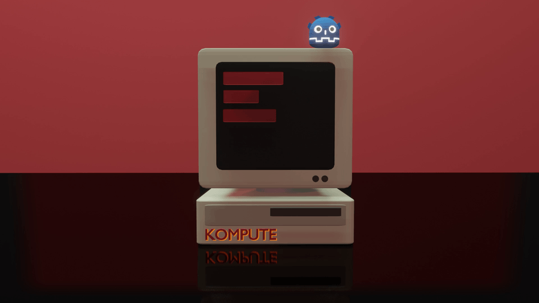
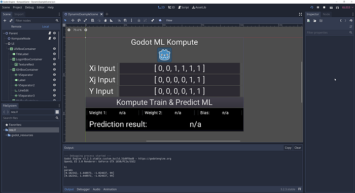
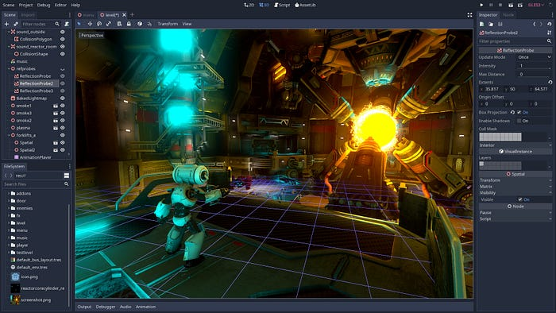
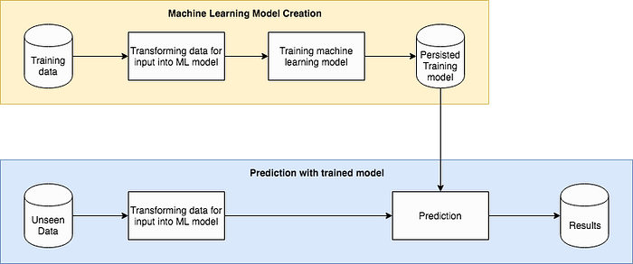
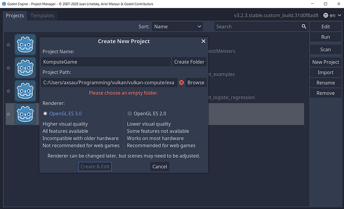
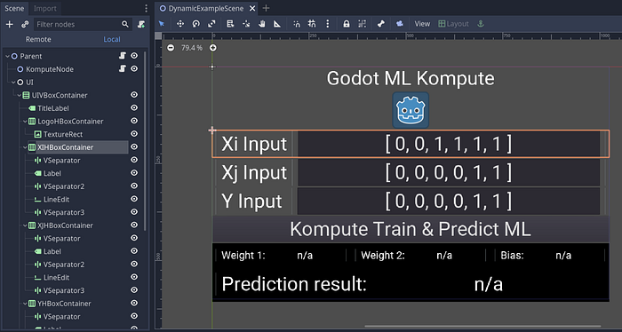
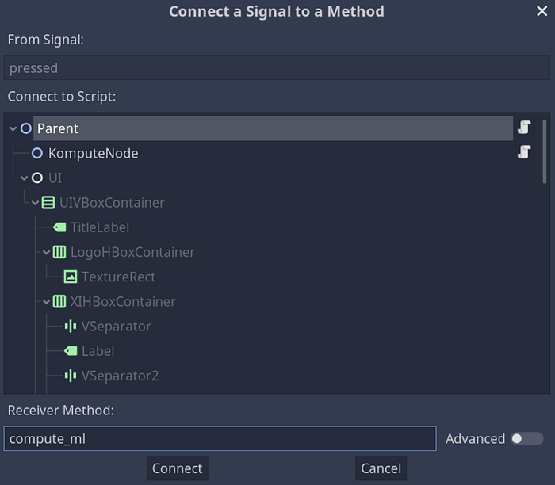
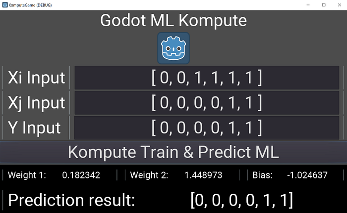
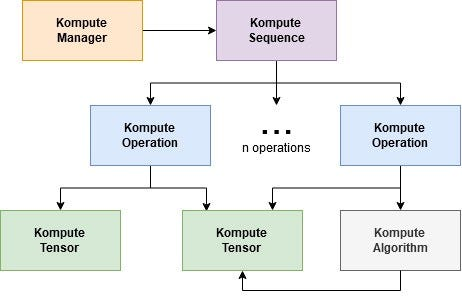
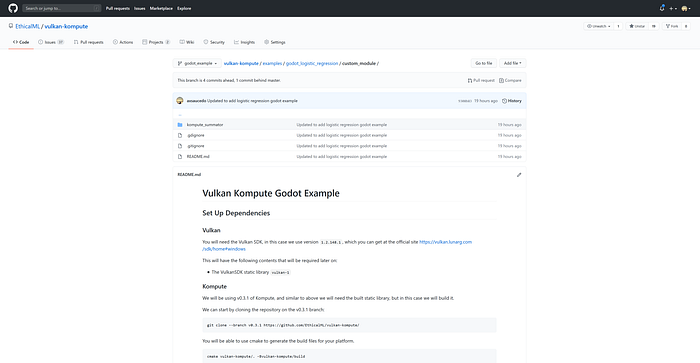

Image by Author

Recently, the world has seen various defining milestones in both, the gaming industry and the AI sector. In only a couple of weeks, we have seen major financial announcements in the gaming industry including [Unity’s $1.3 Billion IPO](https://venturebeat.com/2020/09/18/unity-technologies-raises-more-than-1-1-billion-in-ipo-at-12-1-billion-valuation/) and [Epic Games’ $1.78B Investment](https://venturebeat.com/2020/08/06/epic-games-unveils-1-78-billion-funding-round-at-17-3-billion-valuation/). The AI sector has also been catching up with its hype, reaching a [$60+ Billion Market in 2020](https://www.grandviewresearch.com/industry-analysis/artificial-intelligence-ai-market), and bringing mind blowing applications in the intersection of AI and Gaming, including [AlphaGo’s famous victory over Champion Lee Sedol](https://deepmind.com/research/case-studies/alphago-the-story-so-far), as well as deep learning powered games such as [AI Dungeon](https://play.aidungeon.io/main/landing) (and [many more applications](https://en.wikipedia.org/wiki/Artificial_intelligence_in_video_games)).

This article provides a technical deep dive into this intersection between the two fields, applied artificial intelligence and game development. We delve specifically into how you can leverage the power of the cross-vendor / mobile GPU frameworks for accelerated processing of machine learning and advanced data processing use-cases.

_Simple game interface for this tutorial (Image by Author)_

In this tutorial you’ll learn how to use the [**Kompute framework**](https://github.com/EthicalML/vulkan-kompute) to build GPU optimized code inside the popular open source [**Godot Game Engine**](https://github.com/godotengine/godot).

You will understand how machine learning and advanced GPU compute can be leveraged in game development through the Godot Game engine.

No background knowledge **beyond programming experience** is required, but if you are curious about the underlying AI / GPU compute concepts referenced, we suggest checking out our previous article, “[Machine Learning in Mobile & Cross-Vendor GPUs Made Simple With Kompute & Vulkan](https://towardsdatascience.com/machine-learning-and-data-processing-in-the-gpu-with-vulkan-kompute-c9350e5e5d3a)”.

You can find the full code in the [**example folder in the repository**](https://github.com/EthicalML/vulkan-kompute/tree/master/examples/godot_logistic_regression), together with the [**GDNative Library**](https://github.com/EthicalML/vulkan-kompute/tree/master/examples/godot_logistic_regression/gdnative_shared) implementation and the [**Godot Custom Module**](https://github.com/EthicalML/vulkan-kompute/tree/master/examples/godot_logistic_regression/custom_module) implementation.

Image from Godot [Open Source GitHub Repository](https://github.com/godotengine/godot)

With over [30k github stars and more than 1k contributors](https://github.com/godotengine/godot) Godot is the most popular OSS game engine. Godot [caters for 2D and 3D development](https://www.youtube.com/watch?v=KjX5llYZ5eQ), and has been used for a broad range of mobile, desktop, console and web compatible games / applications. Godot is built in C++ making it fast and light — it’s only [a 40MB download](https://godotengine.org/download/windows).

Godot is very intuitive for newcomers through [robust design principles](https://docs.godotengine.org/en/stable/getting_started/step_by_step/godot_design_philosophy.html), and support for [high-level languages](https://docs.godotengine.org/en/stable/getting_started/step_by_step/godot_design_philosophy.html#all-inclusive-package), including its domain-specific-language [GdScript](https://docs.godotengine.org/en/stable/getting_started/scripting/gdscript/gdscript_basics.html) which has a Python-like syntax, making it very easy to adopt. It is also possible to develop using C#, Python, Visual Scripting, C++, etc.

In this tutorial we will be building a Game using the editor, using GdScript to trigger the ML training / inference, and C++ to develop the core processing components under-the-hood.

## Enter Kompute & the Vulkan SDK

_Playing “where’s waldo” with Khronos Membership (Image by Vincent Hindriksen via [StreamHPC](https://streamhpc.com/blog/2017-05-04/what-is-khronos-as-of-today/))_

Vulkan is an Open Source project led by the [Khronos Group](https://www.khronos.org/), a consortium of a very large number of tech companies who have come together to work towards defining and advancing the open standards for mobile and desktop media (and compute) technologies.

Large number of high profile (and new) frameworks have been adopting Vulkan as their core GPU processing SDK. The Godot Engine itself is working on a major 4.0 update that will [bring Vulkan as its core rendering engine](https://godotengine.org/article/vulkan-progress-report-5).

As you can imagine, the Vulkan SDK provides very low-level access to GPUs, which allows for very specialized optimizations. This is a great asset for data processing and GPU developers — the main disadvantage is the verbosity involved, requiring 500–2000+ lines of code to only get the base boilerplate required to even start writing the application logic. This can result in expensive developer cycles and errors that can lead to larger problems. This was one of the main motivations for us to start the **Kompute**project.

[**Kompute**](https://github.com/axsaucedo/vulkan-kompute#vulkan-kompute) is a framework built on top of the Vulkan SDK, specifically designed to extend its compute capabilities as a simple to use, highly optimized, and mobile friendly General Purpose GPU computing framework.

_Kompute [Documentation](https://ethicalml.github.io/vulkan-kompute/) (Image by Author)_

Kompute was not built to hide any of the core Vulkan concepts — the core Vulkan API is very well designed. Instead it augments Vulkan’s computing capabilities with a BYOV (bring your own Vulkan) design, enabling developers by reducing boilerplate code required and automating some of the more common workflows involved in writing Vulkan applications.

For new developers curious to learn more, it provides a solid base to get started into GPU computing. For more advanced Vulkan developers, Kompute allows them to integrate it into their existing Vulkan applications, and perform very granular optimizations by getting access to all of the Vulkan internals when required. The project is fully open source, and we welcome bug reports, documentation extensions, new examples or suggestions — please feel free to [open an issue](https://github.com/axsaucedo/vulkan-kompute/issues) in the repo.

## Artificial Intelligence in Game Development

In this post we will be building upon the Machine Learning use-case we created in the “[Machine Learning in Mobile & Cross-Vendor GPUs Made Simple With Kompute & Vulkan](https://towardsdatascience.com/machine-learning-and-data-processing-in-the-gpu-with-vulkan-kompute-c9350e5e5d3a)” article. We will not be covering the underlying concepts in as much detail as in that article, but we’ll still introduce the high level intuition required in this section.

To start with, we will need an interface that allows us to expose our Machine Learning logic, which will require primarily two functions:

1. `train(…)`— function which will allow the machine learning model to learn to predict outputs from the inputs provided
2. `predict(...)`— function that will predict the output of an unknown instance. This can be visualised in the two workflows outlined in the image below.

_Data Science Process (Image by Author)_

Particularly in game development, this would also be a common pattern for machine learning workflows, for both predictive and explanatory modelling use cases. This often consists of leveraging data generated by your users as they interact directly (or indirectly) with the game itself. This data can then serve as training features for machine learning models. Training of new models can be performed through manual “offline” workflows that data scientists would carry out, or alternatively through automated triggers retraining models.

## Machine Learning Project in Godot

We will start by providing a high level overview of how our Kompute bindings will be used in our game in Godot. We will create a simple project and train the ML model we created, which will run in the GPU. In this section we will already have the custom KomputeModelML Godot class accessible — details on how to build it and import it into the godot project are covered in a latter section.

_New Project Screen (Image by Author)_

For this we are using [Godot version **3.2.3 stable**](https://godotengine.org/download). Create a new project and a new 2D scene. You should see a blank project with a top level 2D node, as per the image on the left.

Now we’ll be able to start adding resources to our game. We will start by creating a simple UI interface / menu consisting of inputs for the machine learning model that reflects the workflows covered in the previous architecture diagram.

We will have two input LineEdit text boxes for the data `X_i` and `X_j`, and one input LineEdit text box for the `Y` expected predictions. The image below shows the node structure used to build the UI. You can also access the [full godot project in the repo](https://github.com/EthicalML/vulkan-kompute/tree/godot_example/examples/godot_logistic_regression) by importing the `project.godot` file. The nodes will be referenced to read the input data and display the output predictions (and learned parameters).

We will now be able to add the GdScript code in Godot which will allow us to read the inputs, train the model and perform predictions — this script is created under the `Parent`node.

Below is the full script that we are using to perform the processing, which is using the `KomputeModelML`custom Godot class we build in the next section. We’ll break down each of the different areas of the code below.

First we define variables to make the referencing of Godot Editor nodes simpler. This can be done with the dollar sign syntax `$NODE/PATH` as implemented in the snipped below.

The `compute_ml()` function below contains the logic for the machine learning training and predictions. We start by reading the inputs from the text boxes using the Godot editor node references.

We now can create an instance from the C++ class bindings that we will be constructing in the next section. This is the class that exposes the training and prediction functions that we will be using for machine learning inference.

We now can train our model by passing the inputs and the expected predictions. The ML model underneath is [a logistic regression model](https://towardsdatascience.com/machine-learning-and-data-processing-in-the-gpu-with-vulkan-kompute-c9350e5e5d3a#6c88), which will adjust its internal parameters to fit the inputs and outputs best, resulting in a model that is then able to predict unseen datapoints.

Now that we have trained our model, we can perform predictions on unseen data-points. For simplicity, we will pass in the same inputs we used for testing, however you could pass completely new arrays and see what predictions it produces. We can then display the results in the `preds_node` reference node variable that we defined, which will show in the display.

Finally we want to also display the learned parameters, which in this case it includes `w1` , `w2` and the `bias` . We are able to display the weights and bias in the respective labels.

The final thing to set up is to connect the “Kompute Train & Predict” button into the `compute_ml` function, which can be done by setting up a signal that points to the function itself via the editor.

_Setting up the Signal to the compute_ml method in our script (Image by Author)_

Once this is all set up, we can run the Game and trigger the training and prediction using the provided inputs. We can then see the learned parameters as well as the prediction outputs. It is also possible to see how the learned parameters change as we modify the inputs `y`, `xi` and `xj`.

_Kompute ML Godot interface with resulting parameters (Image by Author)_

## Kompute ML Implementation

Now that there is an intuition on what is happening in the game level, we are able to code our underlying C++ class to create the Godot bindings using the [**Kompute framework**](https://github.com/EthicalML/vulkan-kompute).

_Kompute [Architecture Design](https://ethicalml.github.io/vulkan-kompute/overview/reference.html) (Image by Author)_

We will be following the design principles of Kompute which are outlined in this accompanying diagram showing the different components. We will be following this workflow to load the data in the GPU and perform the training.

The header file for the Godot class binding implementation is outlined below, which we will break down in detail. As you can see creating a C++ class with bindings is quite intuitive, and you can see the same functions that we used to call from our Godot GdScript above.

KomputeLogisticRegression.hpp Implementation

The initial section of the class header file includes:

- Import of the `Kompute.hpp`header containing all the Kompute dependencies that we’ll use in this project
- The top-level `Godot.hpp` import is required to ensure all Godot components are available.
- Node2D is the resource that we will be inheriting from, but you can inherit from other classes in [the inheritance tree](https://docs.godotengine.org/en/stable/development/cpp/inheritance_class_tree.html) depending on how you plan to use your custom Godot class
- For data passing across the application, we will be using a Godot `Array` which will handle transfer between GdScript and the Naive C++, as well as a Kompute `Tensor` which will handle the GPU data management.
- The GODOT_CLASS macro definition extends the class by adding extra Godot related functionality. As we will see below, you will need to use GDCLASS instead when building as a Godot custom module.

Following the base functionality, we have to define the core logic:

- `void train(Array y, Array xI, Array xJ)` —Trains the machine learning model using the GPU native code for the logistic regression model. It takes the input array(s) `X`, and the array `y`containing the expected outputs.
- `Array predict(Array xI, Array xJ)` —Perform the inference request. In this implementation it is not using GPU code as generally there tends to be less performance gains through parallelization on the inference side. However there are still expected performance gains if multiple inputs are processed in parallel (which this function allows for).
- `Array get_params()` —Returns an array containing the learned parameters in the format of `[ <weight_1>, <weight_2>, <bias> ]`.

We then are able to declare the methods that will be bound between the C++ and the high level GdScript Godot Engine, and accessible to the editor and broader Game in general. We’ll look briefly below at the code required to register a function.

For data management we will be using Kompute tensors as well as Arrays — in this case we will only need to “learn” and “persist” the weights and biases of our logistic regression model.

Finally, we also define the shader code, which is basically [the code that will be executed as machine code inside of the GPU](https://en.wikipedia.org/wiki/OpenGL_Shading_Language). Kompute allows us to pass a string containing the code, however for production deployments it is possible to convert the shaders to binary, and also use the utilities available to convert into header files.

If you are interested in the full implementation you can find all the files in the [gdnative implementation](https://github.com/EthicalML/vulkan-kompute/tree/godot_example/examples/godot_logistic_regression/gdnative_shared) and [custom module](https://github.com/EthicalML/vulkan-kompute/tree/godot_example/examples/godot_logistic_regression/custom_module) implementation folders. Furthermore if you are interested in the theoretical and underlying foundational concepts of these techniques, this is covered fully in [our previous post](https://towardsdatascience.com/machine-learning-and-data-processing-in-the-gpu-with-vulkan-kompute-c9350e5e5d3a#6c88).

## Compiling and Integrating into Godot

Now that we have the base code for our GPU optimized machine learning model, we are now able to proceed to running it in our Godot game engine. There are two main ways in which Godot allows us to add C++ code into our projects:

1. [**GdNative Library Build Instructions**](https://github.com/EthicalML/vulkan-kompute/tree/godot_example/examples/godot_logistic_regression/gdnative_shared)— In Godot you can add your own “GdNative scripts” which are basically C++ classes with bindings to GdScript, which means these can be used and referenced dynamically in the project. This approach works with the standard Godot installation and doesn’t require re-compiling the full editor like the 2nd option.
2. [**Custom Module**](https://github.com/EthicalML/vulkan-kompute/tree/godot_example/examples/godot_logistic_regression/custom_module)[**Build Instructions**](https://github.com/EthicalML/vulkan-kompute/tree/godot_example/examples/godot_logistic_regression/gdnative_shared)— In Godot only the underlying core classes are part of the “core” components; everything else — the UI, the editor, the GdScript language, the networking capabilities — are custom models. Writing a custom module is easy, and this is how we are able to expose some of the core Kompute functionality. This option requires the **full Godot C++ project to be recompiled** with the custom module.

Once you set one of these methods through the instructions, you will be able to access the custom object from within Godot. There are some nuanced implementation differences between each approach.

We won’t be covering specific build details in the blog post, but you will be able to find the exact code and build instructions in the GdNative Library / Custom Module links above.

## What’s next?

Congratulations, you’ve made it all the way to the end! Although there was a broad range of topics covered in this post, there is a massive amount of concepts that were skimmed through. These include the underlying Vulkan concepts, GPU computing fundamentals, machine learning best practices, and more advanced Kompute concepts. Luckily, there are resources online to expand your knowledge on each of these. Here are some links I recommend for further reading:

- “[Machine Learning in Mobile & Cross-Vendor GPUs Made Simple With Kompute & Vulkan](https://towardsdatascience.com/machine-learning-and-data-processing-in-the-gpu-with-vulkan-kompute-c9350e5e5d3a)” article with a deeper dive in theory and concepts
- [Kompute Documentation](https://axsaucedo.github.io/vulkan-kompute/) for more details and further examples
- [The Machine Learning Engineer Newsletter](https://ethical.institute/mle.html) if you want to keep updated on articles around Machine Learning
- [Awesome Production Machine Learning](https://github.com/EthicalML/awesome-production-machine-learning/) list for open source tools to deploy, monitor, version and scale your machine learning
- [Introduction to ML for Coders course](https://www.fast.ai/2018/09/26/ml-launch/) by FastAI to learn further machine learning concepts
- [Vulkan SDK Tutorial](https://vulkan-tutorial.com/) for a deep dive into the underlying Vulkan components
