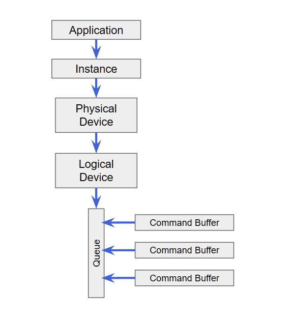
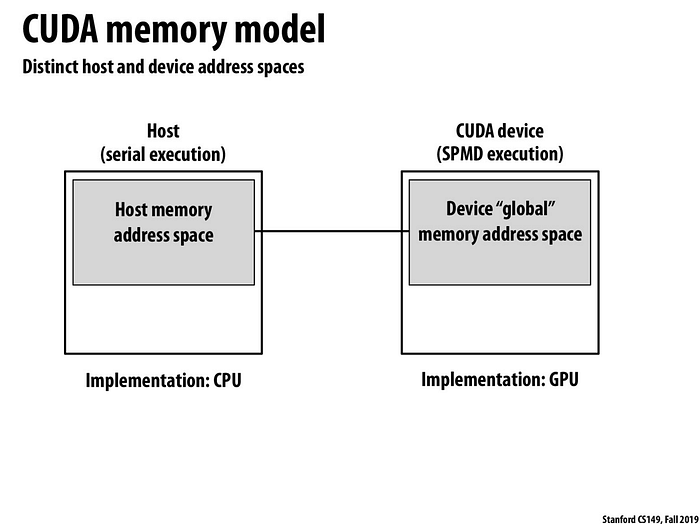
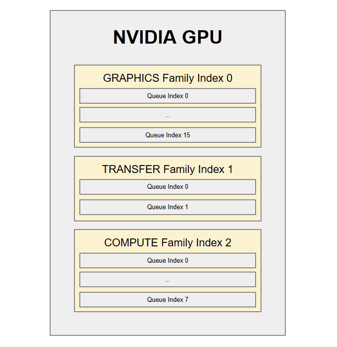
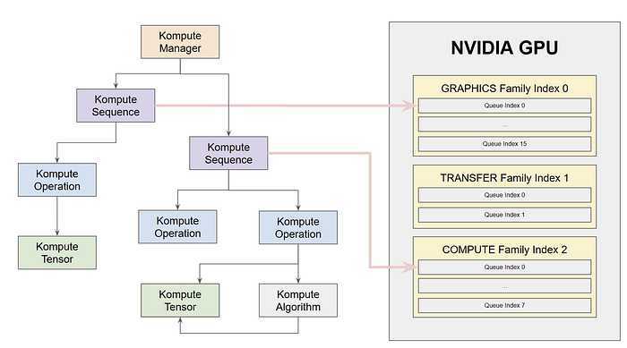

GPUs have proven [extremely useful for highly parallelizable data processing use-cases](https://arxiv.org/abs/1802.09941). The computational paradigms found in machine learning & deep learning for example fit extremely well to [the processing architecture graphics cards provide](http://cs149.stanford.edu/fall19/lecture/gpuarch/).

However, when it comes to multiple GPU workloads, one would assume that these would be processed concurrently, but this is not the case. Whilst a single GPU compute workload is parallelized across the numerous GPU cores, multiple workloads are run one by one sequentially. That is of course **until recent improvements in graphics card architectures**which are now enabling for hardware parallelization across multiple workloads. This can be achieved by submitting the workloads to different underlying physical GPU “queue families” that support concurrency. Practical tecniques in machine learning that would benefit from this include [model parallelism](https://mxnet.apache.org/versions/1.7/api/faq/model_parallel_lstm) and [data parallelism](https://en.wikipedia.org/wiki/Data_parallelism).

In this example we will show how we can achieve **a 2x performance improvement** on a synchronous example by simply submitting multiple workloads across two queue families, resulting in these workloads running in parallel.

This is an important optimization technique, as recent announcements outlined in NVIDIA’s Ampere GA10x architecture specifications [page 19 in this document](https://www.nvidia.com/content/dam/en-zz/Solutions/geforce/ampere/pdf/NVIDIA-ampere-GA102-GPU-Architecture-Whitepaper-V1.pdf) will enable for **3x performance improvements**(i.e. concurrency across one graphics queue and two compute queues)**,** making it clear that this trend will only continue to bring further optimization improvements in this area.

We will be implementing this using Vulkan and the [Kompute framework](https://github.com/EthicalML/vulkan-kompute). More specifically we will cover:

- Disambiguation of “asynchronous” and “parallel” in GPU processing
- A base synchronous example that we will build upon
- Steps to extend the example for asynchronous workload submission
- Steps to extend the example for parallel multi-queue GPU processing

You can find the [**full code in this file**](https://github.com/EthicalML/vulkan-kompute/blob/0b221c9ebd3c8d7c8a81ef2ce80627c9460ec9c2/test/TestAsyncOperations.cpp#L10) — instructions on how to run the full suite using CMAKE can be found in the [main Kompute repository build section](https://github.com/EthicalML/vulkan-kompute#build-overview).

## About Vulkan and Kompute


_Khronos Membership (Image by Vincent Hindriksen via [StreamHPC](https://streamhpc.com/blog/2017-05-04/what-is-khronos-as-of-today/))_

[**The Vulkan SDK**](<https://en.wikipedia.org/wiki/Vulkan_(API)>)is an Open Source project led by the [**Khronos Group**](https://www.khronos.org/), which enables for highly optimized cross-vendor/cross-platform GPU processing.

[**Kompute**](https://github.com/axsaucedo/vulkan-kompute#vulkan-kompute) is a framework built on top of the Vulkan SDK which abstracts the thousands of lines of boilerplate code required, introducing best practices that expose Vulkan’s core computing capabilities. Kompute is the [GPGPU computing framework](https://en.wikipedia.org/wiki/General-purpose_computing_on_graphics_processing_units) that we will be using in this tutorial to build the core asynchronous and parallel code implementation.


_The “Komputer” from [Kompute Repo](https://github.com/EthicalML/vulkan-kompute) (Image by Author)_

## Asynchronous vs Parallel Processing

Before diving into the code, it is important to disambiguate two concepts — **asynchronous workload submission** and **parallel workload processing**.



_Simplified Vulkan Architecture (Image by Author)_

The way parallel workloads are submitted for processing when using the **Vulkan SDK**through **GPU Queues**. This can be visualised in the simplified Vulkan Architecture diagram (pipeline and descriptor components were left out for simplicity).

### Asynchronous Workload Submission

Asynchronous processing encompasses the ability for the CPU host side to be able to do other work whilst the GPU is processing the workload. “Other work” can include calling other C++ functions, or even submitting further workloads to the same or other GPU queues. When the CPU wants to check whether the GPU workload is finished, it can use a **Vulkan “Fence”**which is basically a semaphore resource that allows the CPU to be notified when a GPU workload finishes.

It is important to note that when multiple workloads are submitted to the same queue, even if these are done from multiple C++ threads, the expected execution ordering will still be sequential — at least as of today’s GPU architectures.

### Parallel Workload Processing

Parallel workload processing consists of the concurrent execution of two or more workloads by the GPU. More specifically, if you had two GPU tasks that would take 10 seconds each to process, the theoretical parallel execution would still take 10 seconds for both as they would be carried out at the same time.

In order for parallel workload processing to be achieved, this is something that first and foremost has to be supported by the underlying GPU. The reason why this is important is because even if you were to submit workloads across different GPU queues, the processing may still be done sequentially by the underlying hardware based on its limitations.

## Base Sequential Processing Example

We will now take a look at the code that we will be using throughout this article. This first version of the code will be the sequential flow — we will be able to then convert it into asynchronous code, and finally into parallel code. We will basically be running a workload where we will be doing the following:

1. Creating a Kompute Manager to orchestrate all GPU work
2. Create Kompute Tensors in the CPU host that will be used to process data
3. Map the Kompute Tensors into GPU Device memory
4. Define compute shader which will keep the GPU busy for a few 100s ms
5. Run compute shader in the GPU using the Tensors for data processing
6. Map results of the Kompute Tensors back into CPU Host memory
7. Verify that the operation was successful

For measuring time we will be using `<chrono>` from the standard library. We will be mainly using it to calculate the difference across a start and end time retrieved with `std::chrono::high_resolution_clock::now()` as follows:

```cpp
int main() {
    auto startSync = std::chrono::high_resolution_clock::now();

    // ... code implementation

    auto end = std::chrono::high_resolution_clock::now();
    auto durationSync =
      std::chrono::duration_cast<std::chrono::microseconds>(
        end - start).count();
}
```

You can find the [runnable code in this file](https://github.com/EthicalML/vulkan-kompute/blob/1053cde1f0d27799f0d7dbd8043919656498f8bf/test/TestAsyncOperations.cpp#L8), which is part of the Kompute test suite.

### 1. Creating a Kompute Manager to orchestrate all GPU work

First we have to create the Kompute Manager, which performs all the required memory management and creates all required Vulkan resources. By default the Kompute Manager will pick GPU Device 0, but you are able to pass the specific device index you would prefer to initialise with, and if preferred you can pass your Vulkan resources if you already have a Vulkan application.

```cpp

int main()
{
    // ... previous code blocks

    kp::Manager mgr; // Selects device 0 and first compute queue unless explicitly requested

    // ... latter code blocks
```

### 2. Create the Kompute Tensors in CPU host that will be used to process data

We will now be able to create a set of Kompute Tensors. We first initialise the data in the CPU Host, consisting of an array of zeros with length of 10. We will be using two tensors as we’ll be running two algorithm executions. We will be able to check these Kompute Tensors at the end to confirm that the execution has been successful.

```cpp

int main()
{
    // ... previous code blocks

    std::vector<float> zeros(10, 0);

    // 1. Create a set of data tensors in host memory for processing
    auto tensorA = std::make_shared<kp::Tensor>(kp::Tensor(zeros));
    auto tensorB = std::make_shared<kp::Tensor>(kp::Tensor(zeros));

    // ... latter code blocks
```

### 3. Map the Kompute Tensors into GPU Device memory



**Stanford CS149 Course**[**2019 Slides**](http://cs149.stanford.edu/fall19/lecture/gpuarch/slide_038)

We are now able to copy the host data of the Kompute Tensors into the GPU Device memory.

```cpp

int main()
{
   // ... previous code blocks

    mgr.evalOpDefault<kp::OpTensorCreate>({ tensorA, tensorB });

    // ... latter code blocks
```

This is an important step as by default the Kompute Tensors use device-only-visible memory which means that a GPU operation will need to copy it with a staging tensor.

Kompute allows us to create the buffer and GPU memory block, as well as performing a copy with a staging buffer through the `kp::OpTensorCreate` operation.

### 4. Define compute shader which will keep the GPU busy for a few 100s ms

The compute shader that we create has a relatively large loop to simulate an “expensive computation”. It basically performs a unit addition for `100000000` iterations and adds the result to the input Tensor.

```cpp

int main()
{
    // ... previous code blocks

    std::string shader(R"(
        #version 450
        layout (local_size_x = 1) in;
        layout(set = 0, binding = 0) buffer b { float pb[]; };

        shared uint sharedTotal[1];

        void main() {
            uint index = gl_GlobalInvocationID.x;

            sharedTotal[0] = 0;
            for (int i = 0; i < 100000000; i++)
            {
                atomicAdd(sharedTotal[0], 1);
            }

            pb[index] = sharedTotal[0];
        }
    )");

    // ... latter code blocks
```

### 5. Run compute shader in the GPU using the Tensors for data processing

Now we are able to submit the compute shader for execution through the `kp::OpAlgoBase` operation. This basically allows us to perform a submission of the shader with the respective tensor. This initial implementation runs the execution synchronously, so it will first run the execution of the shader with `tensorA`, and then the execution of the same shader with `tensorB`.

```cpp

int main()
{
    // ... previous code blocks

    mgr.evalOpDefault<kp::OpAlgoBase<>>(
        { tensorA },
        std::vector<char>(shader.begin(), shader.end()));

    mgr.evalOpDefault<kp::OpAlgoBase<>>(
        { tensorB },
        std::vector<char>(shader.begin(), shader.end()));

    // ... latter code blocks
```

### 6. Map results of the Kompute Tensors back into CPU Host memory

Finally we want to retrieve the results from the GPU device memory into the CPU host memory so we can access it from C++. For this we can use the `kp::OpTensorSync` operation.

```cpp

int main()
{
  // ... previous code blocks

    mgr.evalOpDefault<kp::OpTensorSyncLocal>({ tensorA, tensorB });

    // ... latter code blocks
```

### 7. Verify that the operation was successful

Finally we can just check that both resulting `kp::Tensor` contain the expected value of `100000000`.

```cpp

int main()
{
    // ... previous code blocks

    std::vector<float> expected(10, 100000000)
    EXPECT_EQ(inputsSyncB[i]->data(), expected);

}
```

## Extending for Asynchronous Workload Submission

The steps that we will need to extend for asynchronous submission in this case are quite minimal. The only thing we need to do is to substitute the `evalOpDefault` function for the `evalOpAsyncDefault` function, and then using the `evalOpAwaitDefault(<timeInNanoSecs>)` to wait until the job is finished. This basically would look as follows:

```cpp

int main()
{
    // ... previous code blocks

    mgr.evalOpAsyncDefault<kp::OpAlgoBase<>>(
      { tensorB },
      std::vector<char>(shader.begin(), shader.end()));

    mgr.evalOpAsyncDefault<kp::OpAlgoBase<>>(
      { tensorA },
      std::vector<char>(shader.begin(), shader.end()));

    mgr.evalOpAwaitDefault();

    // ... latter code blocks
```

As you can see we are able to submit two tasks for processing asynchronously, and then wait until they are finished with the Await function.

It’s worth pointing out that every time we call `evalOpAsyncDefault` it creates a new managed sequence, and `evalOpAwaitDefault` only waits for the most recent default sequence. This means that in the snippet above, we are only waiting for the second asynchronous operation. This isn’t a problem for our example, but this could introduce bugs if we’re now aware. The proper way to do this is with explicitly created “named sequences” — we will do this in the next section.

## Extending for Parallel Workload Processing

Now that we know we are able to execute multiple workloads asynchronously, we are able to extend this to leverage the multiple queues in the GPU to achieve parallel execution of workloads.

### Running on an NVIDIA 1650 Video Card

In order to show a useful example, we will dive into how this would be achieved in an [NVIDIA 1650 video card](http://vulkan.gpuinfo.org/displayreport.php?id=9700). You are able to try this yourself by checking the device report of your video card — namely on the queue families and parallel processing capabilities available.



_Conceptual Overview of Queues in NVIDIA 1650 (Image by Author)_

The NVIDIA 1650 GPU has 3 queue families. Using `G` for GRAPHICS, `T` for TRANSFER and `C` for COMPUTE capabilities, the NVIDIA 1650 has a `G+T+C` family in `familyIndex 0`with 16 queues, a `T` family on `familyIndex 1` with 2 queues, and a `T+C` family on `familyIndex 2` with 8 queues.

As of today (October 2020), NVIDIA does not support parallel processing of workloads when work is submitted across multiple queues within the same family. However it supports parallelizing when workloads are submitted across queue families. This means that workloads between graphics and compute family queues can be parallelized — we will be using this knowledge in our implementation.

### Implementation of Parallel Workflow Execution

So far we have been submitting all GPU workloads to a single queue, namely the GRAPHICS `familyIndex 0` using the underlying queue index 0. In our case using the GPU 1650, we will be able to achieve parallel processing if we submit workloads across the GRAPHICS family and the COMPUTE family. The diagram below should provide an intuition on what we will be doing.



_Operation Execution in Parallel through Multiple Family Queues (Image by Author)_

In order for us to do this, we will need to modify three key things:

1. We initialise Kompute Manager with the respective queues available
2. We create two Kompute Sequences with each respective queue allocated
3. We run the operations on each respective queue

We will dive into each of these three points.

### 1. We initialise Kompute Manager with the respective queues available

When initialising a manager we are able to pass an array containing the queues that we would like to fetch. In this case, we only fetch one graphics queue and one compute queue, however, based on the hardware specs of the NVIDIA 1650, we would be able to request up to 16 graphics queues (familyIndex 0), 2 transfer queues (familyIndex 1), and 8 compute queues (familyIndex 2).

```cpp

int main()
{
    // ... previous code blocks

    uint32_t deviceId(0);
    std::vector<uint32_t> queues({ 0, 2 });

    kp::Manager mgr(deviceId, queues);

    // ... latter code blocks
```

### 2. We create two Kompute Sequences with each respective queue allocated

Now we are able to explicitly initialise two managed sequences, each allocated to a different queue, referencing the index of the array we passed in the previous step.

```cpp

int main()
{
    // ... previous code blocks

    // The index is relative to the array we used to initialise
    mgr.createManagedSequence("graphicsQueueSequence", 0);
    mgr.createManagedSequence("computeQueueSequence", 1);

    // ... latter code blocks
```

### 3. We run the operations on each respective queue

Now we are able to run operations submitting to each respective queue. In this case both of the GPU workloads are submitted in parallel.

```cpp

int main()
{
    // ... previous code blocks

    mgrAsync.evalOpAsync<kp::OpAlgoBase<>>(
      { tensorA },
      "graphicsQueueSequence",
      std::vector<char>(shader.begin(), shader.end()));

    mgrAsync.evalOpAsync<kp::OpAlgoBase<>>(
      { tensorB },
      "computeQueueSequence",
      std::vector<char>(shader.begin(), shader.end()));

    mgrAsync.evalOpAwait("graphicsQueueSequence");
    mgrAsync.evalOpAwait("computeQueueSequence");

    // ... latter code blocks
```

## Parallel Workload Execution Results

When running the code provided above, we can see a 2x speed improvement in execution time thanks to the parallel family queue submission of workload. You can also see that if we were to submit to extra queues from the GRAPHICS or COMPUTE queues, we would not see any further speed improvements as intra-queue parallelization is not supported in this NVIDIA 1650 card.

You can find the full code and run it in this file — instructions on how to run [the full suite](https://github.com/EthicalML/vulkan-kompute/blob/0b221c9ebd3c8d7c8a81ef2ce80627c9460ec9c2/test/TestAsyncOperations.cpp#L10) using CMAKE can be found in the [main Kompute repository](https://github.com/EthicalML/vulkan-kompute).

This is a particularly important result, as based on the recent announcement from NVIDIA coming together with the release of their 300x video cards, there are improvements via the Ampere GA10x architecture that allows for two compute workloads simultaneously. Relative to the example above, this means that we could see a 3x improvement if we were to use one GRAPHICS queue and two COMPUTE queue (together with the extra performance using the TRANSFER queue for transfer operations).

## Next Steps

Congratulations, you’ve made it all the way to the end! Although there was a broad range of topics covered in this post, there is a massive amount of concepts that were skimmed through. These include the underlying Vulkan concepts, GPU computing fundamentals, and more advanced Kompute concepts. Luckily, there are resources online to expand your knowledge on each of these. Here are some links I recommend for further reading:

- “[Machine Learning in Mobile & Cross-Vendor GPUs Made Simple With Kompute & Vulkan](https://towardsdatascience.com/machine-learning-and-data-processing-in-the-gpu-with-vulkan-kompute-c9350e5e5d3a)” article with a deeper dive in theory and concepts
- [Kompute Documentation](https://axsaucedo.github.io/vulkan-kompute/) for more details and further examples
- [Machine Learning in Mobile & Cross-Vendor GPUs Made Simple With Kompute & Vulkan](https://towardsdatascience.com/machine-learning-and-data-processing-in-the-gpu-with-vulkan-kompute-c9350e5e5d3a)
- [Supercharging your Mobile Apps with GPU Accelerated Machine Learning using the Android NDK & Kompute](https://towardsdatascience.com/gpu-accelerated-machine-learning-in-your-mobile-applications-using-the-android-ndk-vulkan-kompute-1e9da37b7617)
- [GPU Accelerated ML using the Godot Engine and Kompute](https://towardsdatascience.com/supercharging-game-development-with-gpu-accelerated-ml-using-vulkan-kompute-the-godot-game-engine-4e75a84ea9f0)
- [Vulkan SDK Tutorial](https://vulkan-tutorial.com/) for a deep dive into the underlying Vulkan components
