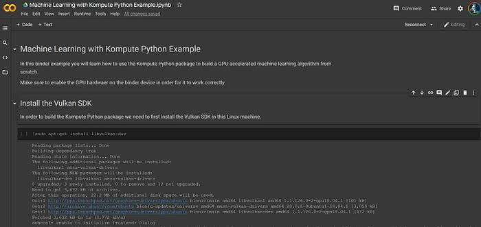
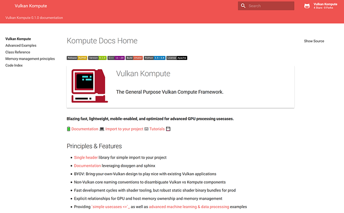
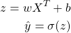
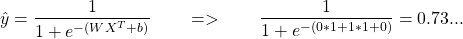
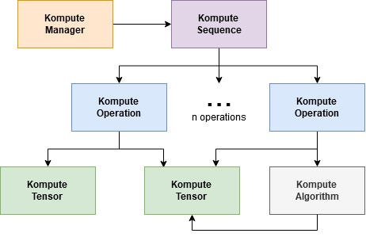

Machine learning algorithms — together with many other advanced data processing paradigms — fit incredibly well to the parallel-architecture that GPU computing offers. This has driven massive growth in the advancement and adoption of graphics cards for accelerated computing in recent years. This has also driven exciting research around techniques that optimize towards concurrency, such as [model parallelism](https://mxnet.apache.org/versions/1.7/api/faq/model_parallel_lstm.html) and [data parallelism](https://en.wikipedia.org/wiki/Data_parallelism).

In this article you’ll learn how to write your own GPU accelerated algorithms in Python, which you will be able to run on virtually any GPU hardware — including non-NVIDIA GPUs. We’ll introduce core concepts and show how you can get started with the [**Kompute Python framework**](https://github.com/axsaucedo/vulkan-kompute#vulkan-kompute)**with**only a handful of lines of code.


**Ben-Nun, Tal, and Torsten Hoefler. “Demystifying parallel and distributed deep learning: An in-depth concurrency analysis.” _ACM Computing Surveys (CSUR)_ 52.4 (2019): 1–43.**

First we will be building a simple GPU Accelerated Python script that will multiply two arrays in parallel which this will introduce the fundamentals of GPU processing. We will then write a Logistic Regression algorithm from scratch on the GPU. Below are the core topics that we will cover, together with the respective resource links:

1. [Kompute python package](https://pypi.org/project/kp/) Installation
2. GPU Accelerated [Array Multiplication Example](https://github.com/EthicalML/vulkan-kompute/blob/master/python/test/test_array_multiplication.py) in Python
3. GPU Accelerated [Logistic Regression Example](https://github.com/EthicalML/vulkan-kompute/blob/master/python/test/test_logistic_regression.py) in Python

Only **basic programming experience** is required for anyone reading this article, no knowledge of GPU computing is required. You can find the full code in the [**main repository**,](https://github.com/EthicalML/vulkan-kompute) and we also created an online Google Colab Notebook where you’ll be able to run the example with a GPU for free — you can find it in [**this link**](https://github.com/EthicalML/vulkan-kompute/tree/master/examples/python).



Google Colab Notebook with Examples for GPU

## Enter Kompute & the Vulkan SDK

There are two parts to the Python framework we will be using today, both which are in the name itself —the **Vulkan SDK**, and **Kompute**.


_Playing “where’s waldo” with Khronos Membership (Image by Vincent Hindriksen via [StreamHPC](https://streamhpc.com/blog/2017-05-04/what-is-khronos-as-of-today/))_

The **Vulkan**SDK is an Open Source project led by the [Khronos Group](https://www.khronos.org/), a consortium consisting of numerous tech companies that have come together to work towards defining and advancing the open standards for mobile and desktop media (and compute) technologies.

A large number of high profile (and new) machine learning frameworks such as Google’s [Tensorflow](https://github.com/tensorflow/tensorflow), Facebook’s [Pytorch](https://github.com/pytorch/pytorch), Tencent’s [NCNN](https://github.com/Tencent/ncnn), Alibaba’s [MNN](https://github.com/alibaba/MNN)—between others — have been adopting Vulkan as their core cross-vendor GPU computing SDK. This is primarily to enable the frameworks for cross platform and cross vendor graphics card support.

As you can imagine, the Vulkan SDK provides very low-level C / C++ access to GPUs, which allows for very specialized optimizations. This is a great asset for GPU computing— the main disadvantage is the verbosity involved, requiring 500–2000+ lines of C++ code to only get the base boilerplate required to even start writing the application logic. This can result in expensive developer cycles and errors that can lead to larger problems. This was one of the main motivations for us to start the **Kompute**project.

[**The Kompute Python package**](https://github.com/EthicalML/vulkan-kompute#vulkan-kompute) is built on top of the Vulkan SDK through optimized C++ bindings, which exposes Vulkan’s core computing capabilities. Kompute is the Python [GPGPU framework](https://en.wikipedia.org/wiki/General-purpose_computing_on_graphics_processing_units) that we will be using in this tutorial to build the GPU Accelerated machine learning algorithms.



_Kompute [Documentation](https://ethicalml.github.io/vulkan-kompute/) (Image by Author)_

## Installing the Python Kompute Package

In order for us to start using the Kompute Python Package we will need to install its required dependencies. The package is available in Pypi, which means we can install it with `pip install`. You will however require the following key components installed on your machine before being able to use it:

- CMAKE v3.41+ (install in [Windows](https://tulip.labri.fr/TulipDrupal/?q=node%2F1081), [Linux (Ubuntu)](https://vitux.com/how-to-install-cmake-on-ubuntu-18-04/), [Mac](https://stackoverflow.com/a/59825656/1889253))
- Vulkan SDK installed via [official website](https://vulkan.lunarg.com/sdk/home)
- C++ compiler (eg. gcc for linux / mac, MSVC for Windows)

Once you have these dependencies installed, you can simply run:

- `pip install kp==0.5.1`

You should now see a success message confirming that the Kompute Python package has been installed. You can try it out yourself in the Google Colab Notebook [provided in the repository](https://github.com/EthicalML/vulkan-kompute/tree/master/examples/python), which you can set up with a GPU.

## Writing your first Kompute: GPU Multiplication

To build our first simple array-multiplication GPU computing application using Kompute, we will write a simple python program that will do the following:

1. Create a Kompute Manager (selects device 0 by default)
2. Create Kompute Tensors to hold data (two input one output)
3. Initialise the Kompute Tensors in the GPU
4. Define the code to run on the GPU
5. Dispatch GPU shader execution against Kompute Tensors
6. Use Kompute Operation to map GPU output data into local Tensors
7. Print your results

The full Python code required is quite minimal, so we are able to show the full script below. We’ll break down each of the sections in more detail.

```python
import kp
import pyshader as ps

# 1. Create Kompute Manager (selects device 0 by default)
mgr = kp.Manager()

# 2. Create Kompute Tensors to hold data
tensor_in_a = kp.Tensor([2, 2, 2])
tensor_in_b = kp.Tensor([1, 2, 3])
tensor_out = kp.Tensor([0, 0, 0])

# 3. Initialise the Kompute Tensors in the GPU
mgr.eval_tensor_create_def([tensor_in_a, tensor_in_b, tensor_out])

# 4. Define the multiplication shader code to run on the GPU
@ps.python2shader
def compute_shader_multiply(index=("input", "GlobalInvocationId", ps.ivec3),
                            data1=("buffer", 0, ps.Array(ps.f32)),
                            data2=("buffer", 1, ps.Array(ps.f32)),
                            data3=("buffer", 2, ps.Array(ps.f32))):
    i = index.x # Fetch the current run index being processed
    data3[i] = data1[i] * data2[i] # Perform multiplication

# 5. Dispatch algorithm execution against Kompute Tensors
mgr.eval_algo_data_def(
  [tensor_in_a, tensor_in_b, tensor_out],
  compute_shader_multiply.to_spirv())

# 6. Sync tensor data from GPU back to local
mgr.eval_tensor_sync_local_def([tensor_out])

# 7. Print results
print(tensor_out.data()) # prints [2.0, 4.0, 6.0]
```

### 1. Create a Kompute Manager (selects device 0 by default)

First, we’ll create our Kompute Manager, which is in charge of creating and managing all the underlying Vulkan resources.

```python
# ...previous code blocks

mgr = kp.Manager()

# ...latter code blocks
```

As you can see, here we are initializing our Kompute Manager, which by default creates all the base Vulkan resources on Device 0 (in my case it’s an NVIDIA card, and Device 1 is my integrated graphics card). For more advanced use-cases it’s also possible to provide the underlying GPU queues that you’d like to load — in [this other tutorial](https://towardsdatascience.com/parallelizing-heavy-gpu-workloads-via-multi-queue-operations-50a38b15a1dc) we show how this can lead to significant speedups, but this is outside of scope of this article.

### 2. Create Kompute Tensors to hold data (two input one output)

We will now create the Kompute Tensors that will be used for input and output. These will hold the data required which will be mapped into the GPU to perform this simple multiplication.

```python
# ...previous code blocks

tensor_in_a = kp.Tensor([2, 2, 2])
tensor_in_b = kp.Tensor([1, 2, 3])
tensor_out = kp.Tensor([0, 0, 0])

# ...latter code blocks
```

When the tensors are created, the data is only initialized in the local CPU memory (aka RAM), but in order to use it in the GPU we’ll have to map the data into the GPU memory.

### 3. Initialise the Kompute Tensors in the GPU

Now that we have our Tensors created with local data, we will map the data into the GPU. For this we will use the `eval_tensor_create_def`, which will initialize the underlying Vulkan buffer and GPU memory, and perform the respective mapping into the GPU.

```python
# ...previous code blocks

mgr.eval_tensor_create_def([tensor_in_a, tensor_in_b, tensor_out])

# ...latter code blocks
```

### 4. Define the code to run on the GPU

Now that we’ve initialized the necessary Kompute Tensor components and they are mapped in GPU memory, we can add the Kompute Algorithm that will be executed in the GPU. This is referred to as the “shader” code, which we build using the `pyshader`library. You can see the full shader code below, and we’ll break down each of the section below.

```python
# ...previous code blocks

@ps.python2shader
def compute_shader_multiply(index=("input", "GlobalInvocationId", ps.ivec3),
                            data1=("buffer", 0, ps.Array(ps.f32)),
                            data2=("buffer", 1, ps.Array(ps.f32)),
                            data3=("buffer", 2, ps.Array(ps.f32))):
    i = index.x # Fetch the current run index being processed
    data3[i] = data1[i] * data2[i]

# ...latter code blocks
```

The GPU shader code can be defined as a Python function with the decorator `@ps.python2shader` , and the parameters in this case include the variables that we’ll be using. This includes the Tensor inputs and outputs that we’ll be processing — the parameter format is the following:

- `<param≥=(“<memory>”, <binding>, <type>, ...)`

In this case we are using Tensors with float values, which inherently would be equivalent to the `ps.Array` value, with `ps.f32` float values as elements.

The first parameter `index` is of type `GlobalInvocationId` , and provides the shader with the current index location in the execution GPU dispatch structure. This is what allows us to know what index in the parallel execution loop we are currently running, which is what we extract from the component `i = index.x` — the reason why here we select `x` is because the execution index can be defined as a `vec3` component, where there would be execution indices for `inedx.x` , `index.y` and `index.z` .

The final component is the actual equation used, which in this case is a simple multiplication of the first and second parameter, and stored in the output (third) parameter.

### 5. Dispatch GPU shader execution against Kompute Tensors

In order to run the shader above we will use the `eval_algo_data_def`function. The parameters required for this Kompute Operation includes the Tensors to bind into the GPU instructions, as well as the GPU shader code that we defined in the Python function above.

```python
# ...previous code blocks

mgr.eval_algo_data_def(
  [tensor_in_a, tensor_in_b, tensor_out],
  compute_shader_multiply.to_spirv())

# ...latter code blocks
```

It’s worth mentioning that Kompute allows the user to also pass the shader as a raw glsl string, or alternatively a file path to a SPIR-V binary or raw glsl/hlsl file. For context, [SPIR-V is the intermediate representation](https://www.khronos.org/opengl/wiki/SPIR-V) that GPUs can use to process relevant operations.

### 6. Use Kompute Operation to map GPU output data into local Tensors

Once the algorithm runs successfully, the result data will now be we held in the GPU memory of our output tensor. We can now use the function `eval_tensor_sync_local_def` to sync the Tensor GPU memory into the local tensor.

```python
# ...previous code blocks

mgr.eval_tensor_sync_local_def([tensor_out])

# ...latter code blocks
```

### 7. Print your results

Finally, we can print the output data of our tensor.

```python
# ...previous code blocks

print(tensor_out.data()) # prints [2.0, 4.0, 6.0]

# ...latter code blocks
```

When you run this, you will see the values of your output tensor printed. That’s it, you’ve written your first Kompute!

Although it may not seem obvious, the above introduced some intuition around core concepts and design thinking in GPU computing, whilst still abstracting a couple of the more in-depth concepts. In the following sections we will be providing more concrete terminology and at the end we’ll also outline a set of articles to dive into if you’re interested to learn more.

## Diving into the Machine Learning intuition

Now we’ll look into the more advanced GPU compute use-case, specifically implementing the “hello world of machine learning”: **logistic regression**. Before we cover the implementation we will provide some intuition on the concepts and the terminology that we’ll be using throughout the following sections.

In machine learning we always have two stages, training and inference. In the diagram below you can see the two simplified flows. At the top is the training flow, where you identify some data, extract some features, and train a model until you are happy with the accuracy. Once you have a trained model, you persist the model “weights” and deploy the model into the second workflow, where the model would perform inference on unseen data.


_Data Science Process (Image by Author)_

In this case we will have an input dataset `X` , where each element is a pair `xi` and `xj` . Our input data will be the following:

- `xi = { 0, 1, 1, 1, 1 }`
- `xj = { 0, 0, 0, 1, 1 }`

With this input data, the expected target value `Y` to be predicted will be the following:

- `Y = {0, 0, 0, 1, 1}`


Logistic Regression Example from [DS Central](https://www.datasciencecentral.com/profiles/blogs/why-logistic-regression-should-be-the-last-thing-you-learn-when-b)

Our core objective in machine learning is to learn using this training data to find the function (and parameters) that will allow us to predict values `Y` from new “previously unseen” inputs.

It’s worth noting that the predicted values will be defined as `ŷ` , which are specifically the values computed with our “prediction” function, distinct to the “true” or “actual” values of `Y` that we defined above.

The functions that we will be using for logistic regression will be the following:



Let’s break down this function:

- `z` — is our linear mapping function
- `ŷ` —is the resulting predicted outputs
- `X`ᵀ —Transpose of the matrix of vectors we’ll represent as `x_i` and `x_j`
- `σ` — The sigmoid function which is covered in more detail below

And the parameters that we’ll be looking to learn with our machine learning algorithm are:

- `w`— The weights that will be applied to the inputs
- `b` — The bias that will be added

There is also the surrounding function `σ`which is the sigmoid function. This function forces our input to be closer to 0 or 1, which could be intuitively seen as the probability of our prediction to be “true” or “false”, and is defined as following:


This is now the prediction/inference function that will allow us to process predictions from new data points. If we say for example that we have a new unseen set of inputs `X = { (0, 1) }`, and we assume that the learned parameters were `W = (1, 1), b = 0`after running our machine learning algorithm through our training data (which we’ll do later on), then we’ll be able to run this through our prediction function by substituting the values as follows:



In this case the prediction is `0.73...`, which would be a positive prediction. This of course is just to demonstrate what our inference function will look like once we learn the parameters `W` and `b.`


Gradient descent visualized from [ML Academy](https://mi-academy.com/2018/10/04/the-history-of-gradient-descent/)

The way that we will be learning the parameters is by performing a prediction, calculating the error, and then re-adjusting the weights accordingly. The method used to “re-adjust” the weights based on the “prediction error” will be done by leveraging gradient descent. This will be repeated multiple times to find more accurate parameters.

For this we will need to use the derivatives of each of the formulas. The first one, which is the derivative of our linear mapping function `z` is using the partial derivatives of the variables `w`, `z`and `b.`First, the partial derivative `∂z`:

- `∂z = z(X) — y`

Where the variables are defined as follows:

- `∂z` — The partial derivative of the linear mapping function `z(x)`
- `z(X)` — the result of the linear mapping function applied to input `x`
- `y` — the actual value label expected for that input x

Similarly the derivatives for w and b respectively are the following:

- `∂w = (X — ∂z)/m`
- `∂b = ∂z/m`

In this case `m` is the total number of input elements.

We will now be able to re-adjust the parameters using the above as follows:

- `w = w — θ · ∂w`
- `b = b — θ · ∂b`

In this case `θ` is the learning rate, which as the name suggests controls the ratio by which the parameters will be modified on each iteration. Intuitively, the smaller, the more iterations it will be required for the algorithm to converge, however if the learning rate is too big, it will overshoot, leading to never being able to converge (from the image above you can imagine it will keep bouncing from side to side never reaching the bottom).

In order for us to calculate loss, we will be using the log loss function, known also as cross-entropy loss function. This function is defined as follows:


Log loss (cross entropy loss) function


Intuitive diagram to visualize cost function [from ML Mastery](https://machinelearningmastery.com/how-to-score-probability-predictions-in-python/)

The function itself is set up such that the larger the difference between the predicted class and the expected class, the larger the error (you can see how much it punishes if the predicted class is on the complete different label).

The loss function will provide us an idea of the improvement of our algorithm across iterations.

Finally, one of the most important points here will be the intuition behind how we can leverage the parallel architecture of the GPU to optimize computation. In this case, we’ll be able to do it by processing multiple input parameters at the same time, referred to as a micro-batch, and then re-adjusting the parameters in batch. This is known as data-parallelization, and is one of many techniques available. In the next section we will see how this is implemented, namely passing a mini-batch of inputs, storing the weights, and then re-adjusting them before the next iteration.

> Note: In this post we won’t delve into much detail, nor best practices on machine learning, however at the end of the article we will be listing a broad range of sources for people interested to take their machine learning (or GPU compute) knowledge to the next level.

Now that we have covered some of the core concepts, we will be able to learn about the implementation.

## Machine Learning GPU Shader Implementation

First we will start with the GPU compute shader, which is the code that will be executed in the GPU. The full shader is outlined below, and we’ll be breaking down each section in detail to explain what each part is doing.

```python

@ps.python2shader
def compute_shader(
        index   = ("input", "GlobalInvocationId", ps.ivec3),
        x_i     = ("buffer", 0, ps.Array(ps.f32)),
        x_j     = ("buffer", 1, ps.Array(ps.f32)),
        y       = ("buffer", 2, ps.Array(ps.f32)),
        w_in    = ("buffer", 3, ps.Array(ps.f32)),
        w_out_i = ("buffer", 4, ps.Array(ps.f32)),
        w_out_j = ("buffer", 5, ps.Array(ps.f32)),
        b_in    = ("buffer", 6, ps.Array(ps.f32)),
        b_out   = ("buffer", 7, ps.Array(ps.f32)),
        l_out   = ("buffer", 8, ps.Array(ps.f32)),
        M       = ("buffer", 9, ps.Array(ps.f32))):

    i = index.x # Fetch the current run index being processed

    m = M[0]

    w_curr = vec2(w_in[0], w_in[1])
    b_curr = b_in[0]

    x_curr = vec2(x_i[i], x_j[i])
    y_curr = y[i]

    z_dot = w_curr @ x_curr
    z = z_dot + b_curr
    y_hat = 1.0 / (1.0 + exp(-z))

    d_z = y_hat - y_curr
    d_w = (1.0 / m) * x_curr * d_z
    d_b = (1.0 / m) * d_z

    loss = -((y_curr * log(y_hat)) + ((1.0 + y_curr) * log(1.0 - y_hat)))

    w_out_i[i] = d_w.x
    w_out_j[i] = d_w.y
    b_out[i] = d_b
    l_out[i] = loss
```

### 1. Define input and output parameters

First we define all input parameters that are analogous to the input and output components we mentioned in the previous sections.

```python
@python2shader
def compute_shader(
        index   = ("input", "GlobalInvocationId", ivec3),
        x_i     = ("buffer", 0, Array(f32)),
        x_j     = ("buffer", 1, Array(f32)),
        y       = ("buffer", 2, Array(f32)),
        w_in    = ("buffer", 3, Array(f32)),
        w_out_i = ("buffer", 4, Array(f32)),
        w_out_j = ("buffer", 5, Array(f32)),
        b_in    = ("buffer", 6, Array(f32)),
        b_out   = ("buffer", 7, Array(f32)),
        l_out   = ("buffer", 8, Array(f32)),
        M       = ("buffer", 9, Array(f32))):

    # ... latter code blocks
```

If you remember, at the end of the last section we mentioned how we will be leveraging the concept of micro-batches in order to use the parallel architecture of GPU processing. What this means in practice, is that we will be passing multiple instances of X to the GPU to process at a time, instead of expecting the GPU to process it one by one. This is why we see that above we have an array for `xi, xj, y, wOuti, wOutj,`and`bOut` respectively.

In more detail:

- The input `X`as arrays `x_i` and `x_j` will hold the micro-batch of inputs
- The array `y`will hold all the expected labels for micro-batch inputs
- The two input weight parameters `w_in_i` and `w_out_j` will be used for calculating predictions
- The input parameter `b` which will be used for calculating the predictions
- The output weights `w_out_i` and `w_out_j`contains weights and will store the derivative of W for all micro-batches that should be subtracted
- Similarly the output bias array contains the derivatives of `b`for all micro-batches that should be subtracted in batch
- Finally `l_out` contains the output array where losses will be returned

### 2. Define the size of the input buffers as M

We also receive the constant `M`, which will be the total number of elements — if you remember this parameter will be used for the calculation of the derivatives. We will also see how these parameters are actually passed into the shader from the Python Kompute side.

```python
        # ... previous code blocks
        M       = ("buffer", 9, Array(f32))):

    m = M[0]

    # ... latter code blocks
```

Now that we have all the input and output parameters defined, we can start defining the core logic, which will contain the implementation of our machine learning training algorithm.

### 3. Keep track of the execution index

We will need to keep track of the current index of the global invocation. Since the GPU executes in parallel, each of these runs will be running directly in parallel, so this allows the current execution to consistently keep track of what iteration index is currently being executed.

```python
    # ... previous code blocks

    i = index.x

    # ... latter code blocks
```

### 4. Define the variables from the input parameters

We now can start preparing all the variables that we’ll be using throughout the algorithms. All our inputs are buffer arrays, so we’ll want to store them in `vec2`and `float32` variables.

```python
    # ... previous code blocks

    w_curr = vec2(w_in[0], w_in[1])
    b_curr = b_in[0]

    x_curr = vec2(x_i[i], x_j[i])
    y_curr = y[i]

    # ... latter code blocks
```

In this case we’re basically making explicit the variables that are being used for the current “thread run”. The GPU architecture consists of slightly more nuanced execution structures that involve thread blocks, memory access limitations, etc — however we won’t be covering these in this article.

Now we get into the more fun part — implementing the inference / predict logic. Below we will implement the inference logic to calculate `ŷ`, which involves both the linear mapping function, as well as the sigmoid function which we defined above.

```python
    # ... previous code blocks

    # Inference and sigmoid logic
    z_dot = w_curr @ x_curr
    z = z_dot + b_curr
    y_hat = 1.0 / (1.0 + exp(-z))

    # ... latter code blocks
```

### 5. Calculate derivatives to “re-adjust” parameters

Now that we have `y_hat`, we can now use it to calculate the derivatives (`∂z`, `∂w` and `∂b`), which in this case are the derivative of the currently-executed index input element.

```python
    # ... previous code blocks

    d_z = y_hat - y_curr
    d_w = (1.0 / m) * x_curr * d_z
    d_b = (1.0 / m) * d_z

    # ... latter code blocks
```

### 6. Calculate the loss from the current iteration

Using the expected prediction output and the calculated prediction output we are now able to compute the loss for the current iteration. As covered above, we are using the log loss (cross entropy) function to calculate the loss.

```python
    # ... previous code blocks

    loss = -((y_curr * log(y_hat)) + ((1.0 + y_curr) * log(1.0 - y_hat)))

    # ... latter code blocks
```

### 7. Store the data on the output parameters

Finally we are able to pass all respective calculated metrics to our output buffers. This will allow us to re-adjust for the next iteration.

```python
    # ... previous code blocks

    w_out_i[i] = d_w.x
    w_out_j[i] = d_w.y
    b_out[i] = d_b
    l_out[i] = loss
```

We’ve now finished the shader that will enable us to train a Logistic Regression algorithm in the GPU —we will now cover the rest of the logic that will call this shader and orchestrate the machine learning training and inference. The full script is outlined below, and you can also try it in the Google Colab notebook with a GPU.

## Machine Learning Orchestration from Kompute

We will be using a few more advanced components from Kompute, which can be more intuitively visualised in the diagram below.



_Kompute [Architecture Design](https://ethicalml.github.io/vulkan-kompute/overview/reference.html) (Image by Author)_

At the core of Kompute are Kompute “Sequences” and “Operations”, which are used for GPU actions. A Kompute Section can record and execute a batch of Kompute Operations for more efficient processing. In this example we will be leveraging Sequences to manage more efficient execution of the machine learning processing.

Similar to the example above, we will be will setting up the following steps:

1. Create Kompute Manager with the device explicitly defined
2. Create all the Kompute Tensors required
3. Execute the Kompute Tensor GPU initialization via Kompute Manager
4. Create Kompute Sequence and record operations for execution
5. Iterate 100 times: Run micro-batch execution & update weights
6. Print resulting parameters to use for future inference

As you can see this is more involved than the simpler example we used above. In this case we will use the Kompute Sequence instead of the Kompute Manager directly, as we want to have deeper control on the commands that can be recorded to send in batch to the GPU. We will discuss this in more detail as we cover each of the steps. Let’s get started.

### 1. Create Kompute Manager with the device explicitly defined

We will be creating the Kompute Manager with the device 0 explicitly defined — you can define another device as required.

```python
# ... previous code blocks

mgr = kp.Manager(0)

# ...latter code blocks
```

### 2. Create all the Kompute Tensors required

Now we’ll be creating all the tensors required. In this sub-section you will notice that we will be referencing all the buffers/arrays that are being used in the shader. We’ll also cover how the order in the parameters passed relates to the way data is bound into the shaders so it’s accessible.

```python
# ... previous code blocks

tensor_x_i = kp.Tensor([0.0, 1.0, 1.0, 1.0, 1.0])
tensor_x_j = kp.Tensor([0.0, 0.0, 0.0, 1.0, 1.0])

tensor_y = kp.Tensor([0.0, 0.0, 0.0, 1.0, 1.0])

tensor_w_in = kp.Tensor([0.001, 0.001])
tensor_w_out_i = kp.Tensor([0.0, 0.0, 0.0, 0.0, 0.0])
tensor_w_out_j = kp.Tensor([0.0, 0.0, 0.0, 0.0, 0.0])

tensor_b_in = kp.Tensor([0.0])
tensor_b_out = kp.Tensor([0.0, 0.0, 0.0, 0.0, 0.0])

tensor_l_out = kp.Tensor([0.0, 0.0, 0.0, 0.0, 0.0])

tensor_m = kp.Tensor([ tensor_y.size() ])

# ...latter code blocks
```

We also store them in a list `params` for easier access:

```python
# ... previous code blocks

params = [tensor_x_i, tensor_x_j, tensor_y, tensor_w_in, tensor_w_out_i,
    tensor_w_out_j, tensor_b_in, tensor_b_out, tensor_l_out, tensor_m]

# ...latter code blocks
```

### 3. Execute the Kompute Tensor GPU initialization via Kompute Manager

The Kompute Tensor initialisation is quite standard so we’ll be able to do this step directly through the manager as we did in the simple array multiplication example previously.

```python
# ... previous code blocks

mgr.eval_tensor_create_def(params)

# ...latter code blocks
```

### 4. Create Kompute Sequence and record operations for execution

In this section we will want to clear the previous recordings of the Kompute Sequence and begin recording a set of sequences. You will notice that unlike the previous section, in this case we won’t be running the `eval()` straight away as we’ll have to first record the operations.

You will also notice that we will be recording three types of Kompute Operations through separate functions:

```python
# ... previous code blocks

# Clear previous operations and begin recording for new operations
sq.begin()

# Record operation to sync memory from local to GPU memory
sq.record_tensor_sync_device([tensor_w_in, tensor_b_in])

# Record operation to execute GPU shader against all our parameters
sq.record_algo_data(params, compute_shader.to_spirv())

# Record operation to sync memory from GPU to local memory
sq.record_tensor_sync_local([tensor_w_out_i, tensor_w_out_j, tensor_b_out, tensor_l_out])

# Stop recording operations
sq.end()

# ... latter code blocks
```

- `record_tensor_sync_device(...)` — This operation ensures that the Tensors are synchronized with their GPU memory by mapping their local data into the GPU data. In this case, these Tensors use Device-only memory for processing efficiency, so the mapping is performed with a staging Tensor inside the operation (which is re-used throughout the operations for efficiency). Here we’re only wanting to sync the input weights, as these will be updated locally with the respective derivatives.
- `record_algo_base_data(...)` — This is the Kompute Operation that binds the shader that we wrote above with all the local CPU/host resources. This includes making available the Tensors. It’s worth mentioning that the index of the tensors provided as parameters is the order in which they are mapped in the shaders via their respective bindings.
- `record_tensor_sync_local(...)`— This Kompute Operation performs a similar set of instructions as the sync operation above, but instead of copying the data to the GPU memory, it does the converse. This Kompute Operation maps the data in the GPU memory into the local Tensor vector so it’s accessible from the GPU/host. As you can see we’re only running this operation in the output tensors.

### 5. Iterate 100 times: Run micro-batch execution & update weights

Now that we have the command recorded, we can start running executions of these pre-loaded commands. In this case, we will be running the execution of a micro-batch iteration, followed by updating the parameters locally, so they are used in the following iteration.

```python
# ... previous code blocks

# Perform machine learning training and inference across all input X and Y
for i_iter in range(ITERATIONS):

    # Execute an iteration of the algorithm
    sq.eval()

    # Calculate the parameters based on the respective derivatives calculated
    for j_iter in range(tensor_b_out.size()):
        tensor_w_in[0] -= learning_rate * tensor_w_out_i.data()[j_iter]
        tensor_w_in[1] -= learning_rate * tensor_w_out_j.data()[j_iter]
        tensor_b_in[0] -= learning_rate * tensor_b_out.data()[j_iter]

# ... latter code blocks
```

### 7. Print resulting parameters to use for future inference

We now have a trained logistic regression model, or at least we’ve been able to optimize its respective function to identify suitable parameters. We are now able to print these parameters and use the parameters for inference in unseen datasets.

```python
# ... previous code blocks

print(tensor_w_in.data()) # prints [0.00032, 1.58746]
print(tensor_b_in.data()) # prints [-0.794009]

# ... latter code blocks
```

And we’re done!

You are able to find this entire example in the example repository, which you’ll be able to run and extend.

## What next?

Congratulations, you’ve made it all the way to the end! Although there was a broad range of topics covered in this post, there is a massive amount of concepts that were skimmed through. These include the underlying Vulkan concepts, GPU computing fundamentals, machine learning best practices, and more advanced Kompute concepts. Luckily, there are a broad range of resources online to expand your knowledge on each of these. Some links I recommend as further reading include the following:

- [Kompute Documentation](https://kompute.cc/) for more details and further examples
- [The Machine Learning Engineer Newsletter](https://ethical.institute/mle.html) if you want to keep updated on articles around Machine Learning
- [Awesome Production Machine Learning](https://github.com/EthicalML/awesome-production-machine-learning/) list for open source tools to deploy, monitor, version and scale your machine learning
- [Introduction to ML for Coders course](https://www.fast.ai/2018/09/26/ml-launch/) by FastAI to learn further machine learning concepts


Image by Author
