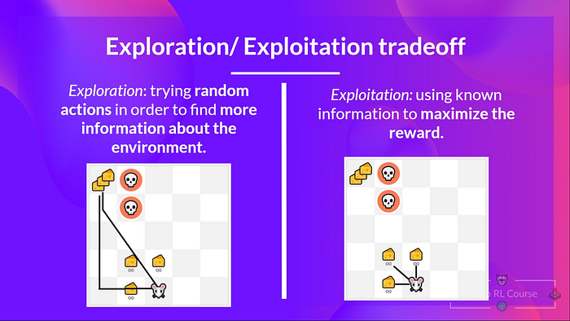
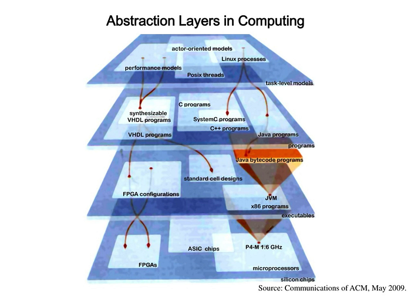
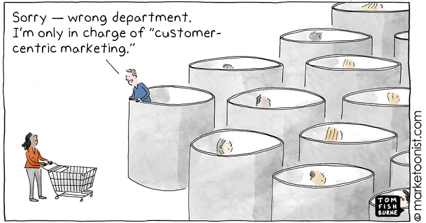
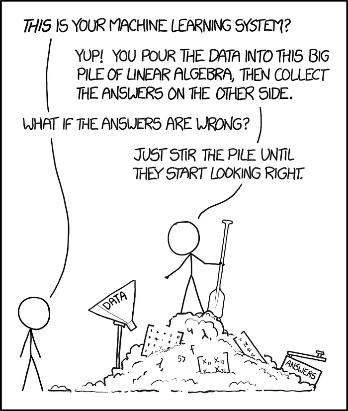
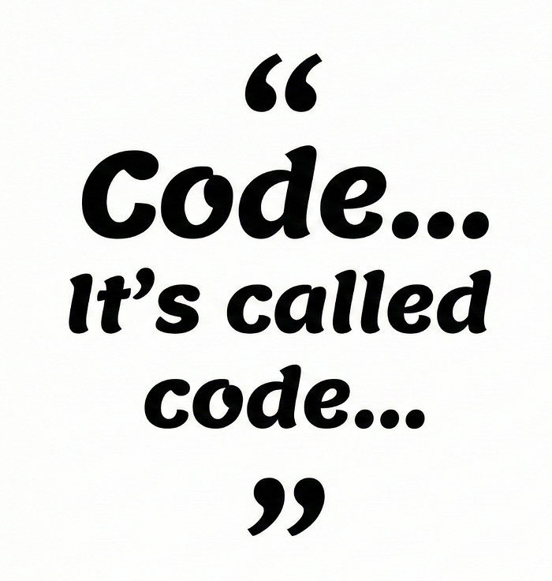

Join me in this post as I explore new paradigms brought by agentic development tools, lessons learned from building systems with AI tooling, and what that could mean for the software engineering practice (not “just coding”) within the next few years.

_“AI is making developers 10x” [_[_link_](https://github.blog/news-insights/research/research-quantifying-github-copilots-impact-on-developer-productivity-and-happiness/)_],_ _“AI is making developers less productive” [_[_link_](https://metr.org/blog/2025-07-10-early-2025-ai-experienced-os-dev-study/)_],_ _“AI is coming for our jobs” [_[_link_](https://www.windowscentral.com/artificial-intelligence/engineers-dont-write-code-anymore-anthropic-ceo-says-ai-is-about-to-eat-the-entire-profession)_], “AI enables coders” [_[_link_](https://www.atlassian.com/blog/artificial-intelligence/how-ai-turns-software-engineers-into-product-engineers)_]._

Well, which one is it?

Let’s start this exploration with this meme:

I’ve been thinking about this meme for a while. The punchline is feels like a great take to the question on how agentic development is impacting the software engineering practice.

I’ve been able to further process this thought particularly as throughout the winter break I got a Copilot Pro subscription and went on a building spree; initially building one project per day, but then getting stuck on a longer project which provided me with a more clear view of what the future may look like for the tech industry.

## Building a team-sized projects in days instead of weeks

If someone was to tell me they single-handedly built a project that spans across custom Kubernetes operators, backend, frontend and SDKs, with robust CI & release process within a couple of days, I would have struggled to believe them.

That is about how shocked I was when I took on the challenge, and successfully built [**K.A.O.S.**](https://github.com/axsaucedo/kaos)in just a couple of days**, a Kubernetes Agent Orchestration System** that deploys and manges multi-agent systems, which consists of a non-trivial set of components:

- Golang control-plane that manages the kubernetes native resources
- Python data-plane that implements Agents, MCPs and ModelAPI client/servers
- React based user interface with interactive CRUD, Agent chat, MCP debugging, etc
- CLI for managing resources and easily performing workflows
- CI/CD with KIND based e2e testing and automated release management

Traditionally building a project like KAOS would’ve taken weeks, and would’ve required a handful of skilled individuals with different skill-sets (eg frontend, backend, infra, etc).

But oh how things have changed.

I was blazing through development milestones and the code was produced at real time speed. It got to the point where iteration cycles were faster than my capability to review changes and design further extensions. This brought two particular themes that really surprised me.

### Surprise #1: Time Constant — Watching tech debt form in real time

The first surprise was the **time constant**.

We all know tech debt is a real problem; in practice it creeps in slowly & silently, and we only realise it when it’s too late. [The interest payments eventually show up](https://martinfowler.com/bliki/TechnicalDebt.html): small changes require larger investments, developer productivity stalls, interesting new bugs arise from everywhere, code areas become fragile, etc.

What I was particularly surprised about was not about tech debt itself, but about **the time constant** in which was being created**.** If at some point I came across an implementation that was slightly off (eg. a quick interface hack, a decision in the wrong layer, etc) and didn’t address it right there and then, within hours I could feel the codebase start bending around it.

I have to say it was fascinating seeing tech debt form in a few hours in real time, when normally this spans across weeks, or even months.

This also coupled with the realisation that now I had the luxury to backtrack on particular implementation directions when seeing something was off. This was only possible due to low cost/effort for development.

This enabled for an **exploration-exploitation branching-like**development approach, as opposed to a purely linear one where otherwise retracting may be too expensive compared to accepting the short term debt.

### Surprise #2: Cognitive Level — Operating at a higher level of abstraction whilst staying tactical

The second surprise was at the **cognitive level**.

Historically when coding the traditional cycle is along the lines of: pick up a task, dive into a module, load that context into your brain’s RAM, and descend through levels of abstractions into the internals to fix what you can as further rabbit-holes arise (aka “being in the zone”). Basically this was the status quo, where we had accepted that our brains (+ typing speed) are the bottleneck.

With agentic workflows, I noticed a different mode:

- Load the entire picture at once and reason about at the **system level**(backend, infrastructure, frontend, SDK, CI, etc) without losing the tactical thread.
- Delegate chunks of implementation whilst being able to steer the direction in real time whilst having the big picture in mind.
- Review the resulting artifacts as discrete, comprehensible deltas noting down extensions and improvements.
- Match against overarching direction otherwise backtrack and iterate; often with various threads in parallel.

This didn’t feel like I was “no longer coding”. It just felt like I was **coding at a different altitude**.

The way I like to think about this is the following analogy: how a tech lead or staff engineer thinks when they’re guiding the team(s) and shaping the system across months of development cycles, instead of just editing files.

## The real unlock is abstraction: specs become complex systems

Now bringing these two “surprises” together is what makes me think: we have been over-emphasising the **improved time constant** and under-discussing the **higher cognitive level** that is being unlocked.

If we do now focus on the higher cognitive level unlocked, a more complex question arises:

**If we have unlocked this higher level of abstraction, what could this enable in practice?**

In organisations we may have a functional setups (teams of backend vs teams of frontend, etc) or cross functional setups (teams with mixes of frontend, backend, etc). Each of these team members would have a manager; teams of managers would report to a head of department; heads would report to a director; directors would report to… you get the point.

As of today, we build these layers because **cognition** and **coordination** don’t scale linearly. At some point, you need a layer whose job is **not** writing the code, but **steering** the system; i.e. aligning architecture, interfaces, guardrails, and operational quality. Further layers then arise to steer strategy, business priorities, etc — which may or may not be aligned with the execution (and vice-versa).

Why are we talking about organisational setups? Here is the twist: with this higher level of abstraction, a single developer may be able to move upwards to that next layer of cognitive abstraction _without giving up the ability to ship tactical changes_. The metric is no longer “how fast do I code”; it becomes:

**How many layers of complexity can one person hold and steer effectively?**

And once you look at it through that lens, the most interesting question becomes not “how many tickets can I close”, but:

## What is an example of what we could build at this higher level of abstraction?

The first potential answer to this question came up as I was exploring it through various conversations. Namely on the topic of a common organizational reality: departmental systems optimizing in silos.

In a typical e-commerce setup you might have separate systems for:

- **Pricing** — optimising discounting, demand shaping, stock clearance
- **Replenishment** — optimising inventory coverage to enable re-stocking
- **Marketing** — optimising campaigns, conversion, and demand spikes

Each system can be locally _smart_, but globally **dumb**.

Pricing may discount inventory down because it sees a stock issue. Replenishment may ramps stock up because it sees demand. Marketing may run a campaign that shifts demand curves. If these systems aren’t aligned, you get cannibalisation: adversarial optimisation that makes the overall customer lifetime value outcome worse.

Today, organizations try to solve this with process and coordination: roadmaps, planning, architecture governance, quarterly alignment, and a lot of “let’s align”. It works… sometimes. But it’s expensive and slow.

If individuals can operate one abstraction layer higher, it enforces that more of this coordination gets embodied in _systems_, not meetings:

- shared constraints,
- shared feedback loops,
- shared intent,
- and shared operational reality.

However, this still doesn’t answer my question; as it only provides the “means”, and not the “end”.

Namely it doesn’t answer the question: **What is an _\_actual__ example of what could be built at this level of abstraction?**

The next attempt was explored through the concept of programming languages:

## From objects and functions to architectural primitives (K8s CRDs as a mental model)

When thinking of this, the mental model I kept returning to was Kubernetes: specifically the [Operator Pattern — also known as Custom Resource Definitions (CRD)](https://kubernetes.io/docs/concepts/extend-kubernetes/operator/).

A CRD is not just a schema. It’s a way to define a higher-level concept as architectural components that can be instantiated, reconciled, and operationalized into sophisticated and complex applications.

In the example of KAOS we abstract the concept of an [Agent, or an MCP or a ModelAPI into an architectural component with a set of attributes](https://axsaucedo.github.io/kaos/v0.1.3/operator/overview.html), that reconciles into a broader set of system and application components that interact across a complex system.

So the thought experiment then becomes:

What if “programming language constructs” were CRD-level like architectural components; namely if we didn’t operate in objects but instead with dynamic architectural components via a _data plane_ of concepts which reconcile into services, policies, interactions, dependencies and so on.

This is where another project I built (bit more half baked this one) gave me a different angle.

Basically, I wondered:

### What would a programming language look like if it natively operated at the next level of abstraction?

And before someone comes here to just shout “erlang!”, I want to explore a bit of blue sky thinking with a slightly more naive exploration. Starting with the idea of a programming language where an agent can be a first-class architectural component in a specification; then what happens if we design it where:

- modules are agents,
- control flow is agentic,
- and even the interpreter loop is an agent?

Not an interpreter in the classic sense (“parse -> execute”), but something closer to a runtime that plans, delegates, reconciles, validates, and iterates.

That line of thinking is what led me to experiment with [**AgenticScript**](https://github.com/axsaucedo/agenticscript/)**:** another weekend project — this time more half-baked — but that may help answer the bigger question.

AgenticScript was an idea to a distributed agent programming language explicitly designed around coordination: agent spawning, inter-agent communication (ask / tell), tool management, a message bus, and rich debugging via a REPL that surfaces agent status, message bus performance, and communication flows.

It was really fun (and impressive) to work through a lexer, parser and interpreter with a code copilot (+ learned there’s a whole sub-field [of Agent-Oriented Programming](https://en.wikipedia.org/wiki/Agent-oriented_programming)). However although it wasn’t a success in regards to pursuing the project end-to-end, it was a success in a different sense as it helped progress this question.

And the answer seemed to lead to the potential of a more uncomfortable conclusion:

### A language at this next abstraction layer might not look like a programming language at all

If we actually want a layer above today’s languages, it may not be a rigid syntax like we’re used to.

This line of thinking is closer to Andrej Karpathy’s famous 2023 phrase of [“the hottest new programming language is English”](https://x.com/karpathy/status/1617979122625712128). Not sure if it’s right to call this a “superset of human language”, but analogous to semi-structured Technical Design Documents (TDDs) that describe concepts, constraints, and components in ways that can compile into living artifacts that interact with broader systems.

Unsurprisingly, this is where the industry is already at the moment; large changes already require TDDs to be written before a solution is implemented.

The difference is that here “spec-driven development” would be framed as treating the specification as the source of truth and regenerating derived artifacts when it changes. And at the more radical end, there’s an explicit argument that code becomes a byproduct between requirements and system outcomes.

If you zoom out, you can see this as the latest iteration of a long lineage of code generation that has been exploring “spec/models -> generated artifacts” for years. The difference now is the “runtime” that would be required to execute such a new paradigm: the interpreter isn’t just executing instructions, **it’s continuously reconciling intent against reality**.

Which implies something important:

If we really want that future, the execution layer will likely be _more complex_ than most of the software we build today. Namely because it needs to absorb the semantic and operational burden that currently lives in teams, process, and organizational structure.

## A pragmatic cop-out (that might actually be the answer)

I can use this as a cop-out and say: maybe this already answers the question of what could be an example of what could be built at this higher level of abstraction.

One plausible answer is:

- an ecosystem that itself exists at a higher abstraction layer (primitives, protocols, declarative intent),
- enabling individuals (and teams) to build at that same layer,
- with higher leverage in speed, integration, and reliability — iff the specs and guardrails are treated as first-class.

Which brings us right back to the meme.

A “comprehensive and precise spec” is called code.

The shift is that we’re increasingly moving the definition of “code” upward: from functions and classes toward **specifications, architectural primitives, and executable intent**.

## Three final reflections from this philosophical rant

### 1) We’re heading toward an “agentic SDLC” standardization moment

I am getting flashbacks of the early 2010s, where many of us may remember those were the days where Scrum coaches were being hired everywhere to teach us “the way” of agile (and move away from the dark side of waterfall).

Whether or not you love Scrum, the pattern is the interesting part: **practice standardizes after fragmentation**.

I expect something similar here:

1. A small minority becomes visibly faster.
2. Organizations try to replicate the gains.
3. We get a proliferation of incompatible “agentic workflows.”
4. Then we converge into a more standardized agentic SDLC — maybe even with something like “agentic coaches” (a phrase that sounds ridiculous until it doesn’t).

So it may not be too far until we start seeing agentic coaches as part of teams, pushing for day-long cycles, renaming spikes to something else (agentic runs?), and inventing another set of agentic poker cards (oh my).

### 2) Developer profiles are diverging (fast)

And we’re already seeing the developer profiles shift. At least I have noticed three broad categories:

- High performers becoming disproportionately more productive.
- Low-discipline workflows becoming disproportionately more dangerous (generating code, not reading it, opening PRs before running it, creating more work downstream).
- The middle majority watching from the sidelines, waiting for “the way we do it here” to crystallize, instead of venturing into the unknown.

This last group is important. Most industries don’t shift because early adopters are excited. They shift when norms, expectations, and playbooks form.

### 3) The bottleneck moves upstream: from “writing code” to judgment, constraints, and verification

The new 10x isn’t typing faster; it’s steering better. When you can generate and integrate _at_ a higher level, the differentiator becomes (a) what you choose to build, (b) how precisely you specify it, and © how aggressively you verify it.

This is also where the tech debt surprise lands me: accelerated iteration doesn’t just accelerate output, it accelerates **misalignment**. People have started naming the new type failure [_“epistemic debt”_](https://failingfast.io/ai-epistemic-debt/?utm_source=chatgpt.com): shipping systems you can’t explain, defend, or reliably change (even if tests pass today).

So the agentic SDLC endgame isn’t “everyone becomes 10x”. It is: **speed becomes commoditised; rigour becomes the moat.** Teams that turn specs, guardrails, evals, and operational feedback loops into first-class artifacts get compounding leverage. Teams that don’t… compound confusion at machine speed.

It is now our responsibility as practitioners and leaders figure out this shift upwards in the cognitive stack; individuals can now do what teams could; teams can do what departments; and what follows should be able to invent the future. This analogy may go beyond the field of software engineering.

As they say: the future is here, it’s just not evenly distributed.
