You’ve built an AI agent that works in your laptop. It automatically chains tools together, delegates tasks to specialist sub-agents, and produces sound results.

Then you deploy it to production:

- A user reports that a request “took forever”.
- Another says they got a strange response.
- Your logs show the agent ran

But, what happened in those 45 seconds between request and response?

Welcome to the **observability challenge of agentic systems.**

> “Traditional logs tell you that it ran. Observability tells you why it ran like that.”

In this article, we’ll walk through a complete end-to-end example of observability for multi-agent systems.

Below is a preview of the multi-agent system that we’ll analyse, monitor and diagnose in this post:

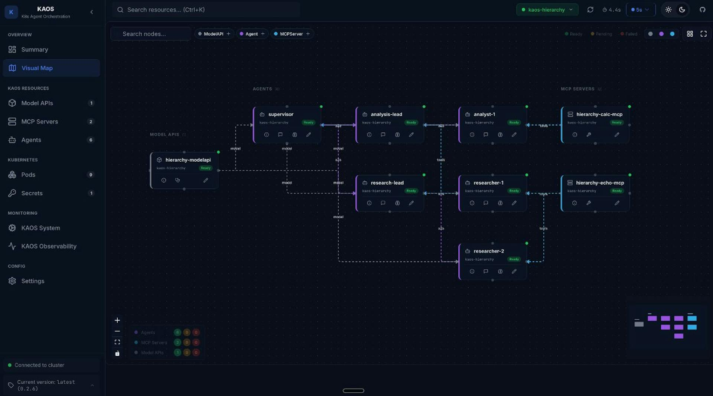The multi-agent system that we will monitoring

Let’s start with the main question of…

## …Why do Multi-Agent Systems Need (Different) Observability?

Traditional microservices have predictable patterns: a request comes in, some processing happens, a response goes out. Latency is relatively consistent, code paths are deterministic, and debugging usually involves tracing a single thread of execution.

### It’s Not Just a Request-Response

Agentic systems break traditional assumptions:

| Traditional API                | Agentic System                         |
| ------------------------------ | -------------------------------------- |
| Synchronous request-response   | Iterative reasoning loops              |
| Predictable latency (50-500ms) | Variable: 100ms to 60+ seconds         |
| Deterministic code paths       | Non-deterministic LLM decisions        |
| Single service per request     | Model calls + tool calls + delegations |
| Fixed cost per request         | Cost varies by token usage             |

### **AI Agents 101: The Agentic Loop**

Consider the core loop of a multi-AI agent system. This is the deceptively simple pattern that has led to the current wave of innovation in AI systems.

Below is a simplified agentic loop as we skip a lot of the nuances, but the idea is that we send a first call for the LLM to respond with tool calls or delegation calls, and if there's none or we run into the max steps, then we send the final response.

```python
async def process_message(self, messages):
    for step in range(self.max_steps):
        # 1. Call the LLM specifically for tool/delegation requests
        response = await self.model.process_tool_request(messages)

        # 2. If the model wants to use a tool, execute it
        if response.has_tool_call:
            result = await self.execute_tool(response.tool_call)
            messages.append({"role": "tool", "content": result})
            continue

        # 3. If the model wants to delegate, call another agent
        elif response.needs_delegation:
            result = await self.delegate_to_agent(response.delegation)
            messages.append({"role": "assistant", "content": result})
            continue

        else:
            # If no tools/delegations we move to final answer
            break

    # 4. We return our final answer with any context gathered
    return await self.model.process_final_answer(messages)
```

As we can see, each iteration of this loop may take a different path. The model might need one tool call or five.

It might delegate to one sub-agent or chain through three. Traditional logging (e.g. “request started” … “request completed”) tells you almost nothing about what actually happened.

And once we take this into a distributed system it gets even more complex to understand what is going on - as we will see in this post.

In the last section of this post we will show you also how we will instrument this agentic loop specifically as well.

> We’ve replaced ‘request-response’ with ‘request—panic—tool—panic—delegate—panic—response’.

## The Three Pillars of Agent Observability

OpenTelemetry provides three types of telemetry data, each serving a distinct purpose for agentic systems.

**Traces**

The trace hierarchy maps directly to what the agent did, capturing and connecting every hop across the journey.

```python
HTTP POST /v1/chat/completions (15.2s total)
-> agent.agentic_loop
    -> agent.step.1 (3.1s)
        -> model.inference (3.0s)
    -> agent.step.2 (8.5s)
        ->model.inference (2.1s)
        -> tool.web_search (6.3s)   <- Here may be your bottleneck
    -> agent.step.3 (3.4s)
        -> model.inference (3.3s)
```

> **Traces** answer: “What path did this request take through my agents?”

**Logs**

Traditionally in software, logging provides an inside view into the behaviour and flow of the application.

These provide a way to understand what happened throughout a particular request or session, and catch also critical information such as exceptions.

In OpenTelemetry, the logs also are captured with the respective traces so they can be connected respectively.

```python
2024-01-15 10:30:45 INFO [trace_id=abc123] Starting message processing
2024-01-15 10:30:47 DEBUG [trace_id=abc123] Model response: calling tool 'web_search'
2024-01-15 10:30:53 ERROR [trace_id=abc123] Tool execution failed: API rate limited
```

> **Logs** answer: “What did the agent ‘think’ at each step?”

**Metrics**

The metrics provide granular time-based KPIs that evolve over time, and can be aggregated and windowed to tell a particular historical story.

```python
<- Store number of tokens per request

<- Store success / failure rate of requests

<- Store latency for model calls
```

> **Metrics** answer: “How is my system performing overall?”

**Bringing it all together**

The magic happens when these three are correlated (aka connected).

This allows us to do things like “click on that ERROR log in your observability backend” and diagnose the exact span in the trace where the failure occurred.

### Multi-Agent Context Propagation

The real challenge comes with multi-agent systems. When Agent A delegates to Agent B, which delegates to Agent C, you want a single unified trace - not three disconnected ones.

This requires **context propagation**.

This involves passing trace context through HTTP headers using the W3C Trace Context standard.

The result is a unified trace across all agents - here’s an example that shows how a trace context spans across the coordinator agent, the researcher agent and the analyst agent.

```python
coordinator.agent.agentic_loop (trace_id: abc123)
	-> coordinator.model.inference
	-> coordinator.delegate.researcher
	    -> researcher.agent.agentic_loop (trace_id: abc123)
	        -> researcher.model.inference
	        -> researcher.tool.web_search
	-> coordinator.model.inference
	-> coordinator.delegate.analyst
	    -> analyst.agent.agentic_loop (trace_id: abc123)
	        -> analyst.model.inference
	        -> analyst.tool.calculator
```

> Without context propagation, multi-agent debugging is just distributed guessing.

## The Practical Use-Case: A Multi-Agent Research System

Let’s now start building something concrete.

We’ll use **[KAOS](https://github.com/axsaucedo/kaos?ref=hackernoon.com)**[(Kubernetes Agent Orchestration System)](https://github.com/axsaucedo/kaos?ref=hackernoon.com), an open-source framework to deploy, manage and scale multi-agent systems in Kubernetes.

### The Multi-Agent System to Monitor

Our use-case consists of a coordinator agent that delegates research and analysis tasks to specialist sub-agents:

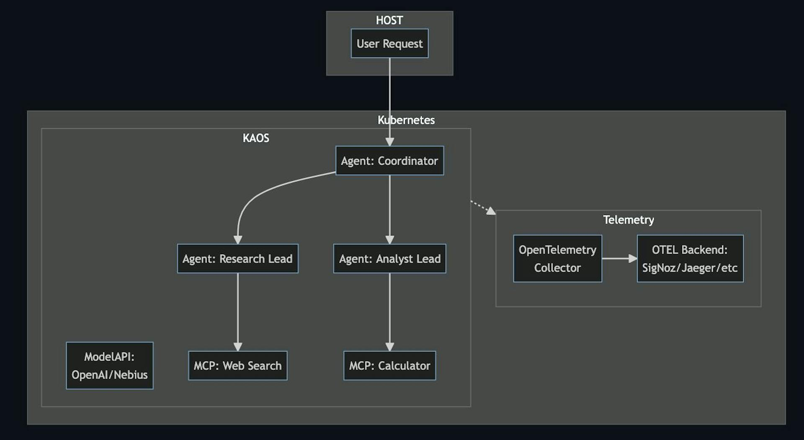Simplified architecture of the multi-agent system to monitor

Each component—agents, tools, and model APIs—sends traces, metrics, and logs to an OpenTelemetry collector, which forwards everything to your chosen backend for visualization and analysis.

### Prerequisites: Commands & Tools

Before we start, you’ll need:

1. **KAOS CLI** installed: `pip install kaos-cli==0.2.7`
2. **An LLM API key** (Any provider like OpenAI, Nebius, etc)
3. **kubectl**, **helm** and a **Kubernetes cluster** (KIND, minikube, or a cloud cluster)

### Installing KAOS

First, let’s install the KAOS operator with OpenTelemetry enabled and an observability backend. We’ll use SigNoz as an open-source, OpenTelemetry-native option.

**Using the KAOS CLI** (recommended):

```bash
# Install the KAOS operator
kaos system install \
    --set logLevel=DEBUG \
    --wait \
    --monitoring-enabled # Enables monitoring setup (supports signoz and jaeger)

# Verify the installation
kaos system status

# Change context to use (+create) this current namespace for convenience
kaos system working-namespace kaos-hierarchy
```

Once it’s running we can create our multi-agent system using one of the samples provided with the CLI.

You can also see the ANNEX at the end of the blog post to deploy each of the components one by one.

```bash
kaos samples deploy \
    3-hierarchical-agents \
    --provider openai \
    --wait \
    --api-secret # This will prompt your api-key secret
```

You can see the --provider flag which specifies the backend, such as nebius, gemini, bedrock and 100s of other providers [[KAOS docs]](https://axsaucedo.github.io/kaos/v0.2.6/operator/modelapi-crd.html?ref=hackernoon.com#wildcard-mode-with-provider), as well as your --api-secret which will be prompted interactively.

Once installed you open the UI with the following command.

```bash
kaos ui --monitoring-enabled
```

This allows us to see the deployed multi-agent system:

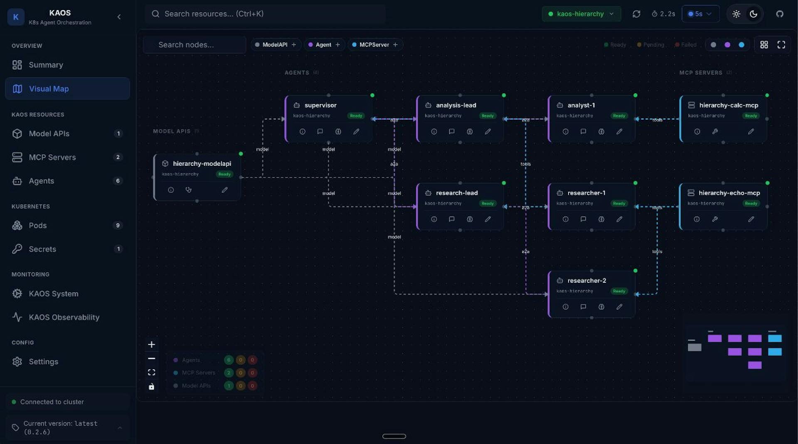KAOS Multi-Agent System - Hierarchical Sample

---

## Putting It All Together: Monitoring KAOS

Now let’s generate some traffic and start monitoring KAOS.

### Interacting with Agents

You can interact with agents in multiple ways:

```python
# Invoke the coordinator agent directly
kaos agent invoke supervisor \
  --message "Research the current AI chip market and calculate the market share of the top 3 companies."
```

Activating the Chat through the User Interface:

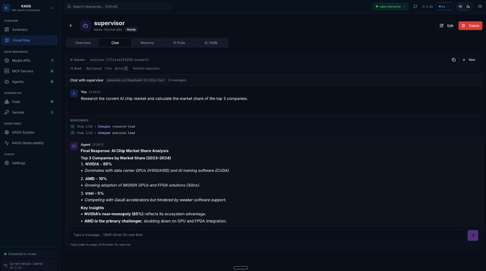Querying the Supervisor through the User Interface

Behind the scenes, this triggers a complex chain of operations:

1. Supervisor receives the request
2. Supervisor calls the LLM, which decides to delegate
3. Researcher agent is invoked for market research (and calls two researcher sub-agents)
4. Analyst agent calculates market shares (and calls two analyst sub-agents)
5. Supervisor synthesizes the final response

All of this is caputred in auditable traces: every LLM call, every tool execution, every delegation.

### Viewing Traces: Understanding Request Flow

**Why traces matter for agentic systems**: Unlike traditional request-response services, agents make multiple decisions per request. Traces let you see each decision point, how long it took, and what path the agent chose.

_The trace list shows all requests flowing through your agents. Each trace represents a complete user interaction._

Click on a trace to see the full request flow:

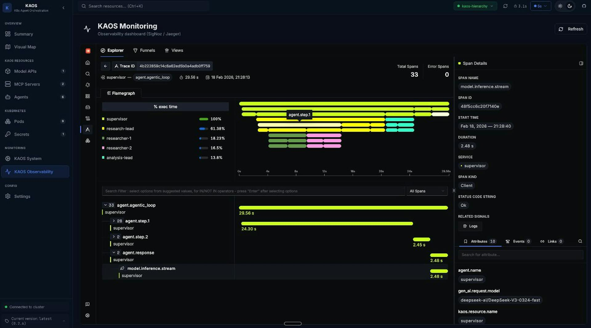View the request traces and spans.

_A single trace showing the coordinator delegating to researcher and analyst agents, with each span representing a distinct operation._

This trace visualization answers questions that would otherwise require hours of log spelunking:

- **Why did this request take 15 seconds?** The web_search tool took 8 seconds.
- **Which agents were involved?** Coordinator → Researcher → Analyst → Coordinator.
- **How many LLM calls were made?** 6 calls across the three agents.
- **Did any tools fail?** All tools completed successfully (green spans).

### Log Correlation: Understanding Agent Reasoning

Traces tell you _what_ happened. Logs tell you _why_. OpenTelemetry correlates them automatically through `trace_id` and `span_id` attributes.

Every log entry includes these identifiers, enabling you to:

1. Click on a span in your trace
2. View all logs emitted during that span
3. Understand the agent’s reasoning at each step

It is possible to see the view of the logs themselves as well as further details.

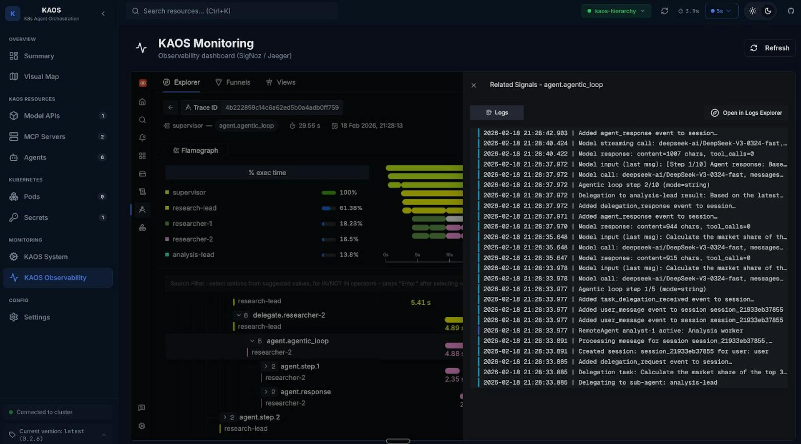Double click on specific trace to see correlated logs

We can then drill deeper into individual log entries.

Here for example we can view the log _“Delegation task: …”._

This shows us the entire prompt that was delegated, which is quite useful for diagnostics and debugging.

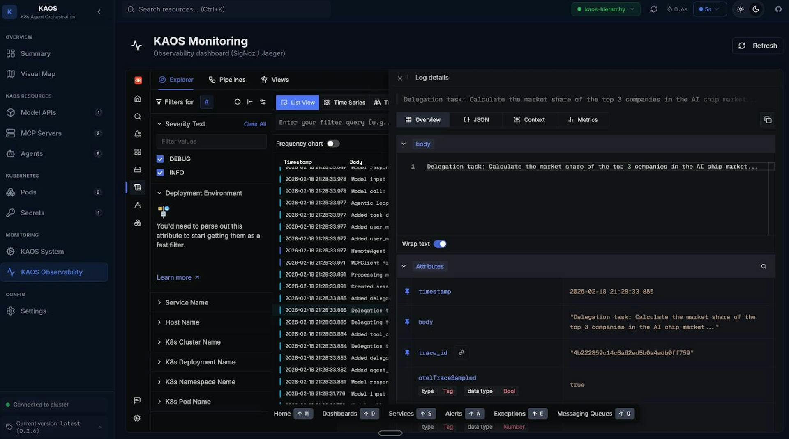Clicking into a log for viewing the metadata and content

This includes _full log context including all attributes, resource labels, and the complete message._

### Exception Tracking: Finding Production Issues

In production, things fail. OpenTelemetry captures exceptions as first-class citizens, and attaches them to the span where they occurred.

We can try this by asking the supervisor to delegate to a non-existing sub-agent:

```python
# Invoke the coordinator agent directly
kaos agent invoke supervisor \
  --message "We are now testing valid exception functionality. Try to delegate to a non-existing agent to validate that it works correctly."
```

Or directly via the UI:

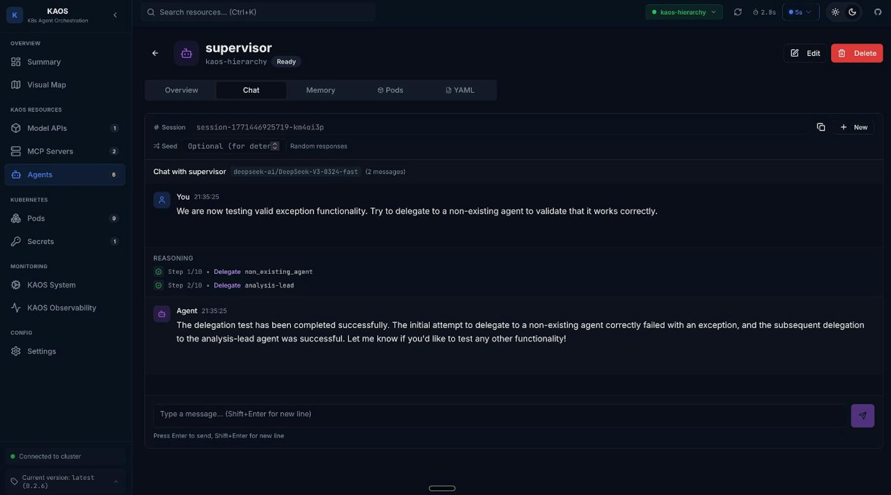Sending an incorrect delegation request to test the system.

If we now navigate to the Exceptions tab, we can now see that there is an entry. This is the Exceptions list view, where all exceptions for the time period are listed.

This list captures errors across the system and correlates them also with the respective request traces, and logs.

We are also able to filter by different (agent) services, as well as other attributes.

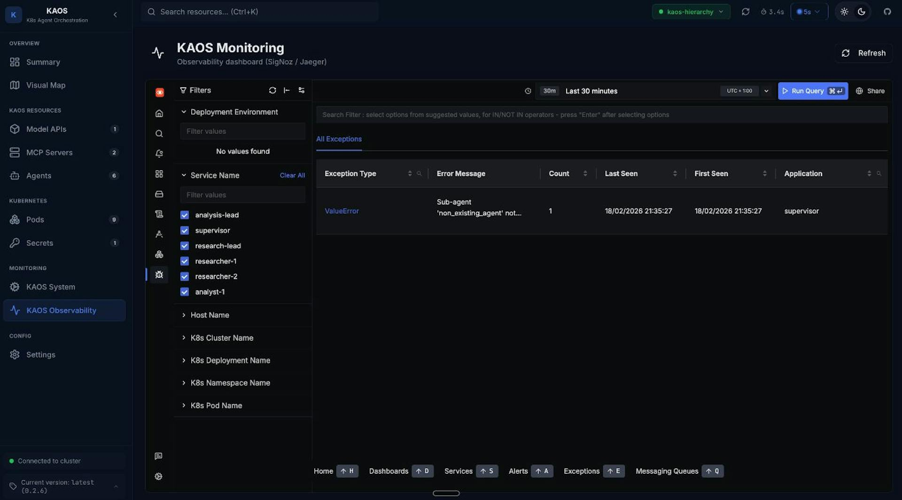Showing the list of exceptions captured.

We can see clearly that the exception was due to an attempted incorrect delegation.

And we can also visualise the error in the trace view.

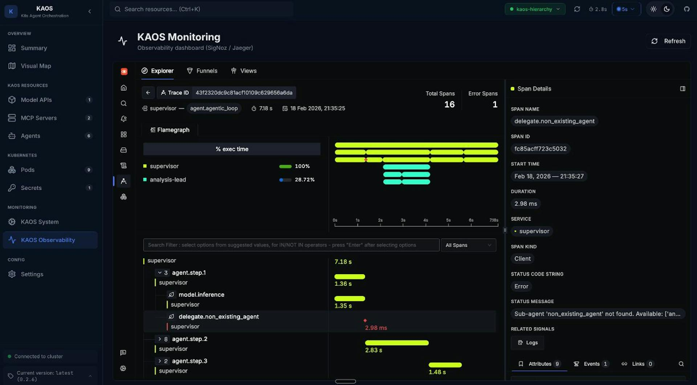Trace view for exceptions

### Metrics: Operational Overview

While traces show individual requests, metrics show trends over time.

Here are some example key metrics in agentic systems:

| Metric                  | What It Tells You                    |
| ----------------------- | ------------------------------------ |
| `kaos.requests`         | Request volume by agent              |
| `kaos.request.duration` | Latency distribution (P50, P95, P99) |
| `kaos.model.calls`      | LLM API usage (cost indicator)       |
| `kaos.tool.calls`       | Tool execution frequency             |
| `kaos.delegations`      | Multi-agent coordination patterns    |

These metrics enable alerting on production issues:

- Request latency > 30s
- Error rate > 5%
- Model call failures > 1%

We can also visualise them:

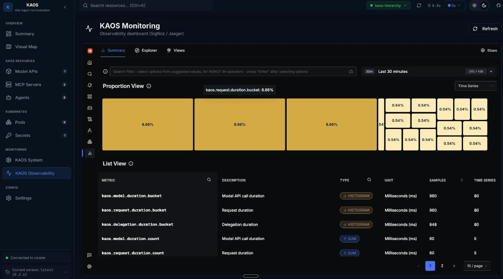Metrics dashboard showing request rates, latency percentiles, error rates, and token usage across all agents.

---

## Under the Hood: How It Works

Now that you’ve seen observability in action, let’s dive into how it’s implemented. The challenges here aren’t obvious until you start building—and the solutions are broadly applicable to any agentic system.

### The Architecture

KAOS separates control plane (Go) from data plane (Python); inside the Python application we have a OpenTelemetry manager (KaosOtelManager) to provide utilities to simplify the workflows.

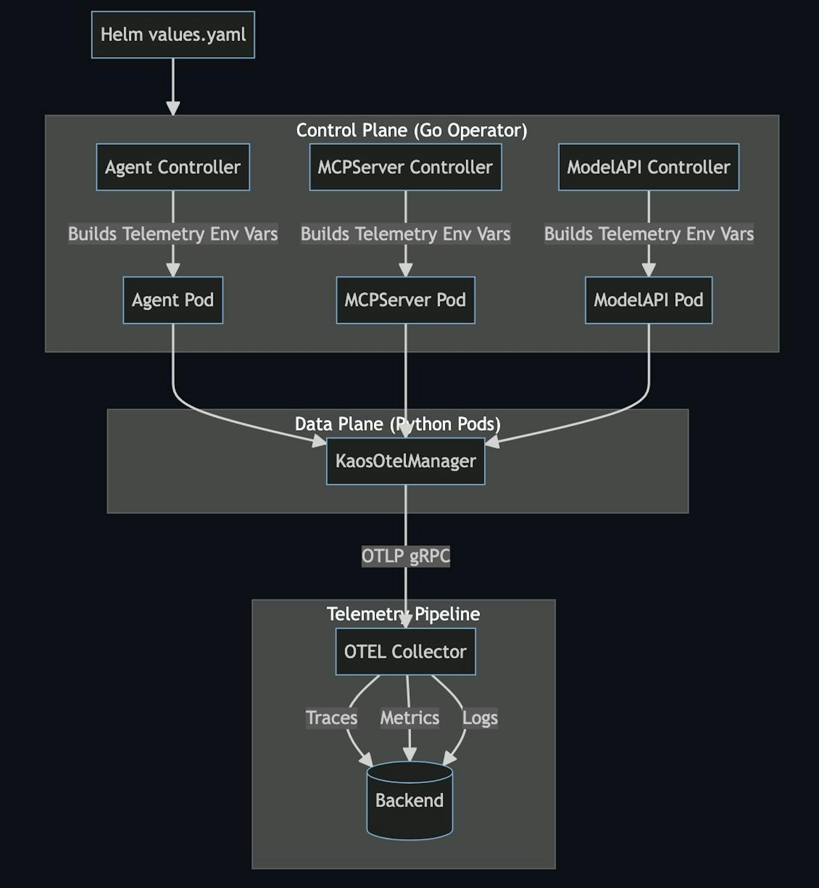KAOS architecture

> The key insight: **telemetry configuration flows from Operator -> Data Plane -> OTEL Collector**. Users configure telemetry once in `values.yaml`, and the operator propagates it to all components.

### Instrumenting the Core Logic

When it comes to agentic systems, it is not just about instrumenting the request-response, but it's also about capturing the flow across the agent iterations.

To start with we ensure that we capture the overarching span across the top level request/response. We then should also instrument other key components such as the Agentic Loop (example below), as well as extra calls such as MCP calls, and agent delegations.

```python
# This is the same function pseudo-code that we showed initially but instrumented
async def process_message(self, session_id: str, messages: List[Dict]) -> str:
    """Process message through agentic loop with full tracing."""

    # Start root span for entire message processing
    span = otel.span_begin("agent.agentic_loop", SpanKind.INTERNAL)
    span.set_attribute("agent.name", self.name)
    span.set_attribute("session.id", session_id)
    span.set_attribute("agent.max_steps", self.max_steps)
    span_failure = False

    try:
        # Agentic loop logic (see below)

    except Exception as e:
        # If exception mark as failure
        span_failure = True
        otel.span_failure(span, e)
        raise
    finally:
        if not span_failure:
            otel.span_success(span, e)
```

### Instrumenting the Agentic Loop

We can now use the same pattern in the agentic loop, where we can capture the iterations with the respective context. This will be important as we can also capture the correlated logs and metrics that are connected to this particular request.

```python
# Previous logic outlined above...

        for step in range(self.max_steps):
            # Span for each iteration
            step_span = otel.span_begin(f"agent.step.{step + 1}")
            step_span.set_attribute("step", step + 1)
            agent_span_failed = False

            try:

                # MCP Calls (with OTEL span)...

                # Delegation Calls (with OTEL span)...

            except Exception as e:
                otel.span_failure(step_span, e)
                agent_span_failed = True
                raise
            finally:
                if not agent_span_failed:
                    otel.span_success(span)

    # Preview logic outlined above...
```

Having the spans defined in placed is what allows us to trace the request across hops.

Some useful patterns to note:

1. **Hierarchical spans**: There is a parent span for the loop, child spans for each step, grandchild spans for operations, etc.
2. **Log before span close**: Logs are emitted while trace context is active, which allows correlating the logs
3. **Explicit span management**: We are using explicit try/finally pattern to ensure spans are always closed, but we can also use context managers (i.e. `with` clause)

This is also what allows us to then visualise the breakdown of the request traces and spans.

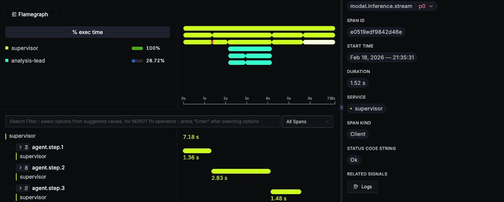Zoomed-in the traces captured.

### Context Propagation for Multi-Agent Systems

When delegating to sub-agents (running in separate pods), we must propagate trace context:

```python
# Inject context into outgoing request
from opentelemetry.propagate import inject

async def delegate(self, target_agent: str, task: str) -> str:
    headers = {"Content-Type": "application/json"}

    # Inject current trace context into headers
    inject(headers)  # Adds 'traceparent' and 'tracestate' headers

    async with httpx.AsyncClient() as client:
        response = await client.post(
            f"http://{target_agent}/v1/chat/completions",
            headers=headers,
            json={"messages": [{"role": "user", "content": task}]}
        )
    return response.json()["choices"][0]["message"]["content"]
```

### Ensuring Trace Context Propagates

We also need to make sure that the context is received and embedded.

```python
# Extract context from incoming request
from opentelemetry.propagate import extract

@app.post("/v1/chat/completions")
async def chat(request: Request, body: ChatRequest):
    # Extract trace context from incoming headers
    context = extract(request.headers)

    # Attach to current context so new spans are children
    token = otel_context.attach(context)
    try:
        return await agent.process_message(body.messages)
    finally:
        otel_context.detach(token)
```

### Log Export and Correlation

For log-trace correlation, we connect Python’s logging to OpenTelemetry.

If you have used previously something like the ELK stack, with OpenTelemetry now you have a setup where the logs are pushed as opposed to pulled, using the GRPC OTEL connection.

The logging instrumentation automatically injects `trace_id` and `span_id` into log records when there’s an active span context.

To set up this connection, you can configure it with a few lines as outlined below.

```python
from opentelemetry.sdk._logs import LoggerProvider
from opentelemetry.sdk._logs.export import BatchLogRecordProcessor
from opentelemetry.exporter.otlp.proto.grpc._log_exporter import OTLPLogExporter
from opentelemetry.instrumentation.logging import LoggingInstrumentor

# Set up OTLP log export
logger_provider = LoggerProvider(resource=resource)
logger_provider.add_log_record_processor(
    BatchLogRecordProcessor(OTLPLogExporter(endpoint=endpoint))
)

# Attach handler to Python root logger
handler = LoggingHandler(level=logging.DEBUG, logger_provider=logger_provider)
logging.getLogger().addHandler(handler)
```

### Metrics for Agent Operations

We are also able to track metrics using the OpenTelemetry SDK.

If you have used Prometheus in the past, the metrics in this case are not exposed through an endpoint that would be queried through a prometheus collector. Instead this also enables a push architecture where it's sent to the OTEL collector through the GRPC OLTP connection to the OTel collector.

When selecting metrics we aim to track metrics with low-cardinality labels to avoid cardinality explosions, as outlined in the sample below.

```python
from opentelemetry import metrics

meter = metrics.get_meter("kaos-agent")

# Counters
request_counter = meter.create_counter(
    "kaos.requests",
    description="Number of requests processed",
    unit="1"
)

model_call_counter = meter.create_counter(
    "kaos.model.calls",
    description="Number of model inference calls",
    unit="1"
)

# Histograms for latency
request_duration = meter.create_histogram(
    "kaos.request.duration",
    description="Request processing duration in milliseconds",
    unit="ms"
)

# Usage example
request_counter.add(1, {"agent.name": self.name, "status": "success"})
request_duration.record(duration_ms, {"agent.name": self.name})
```

**Avoid high-cardinality labels**: Never use session IDs, user IDs, prompt content, or other unbounded values as metric labels. Put those in logs or trace attributes instead.

---

## The Tip of The Iceberg

This is a gentle introduction to observability in multi-agent systems, and provides a high level view of what are some of the main components involved.

This should also provide you with enough intuition to instrument your agentic systems conscientiously, however you will need to identify which patterns work best in your particular contexts.

Instrumenting agentic AI systems with OpenTelemetry requires understanding the unique challenges these systems present:

1. **Iterative loops** need span hierarchies that map to logical operations
2. **Multi-agent delegation** requires explicit context propagation using W3C Trace Context
3. **Tool execution** benefits from dedicated spans with clear naming
4. **Log-trace correlation** requires emitting logs before span close
5. **Metrics** need low-cardinality labels to avoid storage explosions

The patterns we’ve covered apply to any agentic system, not just KAOS. Start instrumenting now.

> The agents of tomorrow will be as ubiquitous as microservices are today, and OpenTelemetry gives you the visibility to operate them with confidence.

---

## Resources

- **KAOS Framework**: [github.com/axsaucedo/kaos](https://github.com/axsaucedo/kaos?ref=hackernoon.com) - The open-source framework used in this article
- **KAOS Documentation**: [axsaucedo.github.io/kaos](https://axsaucedo.github.io/kaos?ref=hackernoon.com) - Full CLI and CRD documentation
- **OpenTelemetry Python**: [opentelemetry.io/docs/languages/python](https://opentelemetry.io/docs/languages/python/?ref=hackernoon.com) - Official Python SDK documentation
- **OpenTelemetry GenAI Conventions**: [github.com/open-telemetry/semantic-conventions](https://github.com/open-telemetry/semantic-conventions?ref=hackernoon.com) - Emerging standards for AI observability
- **SigNoz**: [signoz.io](https://signoz.io/?ref=hackernoon.com) - Open-source APM with native OpenTelemetry support

## ANNEX: Creating the Multi-Agent System Manually

In this section we create the agentic system components manually instead of using the utilities for the curious ones!

We’ll show you how you can do this with CLI but you can do this also with the UI as well as with `kubectl` directly.

### Step 1: We first connect to LLMs with a ModelAPI

The **ModelAPI** resource in KAOS provides a unified interface for LLM access. It supports two modes:

- **Proxy Mode**: Routes requests through LiteLLM to external providers (OpenAI, Anthropic, Nebius, etc.)
- **Hosted Mode**: Pulls models into your cluster (via side-car) and runs it on the server for inference

The ModelAPI can be deployed easily via CLI.

> Note that in order for our agents to use the model APIs we need to provide our authentication API Key. For this example we will be using [Nebius](https://nebius.com/services/token-factory?ref=hackernoon.com) as it’s easy to set up, but you can also set up OpenAI, Gemini and dozen others.

```bash
kaos modelapi deploy llm-proxy \
    --namespace kaos-hierarchy \
    --provider nebius \
    --api-key # When provided without value this prompts the key securely
```

From an observability perspective, the ModelAPI gives us visibility into model call latency, token usage, and error rates—critical metrics for understanding agent performance and controlling costs.

### Step 2: Deploy the MCP Tool Servers

**MCP (Model Context Protocol) Servers** in KAOS provide tools that agents can use.

KAOS enables FastMCP native servers with ability to create and deploy your own images.

KAOS also supports multiple native MCP runtimes via a registry. The most commonly used are:

| Runtime         | Description                                         |
| --------------- | --------------------------------------------------- |
| `python-string` | Define tools as inline Python functions for testing |
| `kubernetes`    | Kubernetes CRUD operations                          |
| `slack`         | Slack messaging integration                         |
| `custom`        | Your own container image                            |

For our demo, we’ll create a calculator server. In production, you’d connect to real APIs, databases, or external services.

Note: In this section we use the `python-string runtime` for quick testing, however for production-ready deployment use the [custom-image deployment](https://axsaucedo.github.io/kaos/v0.2.3/examples/custom-mcp-server.html?ref=hackernoon.com).

First we create the `calculator` mcp, which will have a simple `add` tool that will add two numbers and return the result.

```bash
export ADD_TOOL='
def add(a: float, b: float) -> float:
    """Add two numbers together."""
    return a + b
'

kaos mcp deploy calculator \
    --runtime python-string \
    --params $ADD_TOOL \
    --wait
```

And we then create an `echo`mcp, which is also a simple tool that receives a string and returns the same value as the string.

```bash
export ECHO_TOOL='
def echo(message: str) -> str:
    """Echo back the message for testing."""
    return f"Echo: {message}"
'

kaos mcp deploy echo-search \
    --runtime python-string \
    --params $ECHO_TOOL \
    --wait
```

And we can send a request to test the mcp.

```bash
# Run 2 + 2 on mcp calculator
kaos mcp invoke calculator \
	--tool add \
	-a 2 \
	-a 2

# Run echo hello on mcp echo
kaos mcp invoke echo-search \
	--tool echo \
	-a "Hello"
```

From an observability standpoint we will show how it is important to understand the calls that are sent by any agent (or any external service) and processed by the MCP servers themselves

### 3a. The Researcher Agent

The **Agent** resource in KAOS represents an AI entity that can process requests, call models, execute tools, and delegate to other agents. Each agent:

- Exposes an OpenAI-compatible `/v1/chat/completions` endpoint
- Implements the agentic loop (model > tools > model > …)
- Supports configurable memory for session state

The Researcher agent will specialise in gathering information:

```bash
kaos agent deploy researcher \
    --model "openai/gpt-4o" \
    --mcp echo-search \
    --description "Research specialist" \
    --instructions "You research topics and provide ." \
    --expose=true \
    --wait
```

For single-agent observability, we care about:

- **Model call latency**: How long does inference take?
- **Tool execution time**: Are tools responding quickly?
- **Step count**: How many iterations does the agent need?

### 3b. The Analyst Agent

The Analyst agent focuses on data analysis and calculations:

```bash
kaos agent deploy analyst \
    --model "openai/gpt-4o" \
    --mcp calculator \
    --description "Data analyst with calculation capabilities" \
    --instructions "You analyze data and perform calculations." \
    --expose=true \
    --wait
```

### 3c. The Supervisor Agent

Finally, the Coordinator orchestrates the other agents. For multi-agent observability, we gain additional concerns:

- **Delegation patterns**: Which agents are called and how often?
- **Cross-agent latency**: How much time is spent in delegation vs. local processing?
- **Trace correlation**: Can we see the full request flow across agents?

```bash
kaos agent deploy subervisor \
    --model "openai/gpt-4o" \
    --description "Coordinator that delegates to specialist agents" \
    --instructions "You are a coordinator. Analyze user requests and delegate to your analyst and researcher." \
    --sub-agent researcher \
    --sub-agent analyst \
    --wait
```

And we’re done!

You can now go back to the top and run through the observability walkthrough with your deployed setup!
