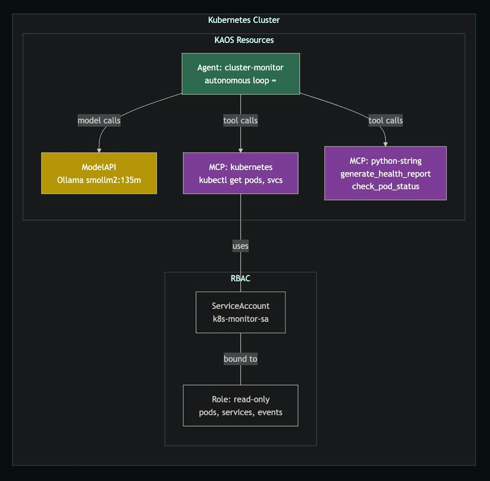

The pattern of “always-on” autonomous agents that work proactively in the background has been taking over the agentic systems space.

This pattern was launched to massive popularity by [OpenClaw](https://clawdocs.org/?ref=hackernoon.com), as it basically moved the field away from purely Chat-based interactions (aka request-response), and towards agents that proactively take over tasks autonomously in the background (aka an infinite loop).

This is an interesting new architectural innovation which has set a clear path where agentic systems are heading towards:

> 24/7 agents with a [heartbeat-style loop](https://clawdocs.org/architecture/heartbeat?ref=hackernoon.com) that keeps checking the world even when you are not prompting it.

And although OpenClaw was one of the first movers, the rest of the frameworks have also followed (+ catching up): [LangGraph](https://docs.langchain.com/oss/python/langgraph/overview?ref=hackernoon.com), [CrewAI](https://docs.crewai.com/introduction?ref=hackernoon.com), [OpenAI Agents SDK](https://openai.github.io/openai-agents-python/?ref=hackernoon.com), [Google ADK](https://google.github.io/adk-docs/?ref=hackernoon.com)…

…and as part of this trend, we also ventured into the world of autonomous agentic systems at scale, learning from implementing autonomous agentic loops in Kubernetes in KAOS - this led us through the good, the bad and the ugly of autnomous agent patterns.

In this post we want to share the learnings designing, developing and scaling autonomous agentic patterns, including what actually changes when an agentic loop becomes an autonomous workload, and why Kubernetes starts to become relevant once you need to orchestrate many of them.

## The Useful Part of the Hype

The phrase “autonomous agent” is overloaded enough to be almost useless.

[Anthropic’s guidance on building effective agents](https://www.anthropic.com/research/building-effective-agents?ref=hackernoon.com) makes a useful distinction between workflows with predefined code paths and agents where the LLM dynamically directs its own process and tool usage.

For a broader research view, recent surveys of [LLM-based autonomous agents](https://arxiv.org/abs/2308.11432?ref=hackernoon.com) and [large language model based agents](https://arxiv.org/abs/2309.07864?ref=hackernoon.com) cover the recurring architecture pieces: memory, planning, action, tools, and evaluation.

Sometimes it may mean “a chatbot that keeps working in the background”. Sometimes it may mean “a stateful graph workflow”. And sometimes it just means “we put `while True` around the model call”.

But there is a useful distinction here - a normal tool-using agent is usually request/response:

1. User asks a question.
2. Agent calls the model.
3. Model decides whether to use tools.
4. Tools return data.
5. Agent returns an answer.

An autonomous agent in the context of this post, ignores whether a human is waiting on the other side of the HTTP response.

The work may continue; the environment may change; the agent may run again; it may call tools repeatedly; it may need to remember what happened last time.

The hard part is not making the model call itself again (aka the loop).

> The hard part is making that agentic loop safe to run when nobody is staring at the chat.

## AI Agents 101: The Loop Everyone Starts With

Most agent systems begin with a deceptively simple loop:

```python
async def run_agent(messages, tools, max_steps=5):
    for step in range(max_steps):
        response = await model.chat(messages, tools=tools)

        if response.tool_calls:
            for call in response.tool_calls:
                result = await tools[call.name](**call.arguments)
                messages.append({
                    "role": "tool",
                    "tool_call_id": call.id,
                    "content": result,
                })
            continue

        return response.text

    raise RuntimeError("agent exceeded max_steps")
```

This is the core pattern behind a lot of the current wave of agentic software, and it maps closely to the reasoning/action loop described in [ReAct](https://arxiv.org/abs/2210.03629?ref=hackernoon.com) and the broader tool-use direction represented by [Toolformer](https://arxiv.org/abs/2302.04761?ref=hackernoon.com).

This loop is powerful, but it is still usually bounded by a synchronous request/response paradigm.

## What Changes When the Loop Keeps Running?

The naive autonomous version looks like this:

```python
async def run_autonomous(goal, tools, interval_seconds=60):
    memory = []

    while True:
        messages = [
            {"role": "system", "content": "You are an autonomous worker."},
            {"role": "user", "content": goal},
            *memory[-20:],
        ]

        response = await run_agent(messages, tools)
        memory.append({"role": "assistant", "content": response})

        await sleep(interval_seconds)
```

This is useful as a mental model (but not something I would want to deploy yet).

Once the loop runs without a synchronous caller, the engineering problem changes:

| Request/response agent               | Autonomous agent                                            |
| ------------------------------------ | ----------------------------------------------------------- |
| User waits for an answer             | Work continues after the caller leaves                      |
| Loop ends with a response            | Loop may run periodically or indefinitely                   |
| Failure is a request error           | Failure becomes an operational incident                     |
| Context can be request-local         | Needs task state, memory, and persistence boundaries        |
| Tool calls happen inside one request | Tool calls may become ongoing side effects                  |
| Debugging starts with one trace      | Debugging starts with task history, memory, state, and logs |

This is the main thesis:

> Autonomy is not the loop. Autonomy is the operating model **around** the loop.

## The Missing Primitive: A Unit of Agent Work

If the agent can keep working after the caller leaves, this is where we start the need to introduce an ability to reason around the tasks being performed.

The simplest form is something as simple as:

```python
class TaskState(str, Enum):
    SUBMITTED = "submitted"
    WORKING = "working"
    COMPLETED = "completed"
    FAILED = "failed"
    CANCELED = "canceled"

@dataclass
class Task:
    id: str
    goal: str
    state: TaskState
    output: str = ""
    history: list[dict] = field(default_factory=list)
    events: list[dict] = field(default_factory=list)
```

This is indeed not an AI breakthrough… it’s ordinary distributed-systems plumbing.

Production autonomous agents inherit all the boring concerns that make systems operable:

- submission,
- lifecycle state,
- output capture,
- error reporting,
- cancellation,
- retention,
- auditing,
- ownership.

If a user starts a long-running research task and closes the browser, they need a task ID. If an agent monitors a Kubernetes namespace, an operator needs to know whether it is working, stuck, failed, or canceled. If a tool starts returning bad data, you need to know which tasks used it.

The [A2A protocol specification](https://a2a-protocol.org/latest/specification/?ref=hackernoon.com) similarly treats a task as the fundamental unit of work for long-running agent interaction - and this is a good place to start.

## Budgets Are Not Just About Cost

The first reason people add budgets is usually cost. But budgets are also safety controls, especially given the risks OWASP groups under [excessive agency in LLM applications](https://owasp.org/www-project-top-10-for-large-language-model-applications/?ref=hackernoon.com):

| Budget                | What it bounds                 |
| --------------------- | ------------------------------ |
| max iterations        | runaway reasoning loops        |
| max runtime           | stuck or excessively long work |
| max tool calls        | API pressure and side effects  |
| token/cost budget     | spend and context growth       |
| per-iteration timeout | one blocked tool/model call    |

A minimal check can be as simple as:

```python
def budget_exhausted(budgets, started_at, iteration, tool_calls):
    if budgets.max_iterations and iteration >= budgets.max_iterations:
        return "max_iterations"
    if budgets.max_runtime_seconds and time.monotonic() - started_at >= budgets.max_runtime_seconds:
        return "max_runtime_seconds"
    if budgets.max_tool_calls and tool_calls >= budgets.max_tool_calls:
        return "max_tool_calls"
    return None
```

## Why OpenClaw, LangGraph, CrewAI, ADK and the Others Point in the Same Direction

OpenClaw’s design pattern is meant to keep a private, self-hosted agent running with memory, integrations, skills, and a heartbeat. Let’s have a look at how other frameworks approach it:

| Framework                                                                                         | Approach                                                                                                                |
| ------------------------------------------------------------------------------------------------- | ----------------------------------------------------------------------------------------------------------------------- |
| [LangGraph](https://docs.langchain.com/oss/python/langgraph/overview?ref=hackernoon.com)          | Durable, stateful agent orchestration.                                                                                  |
| [CrewAI](https://docs.crewai.com/introduction?ref=hackernoon.com)                                 | Crews, flows, memory, guardrails, and human-in-the-loop controls                                                        |
| [OpenAI Agents SDK](https://openai.github.io/openai-agents-python/?ref=hackernoon.com)            | Gives developers a managed loop with sessions.                                                                          |
| [Google ADK](https://google.github.io/adk-docs/?ref=hackernoon.com)                               | Frames the problem around production agents, graph workflows, evaluation, debugging, context management, and deployment |
| [Semantic Kernel](https://learn.microsoft.com/en-us/semantic-kernel/overview/?ref=hackernoon.com) | Brings the same agent/tool orchestration pattern into Microsoft’s enterprise application ecosystem                      |
| [AutoGen](https://microsoft.github.io/autogen/stable/?ref=hackernoon.com)                         | Extends Microsoft Research’s multi-agent conversation work into an official framework                                   |

The abstractions and approaches are different in some cases, but the same primitives keep reappearing in the source code implementation, including:

- state
- tools
- memory
- guardrails
- tracing
- human intervention
- deployment
- resumability
- task control

Once agents stop being one-off prompt handlers, frameworks have to become work managers. They need to manage units of agent work, not just model calls. And when we have to take it to the next level of scale, this is where things get more complicated…

## Kubernetes Enters the Picture

A platform cannot guarantee that the model will reason correctly. But if we have a way in which we can abstract some of these complex agentic concepts into architectural abstractions, we can then answer practical questions that become unavoidable when you run many agents:

- Where does each agent run?
- What identity does it have?
- Which tools can it reach?
- Which secrets can it read?
- What network is it allowed to access?
- How do we restart it?
- How do we observe it?
- How do we isolate it?
- How do we scale it?

[AI workloads are moving away from short-lived stateless requests](https://kubernetes.io/blog/2026/03/20/running-agents-on-kubernetes-with-agent-sandbox/?ref=hackernoon.com), and more toward coordinated agents that run constantly, maintain context, use tools, execute code, and communicate over longer periods.

If OpenClaw is one vision of the always-on agent, Kubernetes is one answer to the fleet question:

> What happens when every team, service, workflow, or tenant wants its own autonomous agents?

At that point you need scheduling, identity, isolation, policy, rollouts, configuration, and observability. Basically we need the same things we already learned to need for microservices, except the workload is now non-deterministic, tool-using, and stateful. Kubernetes already has much of this substrate through the [Operator pattern](https://kubernetes.io/docs/concepts/extend-kubernetes/operator/?ref=hackernoon.com), [RBAC](https://kubernetes.io/docs/reference/access-authn-authz/rbac/?ref=hackernoon.com), [NetworkPolicy](https://kubernetes.io/docs/concepts/services-networking/network-policies/?ref=hackernoon.com), [HPA](https://kubernetes.io/docs/tasks/run-application/horizontal-pod-autoscale/?ref=hackernoon.com), and event-driven scaling systems like [KEDA](https://keda.sh/docs/2.16/concepts/?ref=hackernoon.com).

We made infrastructure much harder again. Let’s now make it simpler.

## Scaling Your Agentic KAOS

To make this less abstract, let’s dive into it with a Kubernetes example using [Pydantic AI](https://ai.pydantic.dev/?ref=hackernoon.com) and [KAOS](https://hackernoon.com/production-observability-for-multi-agent-ai-with-kaos-otel-signoz?ref=hackernoon.com).

[KAOS is a Kubernetes-native agent orchestration framework](https://github.com/axsaucedo/kaos?ref=hackernoon.com). It defines agents, [MCP](https://modelcontextprotocol.io/introduction?ref=hackernoon.com) tool servers, and model APIs as Kubernetes resources. The most recent learnings are shared from the implementation of the new autonomous/[A2A](https://a2a-protocol.org/latest/specification/?ref=hackernoon.com) milestone, which supports asynchronous task lifecycle, JSON-RPC task methods, autonomous self-looping execution, budgets, cancellation, task history, CLI/UI debugging, and examples.

We’ll cover it with a fun example, where we’ll have a Production Operations Agent which will monitor a Kubernetes cluster - namely this will include:

- an agent with a monitoring goal,
- a read-only Kubernetes service account,
- an MCP server exposing Kubernetes tools,
- a reporting tool,
- a model API,
- budgets and task controls,
- an endpoint for async task interaction.

The key part of the Agent configuration looks like this:

```yaml
apiVersion: kaos.tools/v1alpha1
kind: Agent
metadata:
  name: cluster-monitor
spec:
  modelAPI: monitor-modelapi
  model: 'smollm2:135m'
  mcpServers:
    - monitor-k8s-mcp
    - monitor-report-mcp
  config:
    description: 'Autonomous cluster monitoring agent'
    instructions: |
      You are a Kubernetes cluster monitoring agent.
      List pods, check status, and generate a health report.
    autonomous:
      goal: 'Monitor the Kubernetes cluster health. List pods, check their status, and generate a health report.'
      intervalSeconds: 60
      maxIterRuntimeSeconds: 120
    taskConfig:
      maxIterations: 5
      maxRuntimeSeconds: 300
      maxToolCalls: 20
```

These are some of the key configurations:

- `autonomous.goal` defines the persistent objective.
- `intervalSeconds` controls the loop cadence.
- `maxIterRuntimeSeconds` bounds one iteration.
- `taskConfig` gives bounded defaults for async tasks.
- MCP servers define the tools.
- Kubernetes RBAC defines what those tools can actually access.



Monitoring is a good use-case for autonomous agents as the goal persists over time, the environment changes, and the agent needs tools but should be heavily constrained.

For the full end-to-end example, including the MCP Servers and Cluster RBAC, you can try it yourself in [the hands on KAOS example section](https://axsaucedo.github.io/kaos/v0.4.6/examples/autonomous-agent.html?ref=hackernoon.com).

## Continuous Mode vs Async Task Mode

Another design decision that we had to come across which was interesting was the distinction between “continuous autonomous execution” and “async task execution”.

“Continuous mode” does what it suggests, runs in the background with a goal, and infinitely iterates towards that goal: i.e. when the pod starts, it begins working toward that goal. In this case it is daemon-like: monitoring, checking, reporting, maintaining, watching.

“Async task mode” is the superset capability that allows the framework to execute without user / API interaction once the task is submitted; it would just not loop once the goal is achieved or the budgets are depleted.

For an example of an Async task, a caller sends a task, gets a task ID, and the agent continues working in the background.

The caller can later inspect or cancel it, which maps to the async task model in the [A2A protocol](https://a2a-protocol.org/latest/specification/?ref=hackernoon.com).

```json
{
  "jsonrpc": "2.0",
  "method": "SendMessage",
  "id": 1,
  "params": {
    "message": {
      "role": "user",
      "parts": [
        {
          "type": "text",
          "text": "Research recent autonomous agent frameworks and summarize findings."
        }
      ]
    },
    "configuration": {
      "mode": "autonomous"
    }
  }
}
```

Through the KAOS CLI, that becomes:

```bash
kaos agent a2a send researcher \
  --message "Research recent autonomous agent frameworks and summarize findings." \
  --async
```

Then the caller can poll:

```json
{
  "jsonrpc": "2.0",
  "method": "GetTask",
  "id": 2,
  "params": { "id": "task_abc123" }
}
```

Or cancel:

```json
{
  "jsonrpc": "2.0",
  "method": "CancelTask",
  "id": 3,
  "params": { "id": "task_abc123" }
}
```

## Task State Is Not Memory

Another small but important lesson that we had to reason about was that task state and memory are not the same thing; this is obvious when saying it out-loud, but it was important to figure out what we need to have available where for the agent framework to have the right context. This distinction lines up with agent research that treats memory and reflection as part of the agent’s internal execution context, such as [Reflexion](https://arxiv.org/abs/2303.11366?ref=hackernoon.com) and [Generative Agents](https://arxiv.org/abs/2304.03442?ref=hackernoon.com).

We found that task state should be small and stable:

- submitted,
- working,
- completed,
- failed,
- canceled,
- budget exhausted.

Memory can be richer:

- user messages,
- agent responses,
- tool calls,
- tool results,
- delegations,
- observations,
- session history.

If you mix them, your task API becomes noisy and your memory system becomes responsible for lifecycle control (which is not what anyone would want).

## Debugging Many Autonomous Agents

The debugging story changes as soon as the work is no longer attached to one waiting user - everything gets exponentially harder.

You need to answer:

- What task did the agent start?
- Is the agent still running?
- What did the agent do?
- Which tools did the agent call?
- What did those tools return?
- Did the agent hit a budget?
- Can I stop the agent?

We had to think about those questions and expose abstractions to support on those workflows; with KAOS these are through CLI and UI:

```bash
kaos agent a2a send <agent> --message "..." --async
kaos agent a2a get <agent> --task-id <id>
kaos agent a2a cancel <agent> --task-id <id>
```

The UI adds also agent-card inspection, SendMessage, task viewer, auto-polling, cancellation, task history, and memory conversation views. At the telemetry layer, the [OpenTelemetry GenAI semantic conventions](https://opentelemetry.io/docs/specs/semconv/gen-ai/?ref=hackernoon.com) now define model and agent spans that are directly relevant for debugging these systems.

## How You Could Build the Basics Yourself

You do not need a full framework to understand the minimal shape, we can start with a single-iteration primitive:

```python
async def run_agent_once(goal, history) -> tuple[str, int]:
    messages = build_messages(goal, history)
    response = await run_agent(messages, tools)
    return response.text, response.tool_call_count
```

Then wrap it in the smallest useful control loop:

```python
async def run_autonomous_task(task, budgets, cancel_event):
    started_at = time.monotonic()
    iteration = 0
    tool_calls = 0

    task.state = TaskState.WORKING

    while True:
        if cancel_event.is_set():
            task.state = TaskState.CANCELED
            return task

        reason = budget_exhausted(budgets, started_at, iteration, tool_calls)
        if reason:
            task.events.append({"type": "budget.exhausted", "reason": reason})
            task.state = TaskState.COMPLETED
            return task

        output, calls = await run_agent_once(task.goal, task.history)
        task.output = output
        task.history.append({"iteration": iteration, "output": output})
        tool_calls += calls
        iteration += 1

        if calls == 0:
            task.state = TaskState.COMPLETED
            return task
```

This is not production-ready: i.e it does not handle persistence, retries, distributed workers, authentication, policy, observability, or recovery after process restart. However it shows the skeleton:

- task identity,
- state transitions,
- budgets,
- cancellation,
- output,
- history,
- completion detection.

If you use an existing framework, look for where these pieces live.

## When Not to Make Your agents Autonomous

There is a temptation to turn every useful agent into a background process. Anthropic’s advice is a useful counterweight here: start with the simplest solution possible, and only increase agentic complexity when it is needed.

Autonomy is helpful when:

- the environment changes over time
- the goal persists beyond one request
- the work is too long for a synchronous response
- the agent can safely observe or act with scoped tools
- the user benefits from periodic or event-driven progress

Autonomy is not helpful when:

- the action is high-risk and lacks approval controls
- tool permissions are broad or unclear
- success criteria are vague
- cancellation is missing
- progress cannot be inspected
- cost or side effects are unbounded

Those risks also show up in more formal governance and security guidance, including the [NIST AI Risk Management Framework](https://airc.nist.gov/AI_RMF_Knowledge_Base/AI_RMF?ref=hackernoon.com) and the OWASP LLM Top 10 category of excessive agency.

## Lessons for Production Autonomous Agents

To wrap up, I want to share a few set of learnings / patterns I would carry into any autonomous-agent system.

### 1. Start with the loop, but design the task contract early

The agentic loop is the easy part to prototype, however the task contract is what makes it operable.

### 2. Separate continuous autonomy from bounded background work

An agent that monitors forever and an agent that writes a report in the background need different controls.

### 3. Treat budgets as safety controls

Budgets bound cost, time, tool side effects, API pressure, and runaway reasoning.

### 4. Keep task state separate from memory

Task state is the external lifecycle, memory is the execution context, and mixing them makes APIs noisy and debugging harder.

### 5. Scope tools with permissions

Autonomy becomes risky through tools, ensure you support this with read-only service accounts, scoped roles, network policy, and secret boundaries matter more than the prompt. This is where Kubernetes [RBAC](https://kubernetes.io/docs/reference/access-authn-authz/rbac/?ref=hackernoon.com), [NetworkPolicy](https://kubernetes.io/docs/concepts/services-networking/network-policies/?ref=hackernoon.com), and [OWASP’s LLM security guidance](https://owasp.org/www-project-top-10-for-large-language-model-applications/?ref=hackernoon.com) become more important than prompt wording.

### 6. Build cancellation into the first version

Cancellation is not an advanced feature, it is a foundational feature that should be integrated by design.

### 7. Use Kubernetes for workload concerns, not reasoning quality

Kubernetes can help with lifecycle, identity, permissions, isolation, networking, rollouts, and observability - but it will not make a bad model / agent less bad. The Kubernetes [Agent Sandbox](https://kubernetes.io/blog/2026/03/20/running-agents-on-kubernetes-with-agent-sandbox/?ref=hackernoon.com) work is an example of the same platform question being addressed with agent-specific workload primitives.

### 8. Instrument everything

Agent loops are variable, non-deterministic, and tool-heavy: Traces, logs, metrics, task IDs, and memory events are how you understand them later. The [OpenTelemetry GenAI agent spans](https://opentelemetry.io/docs/specs/semconv/gen-ai/gen-ai-agent-spans/?ref=hackernoon.com) and [model spans](https://opentelemetry.io/docs/specs/semconv/gen-ai/gen-ai-spans/?ref=hackernoon.com) are useful standards to track here. This is something that we skimmed through in this post, if you are interested on a more in-depth post on this you should check out: [Monitoring KAOS: Observability for Multi-Agent Systems](https://hackernoon.com/production-observability-for-multi-agent-ai-with-kaos-otel-signoz?ref=hackernoon.com).
