Alice and bob are talking to the same agents. Alice interacts with various agents for infra management. Bob interacts with various agents for app development. Both are able to build on learnings from the last month. But how far should this go? Should Alice be able to recall memories from Bob's interactions? Should a user allow a single agent to recall memories from across their agents?

> This captures the design choices required in multi-tenancy for agentic memory management

Recently I spent some time extending the [Kubernetes Agent Orchestration System (KAOS)](https://github.com/axsaucedo/agentic-kubernetes-operator) to support multi-tiered memory persistence (aka short-, medium- and long-term memory). Along the way I hit most of the same issues that anyone would whilst building or integrating multi-tiered memory into a multi-tenant system, so I thought it would be useful to compile the learnings, design choices and examples into this series.

This is Part 2 of the series, and here I go through some of the design choices made for 3-tier multi-tenant memory. This follows [Part 1](https://www.linkedin.com/pulse/whose-memory-building-multi-tenant-multi-tier-ai-agents-saucedo-kvcsf/), where we surveyed ~30 memory engines, built a working taxonomy, and landed on adopting [Mem0](https://github.com/mem0ai/mem0) as a library behind our own interface, together with the list of gaps (observability, tenant isolation, kubernetes packaging, framework bridging) that become our integration work.

The objective throughout the series is:

> Let's make the memory layer BORING, so that the agents can continue to be the fun part.

This part consists of two sections:

1. **Three memory tiers**: Defining the memory adopted, which includes a short-term window memory, a medium-term rolling summary, and long-term semantic "facts".
2. **Scope model**: A hierarchical multi-tenant read model scope, that spans across `session > agent > user`, defined by a verified identity and a `maxReadScope` ceiling

Finally we wrap up with five hard lessons we learned about tier and scope design that carry beyond KAOS.

As with my previous posts on [observability for agentic systems](https://hackernoon.com/production-observability-for-multi-agent-ai-with-kaos-otel-signoz) and [autonomous always-on agentic patterns](https://hackernoon.com/autonomous-agentic-systems-a-practical-guide-to-always-on-agents), I use KAOS as the concrete implementation example, but the goal is to provide practical intuition for the primitives (tiers, scopes, folding, degradation), so that it applies whether you use KAOS, Mem0 directly, LangGraph, CrewAI, or a memory layer you wrote yourself.

Here's a refresher on this 4-part series on Multi-Tiered / Multi-Tenant Agent Memory:

- **[Part 1: What agent memory is and what to build on.](https://www.linkedin.com/pulse/whose-memory-building-multi-tenant-multi-tier-ai-agents-saucedo-kvcsf/)** The taxonomy, the baseline implementations everyone starts with, and the engine landscape from surveying ~30 tools.
- **Part 2 (this post): Tiers and scopes for multi-tenant agents.** The three-tier design and the answer to whose memory it is.
- **Part 3: Memory as infrastructure.** The Kubernetes `MemoryStore` resource, its deployment topology, and how to integrate it in your own agent (coming soon...).
- **Part 4: Agent memory in action.** A worked example that runs end to end on a secured cluster, with real outputs (coming soon...).

Let's get started.

## Designing our Memory Architecture: The Three Tiers

As a reminder, the taxonomy defined in [Part 1](https://www.linkedin.com/pulse/whose-memory-building-multi-tenant-multi-tier-ai-agents-saucedo-kvcsf/) consisted of five memory types: short-term (working), episodic, semantic, procedural and temporal.

However when aligning with our requirements, I settled with a simplified **three tier model**: a short-term **window**, a medium-term **summary**, and long-term **"facts"**. These are intuitively defined as follows:

| Tier        | What it holds                                                                     | When it updates                                      | Backing                      |
| ----------- | --------------------------------------------------------------------------------- | ---------------------------------------------------- | ---------------------------- |
| Short-term  | The context window of the live session, bounded by a token budget                 | Every turn (cheap append)                            | Relational rows              |
| Medium-term | Rolling summary per session, versioned so past summaries stay accessible          | On compaction, when the window hits its token budget | Relational rows, append-only |
| Long-term   | Atomic facts extracted from context window, keyed by scope, recalled semantically | In the background, after compaction                  | Mem0 into the vector store   |

Now that these tiers are defined, it was possible to also formalise the following design decisions:

- Long-term memory functionality is enabled via Mem0; short- and medium-term memory are built custom.
- These three tiers should cohesively integrate as a single interoperable unit.
- Medium- and long-term extraction **is lossy**; [we could enable provenance](https://arxiv.org/abs/2605.04897), however this adds significant complexity so I decided to keep this out of scope for now.
- Medium- and long-term extraction are always **off the write path**; it triggers when compaction threshold is crossed as opposed to in every insert, which is also how [Mem0's own platform behaves](https://docs.mem0.ai/core-concepts/memory-operations).
- The medium-term summary stays **out of the vector store**: Mem0 wants atomic, individually revisable facts, whereas a summary is a narrative whose whole value is its continuity.
- Underneath all three tiers, the **raw turns are the source of truth** and everything else (summaries, facts, embeddings) is a recomputable projection, which is also what makes lossy extraction and fire-and-forget background processing acceptable.
- [Temporal](https://arxiv.org/abs/2501.13956) (bi-temporal validity) and [procedural](https://arxiv.org/abs/2309.02427) (aka skill persistence) memory are deliberately **deferred** in their explicit form, but achievable through the long-term memory.

These definitions also allow us to design the single coherent service that offers the short-, medium- and long-term memory tiers; the **"MemoryStore Service"**.

I will cover more on the `MemoryStore` service in Part 3 where we actually design the infrastructure components for Kubernetes. Before we get there however, we need to talk about another important (+ tricky) topic:

> **Access Scopes**: or **who** should be able to remember **what**?

## Access Scopes: Whose Memory Is It Anyway?

Every memory operation in a multi-tenant system needs an answer to "whose memory is it?". And the answer has to come from the design of the system components.

We first have to start on the **write path** before we can define a solution for the **read path access**.

For the write, the constraint introduced was the following:

> A single conversation is authored through an agent, on behalf of a user (or autonomous agent), inside of a session, on one memory store.

This means the service records all of these as metadata provenance for every memory input stored. Writes are therefore compound and invariant, while a read resolves to a single scope level and is a matter of policy.

That separation is what lets a write be recalled at several levels later without being duplicated. This is possible because the same memory data that an agent stored for "Alice" carries: 1) her `user_id`, 2) the agent identity, and 3) the session identifier.

This allows recalls at different levels to each find it through a different owner key.

For reads, we decided to use a hierarchical relationship across these three levels, where each wider level contains the previous one:

The access scope is what restricts read-level access, as it can be understood intuitively in the graph above.

This gives each level one documented meaning under each security posture:

| Level     | Meaning                                          | With user auth on                           | With user auth off      |
| --------- | ------------------------------------------------ | ------------------------------------------- | ----------------------- |
| `session` | the current conversation                         | current agent x user x session              | current agent x session |
| `agent`   | this agent's memory of the verified context      | current agent x user                        | this agent's whole pool |
| `user`    | the verified user across all agents on the store | current user, across agents                 | rejected at deploy time |
| `store`   | the entire memory store for the agents using it  | all users x agents x sessions in that store | all agents x sessions   |

The identity always comes from the gateway-verified request headers, never from the request body or the model, which means that when auth is enabled, memory access is enforced by design at the control and data plane level.

The only way to access the `store` level (or the agent-wide pool across users) is through cluster-admin permissions: the memory service refuses these levels on any request arriving through an agent, so no grant, tool, or prompt can reach them, and the only remaining path is `kubectl port-forward`, which Kubernetes RBAC gates. If auth is disabled, the level meanings still hold logically, however there is no verified identity to enforce them against.

Because the read levels are totally ordered as a hierarchy, we are also able to define them with a `maxReadScope` that allows for a threshold definition (for example "max agent level and below").

This also allows the `MemoryStore` to carry its own `maxReadScope` ceiling (default is `agent`), and an agent may not claim above its store's, so cross-agent `user` reads exist only where the store owner deliberately raised the ceiling.

As covered in my previous post on [autonomous always-on agents](https://hackernoon.com/autonomous-agentic-systems-a-practical-guide-to-always-on-agents), KAOS supports agents that run without user input. I was able to also cover these instances by ensuring that a self-initiated iteration runs with the agent's own identity as its user identifier. This means that all requirements for memory scopes are still satisfied, and an autonomous loop's memory stays private to the loop, even if a user also queries that same autonomous agent.

This scope model is probably the obvious choice; the trickier question is how do we enforce the **sharing restrictions** at a project-like scope.

There were a few design options for this:

1. **Many groups inside one MemoryStore.** One store holds the memories of several groups at once. This sounds efficient, however it means building and operating a whole group-management layer. This would involve an API to create and delete groups and to add and remove members, per-group quotas, and a single store whose failure affects every group in it.
2. **One group per MemoryStore.** The store itself is the group: whichever agents are bound to the same store share it, so membership is just the existing binding and no new API is needed. The cost is that every group needs its own store deployment, and sharing across two groups means binding to a second store.
3. **Hierarchical scope paths.** A richer model where scopes are nested paths (for example `org:team:agent`) and agents share memory up to the point where their paths diverge. Every version of this I drafted ended up re-creating an authorization system that the two simpler options already covered.

Interestingly enough, when looking at how the managed platforms handle this, they expose a two-level version of the same tradeoff. Each one has a hard container that their control plane creates and manages, and lighter logical partitions inside it. A few examples:

- [Mem0 platform](https://docs.mem0.ai/platform/platform-vs-oss): A project is the container that memories cannot cross, and the user and agent partitions live within it, with API keys scoped to the project.
- [Vertex Memory Bank](https://docs.cloud.google.com/agent-builder/agent-engine/memory-bank/overview): Provisions one Memory Bank per Agent Engine instance, and within it memories are partitioned by scope, with retrieval only returning memories whose scope exactly matches the request.
- [Zep Cloud](https://www.getzep.com/platform/graphiti/): Each subject (a user, or a group via their group-graph API) gets its own isolated context graph, and the cloud platform is the control plane that manages millions of them.

Based on these tradeoffs, I went for option (2), one group per MemoryStore as it enforces this at the control plane. The store itself is the sharing boundary, which is exactly why the whole-store read scope is named `store`. This meant that I don't have to build a full intra-store group management layer, and the data layer simply records the store's group key as internal metadata on each record.

The way it's designed to is set up to support finer grouping at the `MemoryStore` level by design, as we basically are storing everything under one global group per store.

Now finally once I adopted these design choices, I realised that there were a few caveats that came up, which I had to accept / address:

- **Security Attack Surfaces**: Interesting research such as [AgentPoison](https://arxiv.org/abs/2407.12784) show the impact of poisoning memory (ie 0.1% poisoned memory yields over 80% attack success), as well as [MINJA](https://arxiv.org/abs/2503.03704) which shows that an attacker needs no write access at all, because if the agent writes its own memory from conversations then every user is a write path. **To mitigate this**, it was decided for KAOS to derive the scope server-side from the authenticated agent identity, fail-closed, and never from model- or tool-supplied arguments.
- **Depth of intra-store isolation**: Within one store, the boundaries between agents, users and sessions are enforced by application-level filtering. Application-level predicates carry a classic risk, where one forgotten `WHERE` clause silently returns another tenant's rows. **To mitigate this**, the filtering is centralised in a single storage module so there is one place to audit, and on Postgres the relational tiers can be hardened further with [row-level security](https://www.postgresql.org/docs/current/ddl-rowsecurity.html), where a `FORCE ROW LEVEL SECURITY` policy pins every query to the scope set on the transaction, so a missing predicate returns nothing instead of everything. Worth noting this RLS cannot be enforced at the vector level - however isolation _between_ stores relies on none of this, since each store is its own deployment with its own database connection, which we cover in Part 3.
- **Right to Erasure**: Compliance requirements such as GDPR mean you must be able to answer "delete everything you know about this user" reliably, and in a multi-tier design the same information lives in several derived forms at once (raw turns, summaries, extracted facts, and their embeddings), so deleting from one tier is not enough. **To mitigate this**, KAOS implements `forget` as a single operation that fans out across all three tiers in one pass, deleting the short-term rows, the summaries, and the scope-filtered long-term facts. Note this is destruction, which is different from supersession, where facts are merely marked invalid but kept for history.

Now that we have sorted the tiers and the access scopes, let's distil the lessons from this part before we make it all run as infrastructure in part 3.

## Lessons for Production Agentic Memory

Here are the patterns from this part that I would carry into any agentic memory system.

### 1. Separate conversational continuity from learned knowledge

Same-session verbatim windows and cross-session distilled facts are different memory tiers with different stores, lifecycles, and failure modes. Conflating them for any reason would add more complexity than simplification.

### 2. Raw conversations are the source of truth

Summaries, facts, and embeddings are lossy, but recomputable. Keep the verbatim record durable and you can survive both a lost extraction and a change of mind about your extraction strategy.

### 3. Keep rolling summaries out of the vector store

We use long-term memory stores for atomic facts, whereas the medium-term memory is built with a rolling summary that provides continuity. Summaries and windows can be stored relationally and deterministically.

### 4. The control plane should enforce the memory scope

Derive scope server-side from authenticated identity. When the model is allowed to search, bound the levels it can reach with a `maxReadScope` ceiling. Treat what comes back as untrusted data with provenance, since memory poisoning and cross-session injection are demonstrated attacks with published success rates.

### 5. The store is the group (and vice-versa)

Sharing topology can be a deployment choice instead of an authorization system, with scope filtering within a store and physical isolation by deploying a store per tenant. This may seem restrictive, but it's the model that most production platforms (+ cloud providers) follow.

## Closing Thoughts for Part 2

We opened Part 2 with Alice and Bob talking to the same agents, and with the question of how should their memories be available and accessable. After this initial design, we can now answer it precisely.

Should Alice recall memories from Bob's interactions? Never through an agent, because every recall is bound to the verified identity on the request.

Should a single agent reach across a user's other agents? Only when the user level sits within its `maxReadScope` ceiling, which both the agent and the store owner have to allow.

Everything wider than that belongs to the cluster admin, behind Kubernetes RBAC.

That is the conceptual core of the series: three tiers that decide what an agent remembers, and a scope model that decides who it remembers it for.

In Part 3 we turn this design into running infrastructure with the `MemoryStore` Kubernetes resource, the topology decision behind it, and the degradation contract that keeps a memory outage from taking an agent down, together with how you can integrate the same pattern in your own agent from scratch.

Stay tuned for next week!

**The series:**

- **[Part 1: What agent memory is and what to build on.](https://www.linkedin.com/pulse/whose-memory-building-multi-tenant-multi-tier-ai-agents-saucedo-kvcsf/)** The taxonomy, the baseline implementations everyone starts with, and the engine landscape from surveying ~30 tools.
- **Part 2 (this post): Tiers and scopes for multi-tenant agents.** The three-tier design and the answer to whose memory it is.
- **Part 3: Memory as infrastructure.** The Kubernetes `MemoryStore` resource, its deployment topology, and how to integrate it in your own agent (coming soon...).
- **Part 4: Agent memory in action.** A worked example that runs end to end on a secured cluster, with real outputs (coming soon...).
