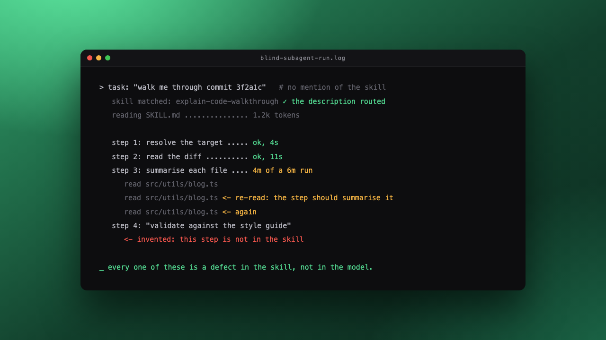

> ["The hottest new programming language is English."](https://x.com/karpathy/status/1617979122625712128) - Andrej Karpathy, 2023

At some point in the last year I noticed I had stopped writing bash scripts. It wasn't an explicit decision I made, it just happened organically as the small automations I used to script became skills instead. The deterministic parts still end up as commands, but now they sit inside a procedure that an agent executes.

A skill is a procedure an agent follows, so I write it as if I were writing code, but in English. The file a reviewer reads is exactly what the agent executes, with nothing compiled in between. I encoded this approach in the [`writing-skills`](https://github.com/EthicalML/agent-skills-marketplace/tree/master/plugins/dev-utilities/skills/writing-skills) skill that we published in the [Agent Skills Marketplace](/blog/announcing-the-agent-skills-marketplace/).

This post covers what good skills look like: the 5 principles I follow, an optional one that has felt magical, good and bad examples for each, and the real skills we open sourced along the way.

## The 5 Principles, Plus an Optional One

1. The description is a router, so it says when to use the skill in the words a user would type.
2. The body is steps, and anything that isn't a step gets deleted.
3. Scripts carry the fixed sequences, and the agent carries the judgement calls.
4. `SKILL.md` holds only what every run needs.
5. Verification is a step of the procedure, for the output and for the skill itself.
6. Optionally, a human feedback loop, where the skill ends by reporting its own friction upstream.

The rest of the post goes through each one with a bad and a good example.

## Principle 1: The Description Is a Router

A skill is a folder with a `SKILL.md` at its root. The frontmatter carries the `name` and the `description`, and the body carries the procedure. The description is the only part the agent sees before deciding whether to load the skill, so it works as a matching rule against the task in front of it.

In practice I've found that a description tends not to fire when it only says what the skill is, because nothing in it matches the words a user actually types. The bad version:

```text
description: A comprehensive utility for working with code changes.
```

The good version:

```text
description: Succinct walkthrough of a code change. Use when the user asks to explain,
  walk through, or break down a commit, PR, diff, or change set. Accepts a commit SHA,
  a PR number or URL, a git range, or a pasted diff.
```

The second one names the trigger phrases and the accepted inputs. I write the description last, once I know what the skill actually does, and I write it for the router rather than for the reader.

## Principle 2: The Body Is Steps and Nothing Else

The body of the skill is the procedure, written as steps that the agent executes in order.

Side note rant: agents are just too verbose by default, and the default iteration you get back is AI slop. I sometimes catch myself writing exactly that as a comment back to the agent (too often). When I blindly delegate the skill writing, I get 600 lines, more of a menu of suggestions than an actual recipe, and even the entire history of the program's changes (context you don't need when executing it). The bad version:

```markdown
## Overview

This skill provides a comprehensive framework for managing releases...

## Architecture

The release pipeline consists of three layers...

## Prerequisites

...

## Troubleshooting

...
```

The good version:

```markdown
1. Run scripts/preflight.sh, and if it fails, read troubleshooting.md.
2. Bump the version, tag the commit, and push the tag.
3. Watch the release CI, and if a check goes red, decide whether it blocks the release.
```

Note how the Troubleshooting appendix from the bad version became a conditional read in step 1, so only the runs that actually fail pay for it.

Most skills I review need the same deletions:

- The introduction explaining what the tool is.
- The architecture section.
- The rationale paragraphs.
- The glossary.
- The "further reading" list.

Error handling stays though, and it goes inside the step that fails. A line like "if the upload fails with a 413, split the file and retry, do not raise the size limit" lives in the upload step and not in a Troubleshooting appendix, as by the time the agent reaches a troubleshooting section it has usually already chosen the wrong recovery. I do the same with constraints, so a rule that governs step 4 is written in step 4.

> Simple doesn't mean simplistic, as a simple solution can still solve complexity, just not in a complicated manner.

Getting to the simple solution is often harder than accepting the complicated default, and that extra work is pretty much the point of the exercise. I add complexity when it's required, not before, and not after.

## Principle 3: Scripts and Judgement Are Different Tools

After many iterations building and using skills, I found the sweet spot by using deterministic scripts where the actions are clear (carrying out auth, executing against an API, etc), and leaning on non-deterministic intelligence where the task benefits from logic (something not working, building a creative structure like a document or deck, etc).

The bad version leaves the fixed sequence to the agent:

```markdown
Authenticate against the registry, then call the publish API with the right
parameters, then check the response for errors, then build the changelog.
```

The good version pins the sequence and hands over only the judgement:

```markdown
1. Run scripts/publish.sh, which authenticates, publishes and validates the response.
2. Read the diff since the last tag and write the release notes in the repo's voice.
```

This can fail in both directions, and I've hit both:

- Put too much in the script and the skill becomes a thin wrapper around a program, at which point you didn't need a skill and could just use the program directly.
- Put too much on the agent and the skill burns minutes and thousands of tokens re-deriving something that we could easily do with a five-line shell script.

## Principle 4: SKILL.md Only Holds What Every Run Needs

`SKILL.md` loads on every invocation, and it consumes context before the agent has looked at a single file of the actual task. So my rule is that `SKILL.md` holds the steps, their conditions, and their commands, and nothing else.

The bad version inlines reference material that every run pays for:

```markdown
Step 3 uses the release profile. The full profile format is documented below,
with all 14 fields and their defaults: ...
```

The good version reads it from the step that needs it:

```markdown
3. Read profile.md for this repo's release settings, and apply them to the tag.
```

An example of progressive disclosure is our `release-repo` skill, which keeps each repository's release profile in a separate file and only reads it when releasing that repo.

One more thing I avoid is restating what a schema or a type already says. If the source of truth is unclear, the fix belongs in the source of truth. A skill that duplicates a schema will disagree with it within a month.

## Principle 5: Verify the Output, Then Verify the Skill

When nobody checks the output of a skill, it will eventually produce wrong output and nothing in the run will flag it. So I put verification in the procedure as its own step, and I size it to what's at stake:

- A script that validates the input before the expensive work starts.
- A gate that confirms the prerequisites exist.
- A single command whose exit code decides whether the skill continues.

I try not to overbuild the checks though, as every check adds context and wall-clock time on every run, so I verify proportionately and push the heavier checks behind a condition.

Then comes verifying the skill itself, which is the step almost nobody does, and in my experience it's worth more than every review pass combined. I don't ask a model to judge my skill, because asking "is this SKILL.md any good?" produces agreeable, useless feedback. Instead I give a blind subagent a real task that should trigger the skill, and I watch what happens.



Then I read the evidence rather than the opinion:

- I look at where the tokens were spent.
- I check which step took far longer than it should have.
- I read the transcript for the agent getting stuck, re-reading the same file, or inventing a step I never wrote.

Every one of those is a defect in the skill and not in the model, as a step that gets misread is a step that's ambiguous.

I run this a handful of times, and I run it on a cheaper model than the one I'm targeting. A cheap model is a more honest test, as it will fall into every hole that a strong model steps over.

## Principle 6 (Optional): A Human Feedback Loop

There's a sixth principle that I've been introducing gradually, and this is the one that has genuinely blown my mind. The skill ends with a step where it reports its own friction back to a human. After the last step, the agent looks back at the run and identifies anything that took more than a couple of attempts, any workaround it had to invent, and any knowledge it picked up that the skill doesn't capture.

- If the fix is small enough (a couple of lines, a docs correction), the agent contributes a PR upstream to the skill's repository.
- For anything bigger, it opens an issue with the context, the files and the steps to reproduce.

When it works, the skill goes from a loop to a **flywheel**, as every run generates feedback, the feedback lands as PRs and issues, and the skill improves before I ever sit down to edit it. The people running it don't need to be able to judge the defect themselves, which matters because many of them can't. In my opinion this iterative, self-improving feedback loop is one of the key insights we will be seeing as an emerging pattern in enterprise and beyond.

I keep it optional, as the extra step costs a little on every run, and not every skill is worth the loop.

## The Skills We Open Sourced

The principles above come from the skills we run every day, and we open sourced them in the [Agent Skills Marketplace](/blog/announcing-the-agent-skills-marketplace/):

- [`release-repo`](https://github.com/EthicalML/agent-skills-marketplace/tree/master/plugins/codebase-automations/skills/release-repo) pins the release sequence in commands and leaves the release notes and the abort decisions to the agent.
- [`dependabot-fix`](https://github.com/EthicalML/agent-skills-marketplace/tree/master/plugins/codebase-automations/skills/dependabot-fix) fixes a failing Dependabot PR and merges it only when its verification gates prove it safe.
- `dependabot-fix-all` runs `dependabot-fix` once per open PR, which is lego-block composition in practice, as a skill written for one job became a step inside a bigger one.
- [`writing-skills`](https://github.com/EthicalML/agent-skills-marketplace/tree/master/plugins/dev-utilities/skills/writing-skills) applies this whole post to itself, which felt like the only honest test of a position like this one.

The same approach runs across our [open-source projects](/open-source/), where [KAOS](https://github.com/axsaucedo/kaos) and this site's repository carry their own skills for releasing, fixing dependencies and drafting content. Everything installs from the marketplace:

```text
/plugin marketplace add EthicalML/agent-skills-marketplace
/plugin install dev-utilities@agent-skills-marketplace
```
