The first time I wired one of my agents up to GitHub I did the thing everyone does. I created a bot account, put its token in a Kubernetes Secret, and let every user's request ride on it.

It wasn't a deliberate design decision, it was just the quickest way to get the demo working, and it held up right until a second person tried to use the agent. GitHub saw one identity for all of us, so I couldn't tell whose request was whose. If I'd wanted to cut one person off, the only lever I had was rotating a credential that everybody else depended on. And that long-lived token now lived somewhere the agent could read, so anything that could talk the agent into it (a prompt injection, a poisoned tool result, etc) could reach for it too.

So how do I let an agent act on one person's behalf without handing it a credential that belongs to everyone else?

I've spent the last stretch of work on the [Kubernetes Agent Orchestration System (KAOS)](https://github.com/axsaucedo/kaos) answering that question, adding agent identity and authorization to the platform. I went in expecting to write a token exchange and came out having read a lot more OAuth RFCs than I'd planned, made 6 architecture decisions (and reversed one of them), and adopted a component I had assumed I'd have to write myself. This 2-part series is the write-up of that: the research, the decisions, and a worked example that runs end to end.

The timing worked out well, because that component has just been released in the open. [Zalando open sourced the Agentic Identity Broker](https://github.com/zalando-incubator/agentic-identity-broker) under MIT, after running it internally in production for several of their MCP servers. The broker is what lets an agent obtain a user's real GitHub token instead of a shared one, and a good chunk of this post is about what it does and why I adopted it instead of writing my own.

Hopefully this is useful for anyone doing the same on their own platform. My objective:

> Nobody should have to write their own token vault just to let an agent open a pull request as them.

As with my previous posts on [observability for agentic systems](https://hackernoon.com/production-observability-for-multi-agent-ai-with-kaos-otel-signoz), [autonomous always-on agents](https://hackernoon.com/autonomous-agentic-systems-a-practical-guide-to-always-on-agents) and the recent series on [multi-tiered agent memory](/blog/whose-memory-is-it-part-4/), I use KAOS as the concrete example. The goal is practical intuition for the primitives (subject and actor, enforcement points, grants, token exchange, consent), so that it applies whether you run KAOS, a gateway of your own, or plain MCP servers behind FastMCP.

This post is the first of a 2-part series:

- **Part 1 (this post): the problem, what to build on, and the broker.** The 3 questions every agent request has to answer, the standards and tools that already exist, what the Agentic Identity Broker does, and the architecture decisions I made on top of it.
- **[Part 2: agent identity in action.](/blog/agentic-security-and-identity-part-2/)** A worked example that runs end to end on a cluster, with two users, two agents, a tool, a model and a third-party service, and real allow and deny outputs.

## Three Questions Every Agent Request Has to Answer

Before any of the machinery makes sense I found it helped to be precise about what I'm actually asking on each request. There are 3 questions, and a lot of the confusion in this space comes from collapsing them into one:

1. **Who are you?** Which human called the agent, and which groups are they in? Sometimes the honest answer is "nobody", because an autonomous agent woke up on a schedule and decided it had work to do.
2. **Who's your agent?** Which agent is making this call, and can it prove that identity without a human present?
3. **What can you and your agent do?** Can _this_ user use _this_ agent, and can _this_ agent reach _that_ tool, model or external service?

The second question is the one most platforms answer badly, because an agent is a workload and a workload doesn't log in. It has no browser, no password and nobody at the keyboard, so every mechanism designed around a human consenting in a redirect doesn't apply to it directly.

The first and second questions together produce a distinction I lean on for the rest of the series. A call that a person started carries two identities at once, and they aren't interchangeable:

- The **subject** is the human the work is being done for. It arrives as an OIDC token from whatever identity provider you already run.
- The **actor** is the agent doing the work. It arrives as the agent's own machine credential, and it's what a chain of agents keeps changing as the work moves between them.

I decide resource access on the **actor**, and I use the **subject** for what the user personally delegated. An autonomous agent that nobody started carries only the actor, which is exactly why the two have to be separable. Collapsing them is tempting because in the simple case there's one user and one agent, and it breaks the instant one agent calls another and you can no longer tell whether "the caller" means the person who started it or the agent 3 hops down.

One warning on the word _subject_, because it's overloaded and I hit the collision myself. When I say subject here I mean the delegating human in an on-behalf-of flow. In part 2 you'll meet an `AccessGrant` whose `subject` field can name a user, a group or an agent, which is a different and more general use of the same word. I've kept the two apart by always saying _AccessGrant subject_ for the second one.

## The Shared Bot Token, and Why Everyone Builds It First

The naive way to let an agent use GitHub is the one I described at the top: one bot account's token, and every user's request rides on it. People build it because it's the easy thing to build (one token in a Secret, one HTTP client, done) and because it works in the demo.

The problems show up in a fairly predictable order once real people use it:

- **Attribution goes first.** GitHub sees one identity for every request, so your audit trail says a bot did it. When somebody asks who asked for a change, the honest answer is that you don't know.
- **Permissions go next.** The bot needs the union of what every user might need, so the least-privileged person on your team is now operating with the most-privileged token you issued.
- **Revocation goes last.** One person leaves, and the only lever you have is rotating a credential that everyone else depends on.


The obvious repairs don't work either, and the broker's own documentation has [the clearest table I've seen](https://agenticidentitybroker.dev/docs/introduction/) on why. There are 3 things teams reach for, and each one drops at least one of the 4 properties you actually need, which are least privilege, user consent, revocability and auditability.

| What you reach for                          | What it costs you                                                                                                                                                    |
| ------------------------------------------- | -------------------------------------------------------------------------------------------------------------------------------------------------------------------- |
| Hand the agent the user's own OAuth token   | The token is far too broad, you can't revoke it for one agent, and there's no record of what the agent did with it. It then spreads to every agent the user touches. |
| Give each agent its own third-party client  | It doesn't scale past a handful, there's no shared place for a user to see what they've consented to, and provider secrets end up copied into every agent.           |
| Static API keys or a shared service account | No per-user delegation and no expiry, with consent and audit weakest of all. This is the bot token I started with.                                                   |

Underneath all 3 is the same missing piece. The cluster can decide _whether_ a request leaves, but it has no authority over GitHub's tokens, so it can't make GitHub see Alice instead of the bot. Nothing you write in a Kubernetes policy object closes that gap. Bridging it needs a component that holds each user's _real_ third-party credential, obtained with that user's consent, and puts the right one on each outbound call. I didn't want to write that component, and as it turns out I no longer have to.

## Standing on the Shoulders of RFCs

Before writing anything I went looking for what I could stand on. The short answer is that the base is solid and the agent-specific layer on top of it is very much still moving, and it's worth being clear about which half you're relying on, because one of them is a decade of deployed practice and the other is a set of drafts that may not survive.

### The Stable Base

None of these were written with agents in mind, and they still do most of the work.

| Specification                                                                                                                                                                                                                                                                 | What it gives you                                                                                                                                                                                                                                                        |
| ----------------------------------------------------------------------------------------------------------------------------------------------------------------------------------------------------------------------------------------------------------------------------- | ------------------------------------------------------------------------------------------------------------------------------------------------------------------------------------------------------------------------------------------------------------------------ |
| [RFC 8693, OAuth 2.0 Token Exchange](https://www.rfc-editor.org/rfc/rfc8693.html)                                                                                                                                                                                             | The one primitive that matters most here. A client presents a `subject_token`, optionally an `actor_token`, and asks for a token aimed at a specific target, and the `act` claim can carry the delegation. It deliberately leaves the trust and policy decisions to you. |
| [RFC 9068, JWT profile for access tokens](https://www.rfc-editor.org/rfc/rfc9068.html)                                                                                                                                                                                        | Makes the user and agent context locally verifiable, so the gateway doesn't need a round trip to check it.                                                                                                                                                               |
| [RFC 8414, authorization server metadata](https://www.rfc-editor.org/rfc/rfc8414.html) and [RFC 9728, protected resource metadata](https://www.rfc-editor.org/rfc/rfc9728.html)                                                                                               | Discovery, so an agent finds the right issuer and asks for a token with the right audience instead of hardcoding either.                                                                                                                                                 |
| [RFC 8707, resource indicators](https://www.rfc-editor.org/rfc/rfc8707.html) and [RFC 9449, DPoP](https://www.rfc-editor.org/rfc/rfc9449.html)                                                                                                                                | Bind a token to a target and to a sender, which is how you stop a token minted for one hop being replayed on another.                                                                                                                                                    |
| [Kubernetes bound, audience-scoped ServiceAccount tokens](https://kubernetes.io/docs/tasks/configure-pod-container/configure-service-account/) ([KEP-1205](https://github.com/kubernetes/enhancements/blob/master/keps/sig-auth/1205-bound-service-account-tokens/README.md)) | A workload identity that expires and rotates itself, already present in every cluster. This is the default agent identity in KAOS.                                                                                                                                       |
| [SPIFFE and SPIRE](https://spiffe.io/docs/latest/spiffe-about/spiffe-concepts/)                                                                                                                                                                                               | The same idea generalised past the cluster boundary, for when one cluster stops being the edge of your world.                                                                                                                                                            |
| [NIST SP 800-207](https://csrc.nist.gov/pubs/sp/800/207/final)                                                                                                                                                                                                                | The vocabulary for what I'm building, a policy enforcement point in the path consulting a policy decision point.                                                                                                                                                         |

The other thing to read is the [MCP authorization specification](https://modelcontextprotocol.io/specification/2026-07-28/basic/security_best_practices), which has moved several times, so read it at its current revision and not the one you bookmarked. It's where the prohibition on _token passthrough_ lives, which is the rule that a token minted for one hop must never be silently reused on the next. In my experience that rule is the single most common way these systems go wrong, because reusing the token is always the path of least resistance and it turns your agent into a confused deputy.

### The Agent-Specific Work Is Still Moving

Here the ground is much softer. There isn't a settled standard for agent identity yet, whatever the vendor decks say.

The most promising umbrella is the IETF WIMSE working group's [AI Identity Management System draft](https://datatracker.ietf.org/doc/draft-ietf-wimse-aims/), which treats an agent as a workload and composes workload identity with OAuth delegation. It only became a working group document on 15 September 2026, 4 days before I wrote this, so nobody has implementation experience with that exact text yet.

Around it sits a bunch of individual drafts, none of them adopted. The [OAuth extension for AI agents acting on behalf of users](https://datatracker.ietf.org/doc/draft-oauth-ai-agents-on-behalf-of-user/) adds a way for consent to name the acting agent explicitly, and it's useful prior art that has already expired. Others propose attenuated task-scoped tokens or verifiable delegation chains. I read them for the ideas and built on none of them.

One draft worth singling out because it shows up in practice is [Client ID Metadata Documents](https://datatracker.ietf.org/doc/draft-ietf-oauth-client-id-metadata-document/), where the `client_id` is an HTTPS URL that the authorization server fetches to learn who is asking. It's the alternative to dynamic client registration, and the trade is that you stop accumulating per-server registration state and start depending on HTTPS origin control and safe document retrieval instead. The broker I ended up adopting uses it.

### The Products, and Which Layer They Occupy

The commercial space is crowded and the marketing blurs the categories, so I found it easier to sort the products by the job I actually needed doing. Establishing and trading identities is where Keycloak, Auth0's work for generative AI, Okta, WorkOS, Descope and the broker in this post sit. Arcade and Composio solve a narrower problem, bundling third-party OAuth per tool and handing your agent a working connector. SPIFFE and the cloud agent identities cover workload identity. A gateway does the enforcing, whether that's Envoy, agentgateway or a mesh, and an engine like Open Policy Agent evaluates the rules.


The thing I noticed drawing this out is that no gateway and no policy engine creates trustworthy delegation context on its own. They enforce a decision about identities that something else has to have established. That's why the broker layer was the one I couldn't skip, and until recently I hadn't found one I could adopt instead of build.

## Zalando Open Sourced the Agentic Identity Broker

The [Agentic Identity Broker](https://agenticidentitybroker.dev/) (AIB) is the component I'd been waiting on, and it went public in the `zalando-incubator` organisation under an MIT licence. Its [documentation site](https://agenticidentitybroker.dev/) calls it an OAuth2 broker for delegation and consent, and states the goal in one line that's worth keeping in mind for the rest of this post: users delegate scoped, revocable access to agents without handing those agents their credentials.

Their concepts page boils it down to [4 facts](https://agenticidentitybroker.dev/docs/concepts/), which saved me writing my own version:

1. **Delegation is per user, per agent, per service, and scoped.** A person creates a grant that lets one agent use specific permission sets with specific services. It can expire, and it can be revoked.
2. **The broker owns the third-party tokens.** Authorising a service creates a session holding encrypted access and refresh tokens, and the agent never receives them.
3. **Access is exchanged, not shared.** At request time a gateway presents the agent token and the target resource, and the broker returns the right provider token.
4. **Authentication is somebody else's job.** The broker does not log users in. A trusted proxy authenticates the person and passes them in a header.

The fourth one is the design decision that let me adopt it without migrating anything, and I come back to it below.

The vault is the part that no cluster-side policy can substitute for. When Alice consents to her agent touching GitHub, GitHub issues a token for Alice and the broker stores it, encrypted. The agent never sees it. That credential has to be issued by GitHub _to Alice_, and nothing you write in a Kubernetes object can conjure it.

The user gives consent in the broker's own UI and can withdraw it there too. The project includes a React frontend where a person can see which agents they've delegated what to, across services like Google, GitHub, Databricks and Linear, and withdraw it. Revoking one agent's access becomes one person clicking one thing, and nobody else's credential rotates.

The exchange itself is narrow. Present the broker with proof of who the user is and which agent is acting, and it returns that user's stored third-party token. That trade is the only thing it does with identity, because agents get their identity from an agent identity service and users get theirs from the login provider you already run.

The [exchange flow](https://agenticidentitybroker.dev/docs/concepts/token-exchange) is worth looking at closely, because the party list tells you where the trust sits. The gateway authenticates to the broker with a signed client assertion validated against the upstream JWKS, so only a gateway you trust can ask for stored credentials at all, and the assertion subject lands in the audit record. The subject token is the agent's token, and the broker pulls the user and the agent out of it with configurable expressions over the claims. The resource names the target, which the broker normalises and matches against the services it knows. Only after all of that does it check that the user actually has a live grant, decrypt or refresh the stored token, and hand it back.

### Where It Sits: in the Gateway's Call Path

The design decision that made AIB attractive to me is where it expects to be called from. The project describes itself as designed for an infrastructure gateway in the call path between an agent and an MCP server, or between agents. You don't import it into your agent as a library, and your agent code never calls it as a service.

The moment credential handling lives in the agent runtime, every language, every framework and every custom MCP server someone writes becomes a boundary you have to trust. Putting the swap in the gateway means the agent's code has no credential path at all, so there's nothing for a prompt injection to talk it into handing over. It can still be talked into making a call it's authorized to make, which is a different problem that I come back to at the end.


The README makes the case for this concretely on the MCP side. Frameworks like FastMCP can implement the full OAuth 2.1 ceremony that the MCP specification asks for, but then you configure and maintain that for every MCP server you deploy, which means running a multitude of OAuth2 authorization servers. With a broker and a gateway in front, MCP server development collapses back down to writing the tools, and the ceremonies, vaulting and token translation happen transparently for all of them at once.

### What It Deliberately Does Not Do

The project is unusually clear about its own boundaries, which I appreciated more than I expected to. It states plainly that it is [not an identity provider](https://agenticidentitybroker.dev/docs/introduction/why-not-idp), with no human login or user directory in it at all, so something upstream has to authenticate the human and hand it a pre-authenticated request. It holds OAuth2 delegations and the third-party tokens behind them and nothing else, so it isn't a general secrets manager either, and it isn't the MCP server, the agent runtime or the gateway.

That short list of non-goals is what made it adoptable for me. A broker that also wanted to be my identity provider would've been asking me to migrate my users, and nobody does that to add agent support.

I should be equally honest about what the design doesn't eliminate. The trusted gateway still sees the downstream provider token, because somebody has to put it on the outbound request. What the architecture does is shrink the set of components that touch a user's credential from every agent and every MCP server down to the gateway, which is a large reduction, and still more than zero.

### Inside It: a Vault, a Grant Model, and Two Doors

The vault takes encryption seriously. Provider access tokens, refresh tokens and service client secrets are all encrypted, with no plaintext fallback available. The documented production path uses per-value AES-GCM-SIV data keys under a hierarchical KMS keyring, and each ciphertext is bound to its own service, so a stored token can't be replayed against a different one. The in-process key backend exists for development and says so.

Two policy gates guard an exchange, and both have to say yes. The broker evaluates its own expression over the request, and the optional external processor in front of it runs Open Policy Agent over the proxied call. They're composed as a fail-closed AND, so the OPA layer doesn't replace the broker's own grant check and neither one can wave a request through on its own.

The grant model is written in terms a human can read. The domain objects are a principal, a registered agent, a third-party service, a permission set and a grant with an optional expiry. The permission set is the interesting one, because it maps a choice a person can actually understand onto the provider scope strings underneath. Revoking a grant removes that one agent's authority, and terminating a provider session deletes the stored tokens and affects every agent that depended on them, so you get two operations with two different blast radii.

The end-user API and the admin API are separate ports with separate contracts, and the admin port is expected to stay internal behind stronger policy. I run it that way.


### Proxy, Local or Hybrid: the Choice That Decides Whether Keycloak Stays

The detail I wish I'd understood sooner is that the broker has [3 OAuth2 server modes](https://agenticidentitybroker.dev/docs/concepts/oauth2-server-modes), and the one you pick decides how much of your existing identity setup you keep.

| Mode                  | Who issues agent tokens                                                                                                                         | When you want it                                                                                                                        |
| --------------------- | ----------------------------------------------------------------------------------------------------------------------------------------------- | --------------------------------------------------------------------------------------------------------------------------------------- |
| `proxy` (the default) | Your existing authorization server does. The broker forwards the OAuth endpoints to it, republishes its keys, and adds the grant system on top. | You already run something for agent tokens and want consent and delegation added to it. This is what KAOS does, with Keycloak upstream. |
| `local`               | The broker does, signing its own ES256 tokens with keys it manages and rotates.                                                                 | You have no authorization server for agents and would rather not stand one up.                                                          |
| `hybrid`              | Both, chosen per registered agent.                                                                                                              | You are migrating, or you have a mixed fleet you do not intend to unify.                                                                |

I run proxy mode, which is the concrete answer to "does this replace Keycloak". It doesn't, because in this mode Keycloak is still the thing issuing the tokens and the broker adds a consent and delegation layer in front. Choosing `local` would change that answer for agent tokens, and it would still leave human login with Keycloak, because the broker doesn't do human login in any mode.

One operational note before you pick proxy. The broker fetches upstream metadata at startup and refuses to start if that fails, and if the upstream keys later go away its JWKS endpoint returns a 503 and key-dependent flows reject requests. That's the right behaviour, and it also means your identity provider just became a hard dependency of every exchange, so plan for it.

### Zalando Has Been Talking About This Publicly

The day before I wrote this, Magnus Jungsbluth and Jan Brennenstuhl presented [Economies of Scale for MCP and Agents: Why You Need an Identity Broker](https://github.com/zalando-incubator/agentic-identity-broker/blob/main/docs/resources/public-relations.md) at AGNTCon and MCPCon Europe in Amsterdam, and the deck is published in the repository. It's worth reading, because it says more about the shape of the thing than the README does.

They say the broker is built and used in the Zalando Agent Platform, which the deck draws as a combination of the kagent runtime, agentgateway, application registration, a user interface and the identity and consent delegation layer. Their engineering blog [describes the same platform](https://engineering.zalando.com/posts/2026/08/agentic-engineering-at-zalando-a-snapshot.html) from the other end, where team-hosted internal MCP servers are automatically protected by a default ingress OAuth filter and the broker sits in that call path.

I keep coming back to how they define effective access on one of those slides. For a user-delegated call it's the user's permission intersected with the agent's permission, plus a live delegation, and all of those have to hold at the moment of the call and not just at the moment somebody set it up. An autonomous call has no user and no delegation in it, so it reduces to the agent's own permission, which is a different question that deserves its own answer.

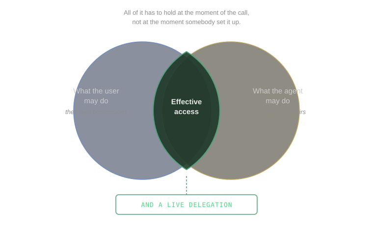

Their maturity labels are unusually specific for a conference deck. Centralised tool authorization is marked available, tool approvals in progress, strong affirmation through CIBA on the roadmap, and intent-based access as outlook. The README adds sessionless on-behalf-of for semi-autonomous agents and formalised agent-to-agent token exchange. It also notes that agent registration now uses client ID metadata documents, and labels the older dynamic client registration flow as historical.

I read the honesty of that labelling as a good sign. What's public is real code with limited internal production use behind it, described as "coding in the open to gauge our approach", and they don't claim a broadly operated mature product. Two of those unfinished items are the hardest open problems in the field. The semi-autonomous case in particular, where an agent wakes on a schedule with no human in a browser, is one that every delegation design built around a redirect flow excludes by construction. Getting that right matters more as agents stop waiting to be asked, and in my opinion it's the most interesting place to contribute.

## Build, Adopt or Wrap?

Having surveyed all of that, the question I actually had to answer was which parts to write myself. The split matters, because "KAOS uses AIB" is a sentence people hear as "AIB does all of KAOS's security", and it doesn't.

The broker took delegated third-party identity. Holding a user's GitHub credential, recording their consent, and swapping one proven identity for another is a genuinely hard problem with a lot of specification surface, and it isn't the problem KAOS exists to solve. Writing my own token vault would've been a lot of work that has nothing to do with orchestrating agents.

Keycloak stayed for user identity, and for agent OIDC clients. This is the part worth being explicit about, because AIB doesn't fill this slot and isn't trying to. Its end-user API takes a pre-authenticated header, which means something upstream has to have already established who the human is. In KAOS that something is Keycloak, providing the login flow, the group membership the access rules match on, and the audience mapper that makes a user's token acceptable as an exchange subject. Keycloak also does double duty on the agent side, where the operator registers each agent as its own client through dynamic client registration, because the broker needs to tie an exchange request to a specific agent. If your deployment has no human users at all you can run agents on Kubernetes ServiceAccounts and drop Keycloak entirely, but the moment a person logs in you need a user identity provider and it won't be the broker.

The enforcement I wrote myself. Deciding whether _this_ agent may reach _that_ resource inside the cluster is a question about KAOS's own objects, and the answer has to be available on every hop of every request. It runs as KAOS's own policy decision point, and part 2 walks through exactly how.

## The Architecture Decisions

These are the 6 decisions that shaped the implementation. For each one I've kept the option I turned down, because in a few cases the rejected alternative was what I'd started building.

### Decision 1: Enforcement Lives at the Gateway

Every call, whether a user reaching an agent or an agent reaching a tool, a model or another agent, travels through one gateway that checks it before letting it through. The gateway validates the identities and asks a policy decision point for an allow or deny. On the specific egress routes the operator generates for a declared third-party service, and only on those, it additionally fetches the user's provider credential from the broker and attaches it to the outbound request.

I rejected putting the checks in the agent runtime. It reads as the simpler option, and it duplicates the decision into every language and framework you support, which makes your security posture a function of application correctness. It also leaves you with no answer for the custom MCP server somebody wrote in an afternoon. I also rejected a sidecar per workload, which enforces uniformly but multiplies the things that have to be upgraded in lockstep, and a service mesh, which solves a larger problem than I had at a cost I didn't want to impose on every KAOS user.


The catch is that a gateway only enforces what actually goes through it, which is why the gateway decision is really two decisions. The second one is a NetworkPolicy that stops workloads talking to each other directly over ClusterIP. Without it a workload can just call another workload by its service name and skip the gateway entirely.

### Decision 2: Two Identities, Kept Separate All the Way Down

A protected call carries the user token and the agent's own token, and both travel together instead of one being exchanged for the other at the edge. Resource access is decided on the agent, and the user identity rides along for third-party delegation.

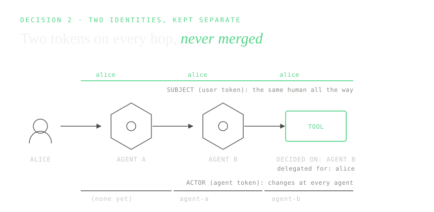

The alternative was to collapse them, resolving the user at the gateway and letting everything downstream trust that. It works until one agent calls another, at which point "the caller" is ambiguous and you can't express the thing you most need to express, which is that this particular agent may reach this particular tool regardless of who started the chain.

### Decision 3: The SDK Carries Identity but Decides Nothing

The KAOS SDK carries the verified identity and context across hops and keeps the agent's token fresh, so that the gateway has something real to check on the next hop. It doesn't authenticate users and it doesn't make authorization decisions.

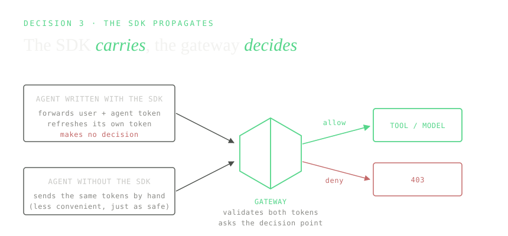

It's tempting to let the SDK do a quick local check, and the moment it does, a workload that skips the SDK skips the security model, and you can't tell the difference from the outside. Keeping the SDK useful but powerless means an agent written without it is just as safe, and only less convenient.

### Decision 4: Authorization as Data, and Why I Reversed Half of It

I wanted explicit grant rows and no policy language, so that the authoring surface reads as "this group may use that agent, this agent may reach that tool, this user delegated that scope". Grant tables are easy to diff and easy to explain to somebody who doesn't write Rego, and most platforms never need more than that.

I originally decided to keep that data in the broker and have it answer the runtime decision, and I reversed that. What runs now is KAOS's own policy decision point, stock Open Policy Agent behind the gateway's standard authorization contract, with the operator projecting grant data into it from the Kubernetes objects. Nobody hand-writes policy, so the data-first model survived intact, and the reversal only moved who evaluates it and where.


Two things pushed the reversal. The decision point has to answer on every hop of every request and fail closed when it can't, so I wanted it running as its own highly available service and not as a dependency on a component with a broader job. The order matters too, because the decision point runs _before_ the token swap, which is what makes "allow this request but do not exchange a token for it" expressible at all. Coupling the two had been the single biggest reason I hadn't adopted a broker earlier.

### Decision 5: Fail With a Re-Auth URL, Then Retry

A first call to a third-party service that the user hasn't consented to fails with an instruction telling them how to approve, and they retry afterwards. A missing platform grant just fails closed with no user action offered, because there's nothing the user could do about it themselves.

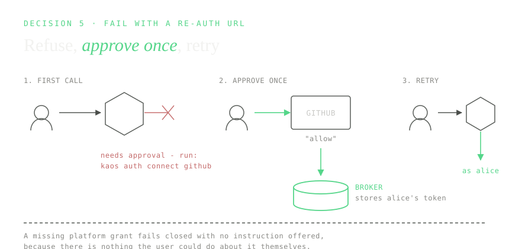

I considered treating every human action as one generic approval queue, which conflates "you need to consent" with "an administrator has to grant you something" and leaves the user staring at a pending state for a decision that was never theirs. I also considered pausing the task and resuming it after approval, which is a better experience and needs durable task state I didn't want to make load-bearing for security.

### Decision 6: I Own the Integration, and the Broker Owns Its Own Lifecycle

The broker and the identity provider run as their own Helm releases, with their own storage, keys, migrations and upgrades. The KAOS operator doesn't manage them; it configures the platform to use them, and keeps the registration current from its side.

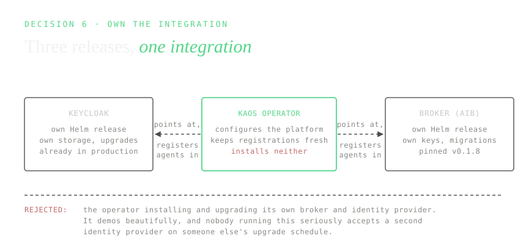

The alternative, having the platform install and lifecycle-manage its own broker, demos beautifully and is wrong for anyone running this seriously. Production deployments already have an identity provider, and they aren't going to accept a second one appearing under an operator's control with its own upgrade schedule.

## Lessons for Production Agent Identity

Four things I'd tell anyone starting this, which aren't obvious from the decisions above.

### 1. Fail closed, then pay for it

The gateway has to deny when the policy decision point says no _and_ when it can't reach it at all, because "no answer" and "no" have to be the same outcome. Treating an unavailable authorization backend as a deny is what fail-closed means in practice, and it shouldn't be relaxable into allow-on-error.

That safe default has a cost, because it makes the decision point a hard dependency of every request in the cluster, so it has to run highly available with multiple replicas from day one. I consider this the right trade, but it's a trade, and it's easy to underestimate until the decision point restarts under load and every request in the cluster politely returns 403.

### 2. Start coarse, because fine-grained authorization is a different problem

The KAOS gateway decides whether an agent may reach a resource. It doesn't decide which tool on that resource, or with which arguments. That finer question needs to understand the payload, which means understanding MCP, which means the gateway grows a protocol parser and your security model grows a dependency on a spec that's still moving.

In my experience resource-boundary decisions get you most of the value for a fraction of the surface, so I'd keep the finer control in the runtime until you have a concrete case that needs it.

### 3. An authorized call can still be poisoned

This is the one I'd put on a poster. Authorization decides whether an agent _may_ call a tool. It says nothing whatsoever about whether that tool's output is trustworthy, and a perfectly authorized call can return poisoned content that talks the agent into its next action.

Prompt injection and tool poisoning live on a different axis to everything in this post, and a team that has just finished an identity programme is exactly the team most likely to think it's covered.

### 4. Put the decision behind a contract you can swap

KAOS evaluates grants with Open Policy Agent, behind the gateway's standard external authorization contract. Nothing above that contract knows what's underneath it, so replacing the engine later is a deployment change and not a redesign.

I got this right partly by luck, since I'd already reversed one decision about where the decision point lives and the neutral contract is what made that reversal cheap. Assume you'll change your mind about the engine, and make sure that's allowed to be a small change.

## Closing Thoughts for Part 1

I opened with an agent holding a bot token that belongs to everyone. That pattern persists because the alternative needs a component that holds each user's real credentials with their consent, and until recently you either wrote that yourself or you did without.

Zalando open sourcing the Agentic Identity Broker changes that arithmetic. The credential vault and the consent surface, which are the parts I least wanted to write, are now something I install. I still had to supply the user identity, the agent identity, the routing, the enforcement and the integration between all of them, so this is one component out of several. But it's the component that was blocking me, and Zalando describing real internal production use behind it counts for more than a reference implementation would.

The parts that remain unfinished are the ones where the specifications themselves are still being written. On-behalf-of for an agent with no user session is the one I'd watch, and it's open for contribution.

Everything in this post is design, so in part 2 I run it on a real cluster, with two users who get different answers to the same request, an autonomous agent acting as itself, a tool and a model gated by what their agent declared, and a third-party call that goes out as the real person. The failed requests are in there too, and they're the ones that show the controls actually taking effect.

**The series:**

- **Part 1 (this post): the problem, what to build on, and the broker.** The 3 questions every agent request has to answer, the standards and tools that already exist, what the Agentic Identity Broker does, and the architecture decisions I made on top of it.
- **[Part 2: agent identity in action.](/blog/agentic-security-and-identity-part-2/)** A worked example that runs end to end on a cluster, with two users, two agents, a tool, a model and a third-party service, and real allow and deny outputs.
