What is Agentic Security & Identity? In this practical walkthrough we cover this topic by diving into 3 key questions:

1. **Who are you? [User Identity]** - What user called the agent? What if it's an autonomous agent?
2. **Who's your agent? [Agent Identity]** - What is the identity of the agent? Is the Agent able to act on the user's behalf? Or on its own behalf?
3. **What can you & your agent do? [Access Control]** Can *this* user use *this* agent, and can *this* agent reach *that* tool or model?

We had to figure out how these questions had to be answered when introducing identity and authorization to the Kubernetes Agent Orchestration System (KAOS). 

Here we walk through some of the architectural decisions, learnings and examples of agentic identity and authorization in KAOS. 

We configure a cluster with KAOS for the agent orchestration integrated with Keycloak for identity & authentication, as well as an agent impersonation service for identity exchange.

We will walk through a concrete example where we will deploy a multi-component agentic system and show how calls from different users (or autonomous agents) succeed or fail.

---

## 1. The control plane

The **control plane** is the set of components that establish identity and decide the rules. None of them carry your agents' actual traffic; they answer the three questions above about it. Here they are on one map. The greyed pieces belong to [Part 5](#5-agents-acting-on-behalf-of-users---on-outside-services) and can be ignored for now.



There are quite a few components in this overview, so let's walk through them:

* **Gateway Mesh**: The single gateway every request passes through - including agent-to-tool, agent-to-model and agent-to-agent calls, which is what makes it a mesh.
* **User Identity Service**: Authenticates users, proves who they are and which groups they belong to; supports OIDC compatible services so we use [Keycloak](https://www.keycloak.org/) here. 
* **Agent Identity Service**: Gives each agent their identity through secure credentials; the default uses k8s Service Accounts, but also supports OIDC compatible services; we also configure Keycloak in this example.
* **KAOS Authz Service**: This is the authorization (authz) service that KAOS uses to allow/deny requests based on the "user" calling the "agent" accessing the "resource".
* **Agent Impersonation Service**: Lets an agent act on an outside service (like GitHub) as the user by exchanging third-party tokens (github/slack/etc) through a consent mechanism. The concrete tool we use is the **Agent Identity Broker (AIB)**, and it deserves its own section, covered in Part 5.
* **KAOS Operator**: This component synchronises auth & identity bidirectionaly; it registers the KAOS resources on upstream auth services, and injects identities and secrets across KAOS resources.

Before we show how this all fits together with an example, let's configure our kubernetes cluster with this setup.

### 1.1 Install it in one command

We use the [KAOS CLI](https://axsaucedo.github.io/kaos/) to install the Gateway Mesh, User Auth, Agent Auth, the KAOS Authz Service, the KAOS Operator, and the Agent Identity Broker (AIB).

This command wires everything together in a new cluster:

```perl
kaos system install \
  --gateway-strict \         # Traffic can only go through gateway
  --authz-enabled \          # KAOS Authorization service enabled
  --user-auth keycloak \     # Use Keycloak for User auth (alt: OIDC)
  --agent-auth keycloak \    # Use Keycloak for Agent Auth (alt: Service Accts. or OIDC)
  --token-exchange-enabled \ # Use AIB for token exchange

                         # Other flags
  --wait \               # Block until everything is ready
  --create-cli-config    # In-folder config file for cli
```

`kaos system install --help` lists everything else (image tags, resource limits, replica counts, realm names, observability backends); the Helm values behind each flag are shown per-component in [section 4](#4-how-each-piece-works).

Let's confirm the pieces are healthy:

```bash
kaos system status
```
```text
gateway           ready
login service     ready   (keycloak)
access-control    ready   (2/2 replicas)
sync service      ready
```

And let's make sure that everything is configured correctly:

``` perl
kaos config show
```
```text
gateway:
  address: http://kaos-gateway.kaos-system.svc.cluster.local
  through_gateway: true
auth:
  issuer: http://keycloak.keycloak.svc.cluster.local:8080/realms/kaos
  client_id: kaos
  realm: kaos
  broker_url: http://aib-agentic-identity-broker.aib-system.svc.cluster.local:8000
  broker_admin_url: http://aib-agentic-identity-broker.aib-system.svc.cluster.local:14000/api
namespace: kaos-system
sessions: {}
```

---

## 2. The data plane

The **data plane** is the actual agent traffic: users invoking agents, agents calling tools and models. Every one of those calls travels through the Gateway Mesh and is checked before it is let through. 

We will use a hands on example with a set of configured resources as follows:

- two users: **alice** (group `researchers`) and **bob** (group `support`)
- two agents: **researcher** (user-activated) and **autobot** (autonomous agent)
- one MCP tool: **echo-mcp**
- one model: **model-api** (a model endpoint both agents may use)
- one external service: **GitHub** - covered in Part 5

The rules: the `researchers` group may use the `researcher` agent; the `researcher` agent may reach `echo-mcp` and `model-api`; the autonomous `autobot` may reach `model-api`. Everything else is denied - including bob (poor bob).

Here's a chart that shows what we'll try to accomplish:



### 2.1 How identity flows through a request

Every call, a user/agent reaching an agent, or a user/agent reaching a tool or model, travels **through the Gateway Mesh**, which does two checks before letting it through:


A *signed token* is like an ID card issued by the identity provider, and it's held by both the user and the agent. 

User Auth issues signed tokens for human users and it carries their groups. (`groups` isn't a core OIDC claim - the identity provider maps it in; with Keycloak that's a group-membership protocol mapper.)

Agent Auth also issues signed tokens, but these are provided as secrets for agents, which then are exchanged for signed tokens.

The gateway does the two checks in order; first it confirms the token is genuine and unexpired (identity), then it asks the KAOS Authz Service whether that identity is allowed to do this (permission).

Only if both pass does the request reach its destination.

It's also worth noting that if the authz service *can't be reached at all*, the request is denied, never waved through. This is configured by design and it is possible to loosen via config params (but not recommended), that's why authz service is designed as highly available.

### 2.2 Deploy the agents and tools

Everything the example needs, both agents, the tool, the model, and the access rule for who may use them, is bundled as a single sample. We will deploy it with a single command, then walk through each object and create it step by step.

Here's the one line deploy command:

```bash
kaos samples deploy 8-authorization-walkthrough -n kaos-system
```
```text
modelapi.kaos.tools/model-api serverside-applied
mcpserver.kaos.tools/echo-mcp serverside-applied
agent.kaos.tools/researcher serverside-applied
agent.kaos.tools/autobot serverside-applied
accessgrant.kaos.tools/researchers-to-researcher serverside-applied


Deployed sample '8-authorization-walkthrough'
```

The tool's single function is an echo, and the model's responses are mocked, so every result is deterministic and the walkthrough exercises *access control* rather than model behaviour. The four resources first, each a plain Kubernetes object (the access rule follows in [2.3](#23-grant-access)):

| Resource | Kind | What it is |
|---|---|---|
| **model-api** | `ModelAPI` | A model endpoint both agents may call. |
| **echo-mcp** | `MCPServer` | A tool (an MCP server) exposing a single `echo` function the `researcher` may use. |
| **researcher** | `Agent` | A user-facing agent. It needs a person behind it and carries that person's identity through to whatever it calls. |
| **autobot** | `Agent` | An *autonomous* agent. No user behind it; it runs on a schedule and acts as itself. |

#### Reproduce it yourself

Each resource has its own `kaos ... create` command, so you can build an equivalent setup by hand and see the shape of each object. The model and tool first:

```bash
# a small in-cluster model endpoint
kaos modelapi create model-api \
  --mode hosted \
  --model "smollm2:135m"

# an echo tool exposed as an MCP server
kaos mcp create echo-mcp \
  --runtime python-string \
  --params 'def echo(message: str) -> str:
      """Echo a note for the authorization walkthrough."""
      return f"Echo: {message}"'
```

Then the two agents. The user-facing one references the model and tool it should use:

```bash
kaos agent create researcher \
  --modelapi model-api \
  --mcp echo-mcp \
  --instructions "Echo the user's request and use echo-mcp when asked."
```

The autonomous one adds an `autonomous` goal so it runs on its own interval instead of waiting for a person:

```bash
kaos agent create autobot \
  --modelapi model-api \
  --autonomous-goal "Produce the automated echo report." \
  --autonomous-interval 3600
```

<details>
<summary>[Collapsed section] Expand to see the equivalent Kubernetes objects</summary>

`kaos ... create` writes ordinary KAOS objects; this is what the sample applies. The `ModelAPI` runs in `Proxy` mode and each agent carries `DEBUG_MOCK_RESPONSES`, so the echo replies are deterministic. Note `autobot` differs from `researcher` mainly by its `autonomous` block. That single field is what makes it act as itself rather than needing a user.

```yaml
apiVersion: kaos.tools/v1alpha1
kind: ModelAPI
metadata:
  name: model-api
spec:
  mode: Proxy
  proxyConfig:
    models:
      - "*"
---
apiVersion: kaos.tools/v1alpha1
kind: MCPServer
metadata:
  name: echo-mcp
spec:
  runtime: python-string
  params: |
    def echo(message: str) -> str:
        """Echo a note for the authorization walkthrough."""
        return f"Echo: {message}"
---
apiVersion: kaos.tools/v1alpha1
kind: Agent
metadata:
  name: researcher
spec:
  modelAPI: model-api
  model: echo
  mcpServers:
    - echo-mcp
  config:
    description: User-facing echo agent for authorization checks
    instructions: Echo the user's request and use echo-mcp when asked.
  container:
    env:
      - name: DEBUG_MOCK_RESPONSES
        value: '["{\"tool_calls\": [{\"id\": \"call_1\", \"name\": \"echo\", \"arguments\": {\"message\": \"authorization note\"}}]}", "Researcher echo response"]'
  agentNetwork:
    expose: true
---
apiVersion: kaos.tools/v1alpha1
kind: Agent
metadata:
  name: autobot
spec:
  modelAPI: model-api
  model: echo
  config:
    description: Autonomous echo agent for authorization checks
    instructions: Echo a short automated report.
    autonomous:
      goal: Produce the automated echo report.
      intervalSeconds: 3600
  container:
    env:
      - name: DEBUG_MOCK_RESPONSES
        value: '["Autobot echo response"]'
  agentNetwork:
    expose: true
```
</details>

### 2.3 Grant access

The sample deployed one more object alongside the resources: an **AccessGrant**, the rule for who may reach what. Access control is on, so nothing is reachable until it is authorized, and this grant is what lets alice's group in. It binds a **subject** (who) to one or more **resources** (what). Like the resources, you can write it yourself with `kaos auth grant create`; `--dry-run` *shows* you the object instead of applying it:

```bash
kaos auth grant create --group researchers --resource agent/researcher --dry-run
```
```yaml
apiVersion: kaos.tools/v1alpha1
kind: AccessGrant
metadata:
  name: researchers-to-researcher
spec:
  subjects:
    - kind: Group
      name: researchers
  resources:
    - kind: Agent
      name: researcher
```

A `subject` has a `kind` of **Group** (matched against the groups in the user's token), **User** (matched against the user's subject or email), or **Agent**. A `resource` names a `kind` (`Agent`, `MCPServer`, `ModelAPI`, or `MemoryStore`) and a `name`, or a label `selector` to match many at once. Apply it (drop `--dry-run`):

```bash
kaos auth grant create --group researchers --resource agent/researcher
```
```text
[OK] created AccessGrant researchers-to-researcher
```

That is the *only* grant we write, which may surprise you: the `researcher` agent reaches `echo-mcp` and `model-api`, and `autobot` reaches `model-api`, yet we grant neither. An agent's access to its own tools and model is **derived from the agent itself**. When you declared `researcher` with `modelAPI: model-api` and `mcpServers: [echo-mcp]`, the KAOS Operator projected those links straight into the enforcement data, the declaration *is* the authorization. There is no separate AccessGrant to write for it, and none shows up in `kubectl get accessgrant`. The one thing that has no home in the agent spec is which **users** may enter an agent, so that is the single grant you create.

> *The declaration is the authorization.*

So the grant list is short:

```bash
kaos auth grant list
```
```text
NAME                        SUBJECTS      RESOURCES     ENFORCED
researchers-to-researcher   researchers   researcher    True
```

The `ENFORCED` column is the KAOS Operator reporting back: `True` means it has projected the rule into the Authz Service and the gateway is enforcing it. `False` would name the reason, for example that access control is not enabled or that no user login provider is configured.

If you ever need an agent to reach something it did *not* declare, you can add an `--agent` grant (`kaos auth grant create --agent <agent> --resource ...`). That AccessGrant is merged *on top of* the derived access, it never replaces it. For the common case, declaring the dependency is all you need.

Those permissions, the one grant you wrote plus the ones derived from the agent specs, are the *only* access that exists. Here is the same map, each green edge labelled with where its permission comes from. Everything not green is denied:



## 3. Walk the example

### 3.1 Log in as the users

`kaos auth login` gets a token from the login service and remembers it, printing what that login proves:

```bash
kaos auth login alice --password kaos-password
kaos auth login bob --password kaos-password
```
```text
[OK] logged in as alice - groups: researchers
[OK] logged in as bob - groups: support
```

The "groups" it prints aren't decoration. They're the exact claim the gateway will read out of the token on every request, and the exact thing an AccessGrant's `Group` subject matches against. alice carries `researchers`; bob carries `support`. Nothing about alice as an individual is granted anything; her *group* is.

### 3.2 Run the requests

`--user` sends the call **through the gateway as that person**, and the CLI prints the plain result:

```bash
kaos agent invoke researcher --user alice -m "summarise repo X"
kaos agent invoke researcher --user bob -m "summarise repo X"
```
```text
Researcher echo response
[OK] allowed - request permitted
[X] denied - user not in a granted group
```

Same agent, same request. The only difference is who's behind it. alice's token carries `researchers`, which the `researchers-to-researcher` grant allows; bob's carries `support`, which nothing grants, so he's refused at the door. alice's request lights up the granted path:


...while bob's request never gets past the first edge:


The agent using its granted tool and model:

```bash
kaos agent invoke researcher --user alice -m "read echo-mcp and ask model-api"
```
```text
Researcher echo response
[OK] allowed - request permitted
```

This exercises the *second* kind of rule. alice got in (first check), and now the agent reaches out to `echo-mcp` and `model-api`. Each of those hops is itself a request through the gateway, checked against the access `researcher` *declared* on its own spec (`mcpServers: [echo-mcp]`, `modelAPI: model-api`). Both are declared, so both succeed - they are the two right-hand green edges on alice's diagram above.

The autonomous agent acts as **itself** (no user), allowed only what *it* was granted:

```bash
kaos agent invoke autobot -m "run the automated report"
```
```text
Autobot echo response
[OK] allowed - request permitted
```


There is no `--user` here, yet the call is allowed, while the very next example (a user-facing agent with no `--user`) is denied. That is not a hole in fail-closed; it is fail-closed working. The autonomous agent presents its *own* identity, which is valid, and grant 3 lets that identity reach `model-api`. A user-facing agent invoked with no `--user` has *no* identity behind it at all:

```bash
kaos agent invoke researcher -m "summarise repo X"      # no --user
```
```text
[X] denied - no valid identity
```

And the fails-closed guarantee. `kaos system access-control` scales the KAOS Authz Service up or down; with it gone, the gateway denies rather than guesses:

```bash
kaos system access-control --off
kaos agent invoke researcher --user alice -m "hi"
kaos system access-control --on
```
```text
[OK] access-control off
[X] denied - access-control unavailable (failing closed)
[OK] access-control on
```

Every row of the Part 2 table, proven with plain commands, and nothing was configured by hand in User Auth or the Authz Service; the KAOS Operator kept them aligned with the objects you declared.

---

## 4. How each piece works

The example above is the *what*. This section is the *how*, one capability at a time. Each sub-section ends with the actual configuration behind it: declared objects and Helm values.

### 4.1 Agent identity: how does an agent prove who it is?

How does the gateway know which agent is calling - even when no person started it? That is Agent Auth's job, and it is the one place on the Part 1 map where the KAOS Operator's out-of-band work is easiest to see. Here is the same map from the operator's point of view, with the sync work drawn in:


Every agent gets an identity so the gateway knows who is calling. **By default that identity is a Kubernetes ServiceAccount.** When an agent's pod starts, KAOS mounts a short-lived ServiceAccount token into it, scoped so it's only valid for the gateway (its *audience* is `kaos-gateway`). Every call the agent makes carries that token; the gateway reads it to learn which agent is calling, then checks that agent's grants. The token expires and is refreshed automatically, so there's no long-lived secret sitting in the pod - this is Kubernetes' standard [bound, audience-scoped ServiceAccount token](https://kubernetes.io/docs/tasks/configure-pod-container/configure-service-account/) mechanism ([KEP-1205](https://github.com/kubernetes/enhancements/blob/master/keps/sig-auth/1205-bound-service-account-tokens/README.md)), not anything KAOS invents. The operator registers each agent so the Authz Service recognises it.

This guide selected `keycloak` at install instead, because delegated third-party access (Part 5) needs each agent to hold a login-service identity. With `keycloak`, the operator registers each agent as its *own client* in User Auth automatically, using dynamic client registration (DCR) - the "registers each agent as a client" edge on the chart. No one creates those clients by hand. The stored Kubernetes Secret holding the agent's client credentials is the idempotency key: if the Secret is present the agent is already registered, and deleting it forces a clean re-registration on the next reconcile. Timing differs by subject too, as the chart's other edges show: users and groups are provisioned once at install, while each agent's client is created when the agent is reconciled. For everything in Parts 1 to 4, `serviceaccount` is simpler and preferred; only Part 5 requires `keycloak`.

An **autonomous** agent (like `autobot`) has no user behind it, so it acts **as itself**. Its own identity is the "who asked", and it can reach only what that identity was granted. A user-facing agent (like `researcher`) instead carries the *user's* identity through to whatever it calls, so downstream checks see the real person.

<details>
<summary>[Collapsed section] Expand to see the Helm values that drive agent identity</summary>

Agent identity is a single `provider` choice under `security.agentAuth.identity`. The default provider is Kubernetes-native:

```yaml
security:
  agentAuth:
    gatewayJwtOptional: true
    identity:
      provider: serviceaccount        # the default
      serviceAccount:
        audience: kaos-gateway
        expirationSeconds: 3600
        tokenPath: /var/run/secrets/kaos-agent/token
```

`gatewayJwtOptional: true` means that for agent tokens, the Authz Service performs the full identity check; the gateway's own user-token check does not block agent calls. This is required for autonomous agents: their Kubernetes-issued ServiceAccount token is not a user login token, and the user login provider would otherwise reject it before the access check ever runs. The `serviceAccount` block is the short-lived mounted token described above: valid only for the gateway (`audience`), auto-refreshed (`expirationSeconds`), read from `tokenPath`.

Switching the provider is the whole difference between the two modes - this is what `--agent-auth keycloak` sets:

```yaml
security:
  agentAuth:
    identity:
      provider: keycloak     # each agent becomes its own login-service client
```

With this provider the operator registers each agent's client via dynamic client registration and stores its credentials in a Kubernetes Secret - the idempotency key described above; delete it to force re-registration on the next reconcile. This is heavier than `serviceaccount`, and needed only when the agent must present a login-service identity to the Agent Identity Broker (Part 5).
</details>

### 4.2 User identity: who is this person, and what groups are they in?

Who is this person, and which groups are they in? When a person is behind a request, User Auth (Keycloak in our example) proves who they are and **which groups** they're in. That group membership is what access rules match on. `alice` isn't granted access personally; her *group* `researchers` is. The intuition in one picture:


`kaos auth login` ran the standard login exchange and cached alice's token; the groups it printed are the same ones the gateway will read on every request. The one thing KAOS requires of the login service is that issued tokens carry a **groups** claim (and a stable **subject** claim naming the user). Everything else about your identity provider, how people actually authenticate, where the groups come from, is up to you.

<details>
<summary>[Collapsed section] Expand to see the Keycloak realm KAOS configures</summary>

The installer creates a realm with the users, the `researchers`/`support` groups, and, critically, a set of *protocol mappers* that stamp the right claims onto every issued token. The mappers are the load-bearing part: without the groups mapper, tokens wouldn't carry group membership and group-based AccessGrants couldn't match. This is the shape KAOS provisions (trimmed to the relevant pieces):

```json
{
  "realm": "kaos",
  "enabled": true,
  "groups": [
    { "name": "researchers" },
    { "name": "support" }
  ],
  "users": [
    {
      "username": "alice",
      "email": "alice@example.com",
      "enabled": true,
      "groups": ["researchers"],
      "credentials": [{ "type": "password", "value": "...", "temporary": false }]
    },
    {
      "username": "bob",
      "email": "bob@example.com",
      "enabled": true,
      "groups": ["support"],
      "credentials": [{ "type": "password", "value": "...", "temporary": false }]
    }
  ],
  "clients": [
    {
      "clientId": "kaos",
      "publicClient": false,
      "secret": "kaos-dev-secret",
      "directAccessGrantsEnabled": true,
      "standardFlowEnabled": true,
      "protocolMappers": [
        {
          "name": "kaos-groups",
          "protocolMapper": "oidc-group-membership-mapper",
          "config": {
            "claim.name": "groups",
            "full.path": "false",
            "access.token.claim": "true"
          }
        },
        {
          "name": "kaos-subject",
          "protocolMapper": "oidc-usermodel-property-mapper",
          "config": {
            "user.attribute": "id",
            "claim.name": "sub",
            "access.token.claim": "true"
          }
        },
        {
          "name": "kaos-audience",
          "protocolMapper": "oidc-audience-mapper",
          "config": {
            "included.client.audience": "kaos",
            "access.token.claim": "true"
          }
        }
      ]
    }
  ]
}
```

The gateway is told where to find this realm and what audience to expect through two Helm values:

```yaml
security:
  userAuth:
    issuer: http://keycloak.keycloak.svc.cluster.local:8080/realms/kaos
    audience: kaos      # tokens must be minted for this audience
```

In production you point `--user-auth` at your own OIDC provider instead, and map your existing directory groups into the `groups` claim. KAOS doesn't care *how* the claim gets populated, only that it's there.
</details>

### 4.3 Access control: the rules and their enforcement

This is where "is it allowed?" is answered. Two kinds of rule:

- **Who may use a resource.** An `AccessGrant` binds a **group** (or user) to a resource: *"`researchers` may use `researcher`."* This gates a person reaching an agent.
- **What an agent may reach.** An `AccessGrant` binds an **agent** to tools/models: *"`researcher` may reach `echo-mcp` and `model-api`."* This gates movement between components.

Both are the same object type; only the subject differs (a group/user vs. an agent). That uniformity is deliberate: there's one rule format to learn, one place to look, and one `kaos auth grant list` that shows every permission in the cluster.

Enforcement lives at the gateway, which asks the **KAOS Authz Service** on every request. That service:

- runs **in-cluster as its own always-on service** (multiple replicas, so it's highly available),
- **fails closed**: if it says no, or can't be reached, the request is denied (you saw this with `--off`), and
- is only reachable *through the gateway* when `--gateway-strict` is set, so a workload can't sidestep it by calling a resource directly.


The Authz Service never reads your AccessGrant objects directly. The KAOS Operator is the go-between: it watches the objects, compiles them into the data the Authz Service evaluates, and keeps that projection current as you add and remove grants. This is what the `ENFORCED` column reported: the operator confirming the rule is live.

Autonomous agents fit the same model. Their *own* identity is the subject, so `autobot` needs a grant for anything it touches, exactly like a user does.

<details>
<summary>[Collapsed section] Expand to see the Helm values that drive enforcement</summary>

Enforcement is the KAOS Authz Service (stock OPA behind Envoy's authorization plugin) plus the operator's projection of your grants into it:

```yaml
security:
  pdp:
    enabled: true                 # the KAOS Authz Service
    image: openpolicyagent/opa:1.18.1-envoy-static
    replicas: 2                   # highly available
  agentAuth:
    authorization:
      # "automated": the KAOS Operator projects grant data from your
      # AccessGrant objects. You never author decision-service policy by hand.
      policyDataSource: automated
    projection:
      # prune removes stale grant data when an Agent or AccessGrant is deleted,
      # so permissions never outlive the object that declared them.
      prune: true
  # the "gateway is the only path" posture, so the check can't be bypassed
  strictGatewayApi:
    enabled: true
  networkPolicy:
    enabled: true                 # deny direct workload-to-workload traffic
  gatewayRouting:
    enabled: true                 # route agent -> tool/model/peer calls via the gateway
```

The fail-closed behaviour isn't a setting you turn on. It's how the gateway treats an authorization backend that says no *or* doesn't answer. Denying on "no answer" is the default and can't be relaxed into "allow on error".
</details>

> **What we learned:** Fail-closed isn't a toggle you flip - it's treating "no answer" from the authz service as a *deny*, never an allow. That safe default costs availability, which is exactly why the Authz Service runs HA.

**Further reading - the enforcement model.** Checking every hop at a gateway is a standard *zero-trust* shape: a policy enforcement point (the gateway) consulting a policy decision point (the Authz Service), the vocabulary formalised in [NIST SP 800-207](https://csrc.nist.gov/pubs/sp/800/207/final). The concrete mechanism - an Envoy external-authorization filter calling out to a policy engine - is documented in the [OPA-Envoy plugin](https://www.openpolicyagent.org/docs/envoy). And while agents here default to Kubernetes ServiceAccounts, the same workload-identity idea generalises beyond the cluster through [SPIFFE/SPIRE](https://spiffe.io/docs/latest/spiffe-about/spiffe-concepts/) and the emerging [IETF WIMSE](https://datatracker.ietf.org/doc/draft-ietf-wimse-arch/) work.

---

## 5. Agents acting on behalf of users - on outside services

What happens when the researcher agent needs to access GitHub on behalf of the user? Whose GitHub account does it act on? 

Everything so far focuses on identity for access control, but so far we don't have the mechanisms to access **external oauth services like GitHub as the specific user**, as opposed to using a shared bot account.

### 5.1 The intuition

The naive way to let an agent use GitHub is to give it a single bot account's token and let every user's request ride on it. That's the default failure mode because it is the *easy* thing to build: one token in a Secret, one HTTP client, done. But it's a shared credential: GitHub sees one identity for everyone, you can't tell whose request was whose, and revoking one person's access means rotating the token for all of them. Worse, that durable token now lives somewhere the agent can read.

And nothing from Parts 1-4 can fix it, because an in-cluster `AccessGrant` cannot express "GitHub as alice". The cluster has no authority over GitHub's tokens: it can decide *whether* a request leaves, but it cannot make GitHub see alice instead of the bot. Bridging that gap needs a component that holds each user's *real* GitHub credential - issued by GitHub, consented to by the user - and puts the right one on each outbound call.

KAOS does the opposite of the shared bot on all three counts:

- **Acting as the user, never a shared bot.** When alice asks the researcher to touch GitHub, GitHub receives *alice's own* token and sees alice. bob's requests go out as bob. Permissions and audit on the GitHub side are per-person, exactly as if each user called GitHub directly.
- **The agent never sees a durable credential.** The agent only ever holds its own short-lived in-cluster identity. The real GitHub token is swapped onto the outbound request at the gateway; the agent code never touches it.
- **Revocation is per user.** alice can withdraw her approval at any time without affecting anyone else.

### 5.2 Enter the Agent Identity Broker (AIB)

The component that holds each user's real credential is the **Agent Identity Broker** (AIB; deployed from the `agentic-identity-broker` chart). It runs as its own self-managed Helm release alongside the cluster, much like Keycloak - the KAOS operator deploys none of it. What it holds: each user's real third-party tokens, in a vault, put there when the user consents (5.4). What it does: exactly one thing - **exchange**. Present it proof of who the user is and which agent is acting, and it returns that user's stored third-party token. It never issues anyone's identity; agents get theirs from Agent Auth, users from User Auth, and the AIB only ever trades one proven identity for a stored credential.

**Nothing new is installed here.** Every component in this part went in with the single install command in 1.1 (`--agent-auth keycloak`, `--token-exchange-enabled`). On the Part 1 map, the greyed pieces simply light up, and it is everything *else* that goes grey:


This is also why the install needed `--agent-auth keycloak`: the AIB must be able to tie an exchange request to a specific agent, and for that the agent needs a login-service identity rather than a ServiceAccount. The KAOS Operator keeps the connection current from the other side - it registers each agent in the AIB under a stable **logical name** (`kaos/<namespace>/<name>`) and keeps that record's client id up to date across re-registrations, the greyed operator edge on the 4.1 chart.

### 5.3 Register GitHub and create a permission set

Here the graded introduction of GitHub ends and the contrast matters, so let's state it plainly. `echo-mcp` is a tool **inside** the cluster - a KAOS resource, gated by AccessGrants. GitHub is a service **outside** it. You could wrap GitHub in an internal MCP server with a shared bot token - that is exactly the anti-pattern the intuition section described. Instead, GitHub is declared **in the AIB**, and each call goes out as the real user.

Outside services are administered in the AIB itself, not as cluster objects, because the AIB is what actually holds the user's third-party tokens. The declaration has three parts: the **service** (GitHub - its API hostname and OAuth endpoints), a **permission set** (the scopes an agent may request on it), and the **agent link** (which agent may use that permission set, keyed by the agent's stable logical name). The operator keeps that logical name and the agent's login-service client current, and *reflects* the declaration into the cluster plumbing it implies. The safety property that makes this trustworthy: the token swap exists only on the GitHub route; internal traffic never touches the AIB. This is the same boundary the [MCP authorization spec](https://modelcontextprotocol.io/specification/2025-06-18/basic/authorization) draws when it forbids *token passthrough* and requires audience validation - a token minted for one hop must never be silently reused on another, which is the classic *confused-deputy* trap.

<details>
<summary>[Collapsed section] Expand to see the outside-service declaration in the AIB</summary>

The declaration is AIB-native. There is no third-party YAML in your Git repo; the AIB is the config authority, and it is where third-party access is audited (the accepted trade-off for keeping it out of the cluster API).

```yaml
# Administered in the AIB, not as a Kubernetes object.
service:
  name: github
  hostnames: ["api.github.com"]
  oauth:
    authorization_url: https://github.com/login/oauth/authorize
    token_url: https://github.com/login/oauth/access_token
  scopes: ["repo", "read:user"]

permission_set:
  service: github
  scopes: ["repo", "read:user"]

agent:
  logical_name: kaos/kaos-system/researcher
  client_id: <keycloak-dcr-uuid>
  permission_sets: ["github"]
```

The `logical_name` is the stable agent name the operator maintains; `client_id` is the agent's login-service client (the DCR UUID from 4.1), kept current across re-registrations. From this declaration the operator materializes the egress route to `api.github.com`, attaches the AIB's token-swap filter to *only* that generated route, and injects the exchange target into the bound agent. Nothing here touches the internal access-control path.
</details>

Inside the cluster, nothing about the earlier checks changes: alice still has to be allowed to use the researcher, and the researcher still has to be granted its tools. The new part is only the *last hop*, the outbound call to GitHub.

### 5.4 The request and consent flow

> *GitHub sees alice, not a bot: the user's identity travels all the way through the agent to GitHub, so every call goes out as the real user - never a shared bot token.*

The very first time alice asks for something on GitHub there's no approval on file, so the request is refused with an instruction. alice approves once, the AIB stores her token, and from then on it just works, until she revokes it:


Walk it for real. The first time, there's no approval yet:

```bash
kaos agent invoke researcher --user alice -m "list my GitHub repos"
```
```text
[X] needs approval - run: kaos auth connect github --user alice
```

alice approves. The CLI opens GitHub's approval screen, she clicks allow, and the AIB stores her token:

```bash
kaos auth connect github --user alice
```
```text
[OK] connected - alice can now use github through their agents
```

*(On a local demo cluster the approval is completed automatically against a mock GitHub, so the notebook runs without a real browser; in production alice clicks "allow" in her browser. That's the only difference.)*

Retry. Now it works, **as alice**:

```bash
kaos agent invoke researcher --user alice -m "list my GitHub repos"
```
```text
Third-party tool completed.
[OK] allowed - acting as alice on github
```

Approval is revocable, and revocation simply returns you to step 1 of the flow: after a disconnect the agent is refused again until re-approved:

```bash
kaos auth disconnect github --user alice
kaos agent invoke researcher --user alice -m "list my GitHub repos"
```
```text
[OK] disconnected
[X] needs approval - run: kaos auth connect github --user alice
```

**Under the hood**, that successful call is three moves:

1. The agent runtime **re-mints alice's own token so it also names the acting agent**. This is a standard OAuth 2.0 token exchange ([RFC 8693](https://www.rfc-editor.org/rfc/rfc8693)) against User Auth, authenticated with the agent's own client credentials, and it produces a token with `sub=alice`, `azp=researcher`, `aud=token-exchange-broker` - one token that proves both who the user is and which agent is acting. This is what it means for the agent to *impersonate* the user, or act *on its behalf* (the terms are used interchangeably): the exchanged token keeps *both* identities, so the action stays auditable as *alice via researcher* rather than an anonymous bot.
2. On the outbound GitHub route - and **only** on that route - the gateway presents the re-minted token, together with the agent's own credential, to the AIB. The AIB validates both, checks that alice consented, and returns alice's real GitHub token from its vault.
3. The gateway swaps alice's GitHub token onto the outbound request. GitHub receives it and sees alice - steps 7-10 on the 5.2 map.

The token swap can never leak onto internal paths, because the swap filter is attached only to the egress route the operator generated for the declared service. Only alice's own token ever reaches GitHub, and the agent never sees a long-lived credential. But you don't have to think about any of that: `connect` once, then `invoke --user` as normal.

---

**Further reading - acting on behalf of a user.** This pattern isn't bespoke; it's where the ecosystem is converging:

- [RFC 8693: OAuth 2.0 Token Exchange](https://www.rfc-editor.org/rfc/rfc8693) - the standard behind the re-mint, covering both impersonation and delegation semantics and the `act` claim that names the acting agent.
- [Christian Posta - OAuth delegation and "on behalf of" for AI agents](https://blog.christianposta.com/explaining-on-behalf-of-for-ai-agents/) - the same gateway-mediated, preserve-both-identities model, argued from the agent-gateway world.
- [IETF draft: On-Behalf-Of User Authorization for AI Agents](https://datatracker.ietf.org/doc/draft-oauth-ai-agents-on-behalf-of-user/) - an early standardisation attempt that adds an explicit user-consent step on top of token exchange, mirroring the AIB's connect/approve flow.

---

## 6. Wrapping up: what we built, and what we chose

Three questions - who's the user, who's the agent, what may each reach - answered on every hop by one gateway that fails closed. That's the whole system in a sentence. Pulling back, here's what it adds up to.

### The high-level picture

- **Identity is two halves.** A user-facing agent carries the *user's* identity downstream (the user is the *subject*); an autonomous agent acts as *itself* (the agent is the *actor*). The gateway validates both - the user token from the login provider, the agent token from the AIB - on every request.
- **Access is one question, keyed on the actor.** "Can *this* calling agent reach *that* resource?" is decided at the gateway from grant data. The user identity rides along for third-party delegation, but resource access is attributed to the *agent* - which is what keeps multi-agent chains correct.
- **On-behalf-of is a per-user token swap.** When an agent touches GitHub it goes out as the *real user*, confined to the egress route - never a shared bot token.

### If you're building agent identity yourself

- **Put enforcement at the gateway, not in agent code.** The moment authorization lives in the runtime, every language and every custom server becomes a boundary you have to trust. One choke point enforces uniformly across SDK and non-SDK workloads.
- **Two identities, not one.** "The agent" and "the user behind the agent" are different principals. Decide resource access on the *agent*; use the *user* for what the user personally delegated. Collapsing them breaks the instant one agent calls another.
- **Fail-closed needs a second lock.** A deny-by-default gateway can still be walked around via direct cluster networking - so it's only as strong as the NetworkPolicy that forces traffic through it. The safe default is binary and costs availability; plan for HA.
- **Model authorization as data first.** Explicit grant rows - requested, approved, delegated - go a long way before you need a policy language. Keep the decision behind a neutral contract so you can swap engines later.
- **Identity is not safety.** Authorization decides whether an agent *may* call a tool; it says nothing about whether that tool's output is trustworthy. Prompt injection and tool poisoning are a separate surface - out of scope here, but not out of mind.

### The architectural tradeoffs we chose

- **Gateway enforcement over SDK enforcement.** We rejected in-code checks - they'd duplicate the decision per runtime and make security depend on application correctness. The cost: everything sits behind the gateway (plus NetworkPolicy), and off-gateway custom servers opt into their own checks.
- **Data-first grants over a policy engine.** Simple grant tables, not a general policy/Rego layer by default - but behind the standard Envoy `ext_authz` contract, so OPA is a drop-in when real policy complexity arrives.
- **Declared dependency = grant, for now.** Today an agent's declared `mcpServers`/`modelAPI` project straight into enforcement (fast, DRY). The target model adds an approval lifecycle on those requested edges; we took the bootstrap path deliberately and kept the distinction explicit.
- **Coarse resource-boundary, not tool-granular.** The gateway decides "can this agent reach this resource," not "which tool, which arguments." Finer control stays a runtime concern.
- **Workload identity stays Kubernetes-native.** mTLS / SPIFFE / service-mesh binding is out of scope, not deferred - the trust model is the AIB credential under Secret isolation plus NetworkPolicy. SPIFFE and WIMSE (further reading above) are where this generalises if a concrete cross-cluster need appears.
